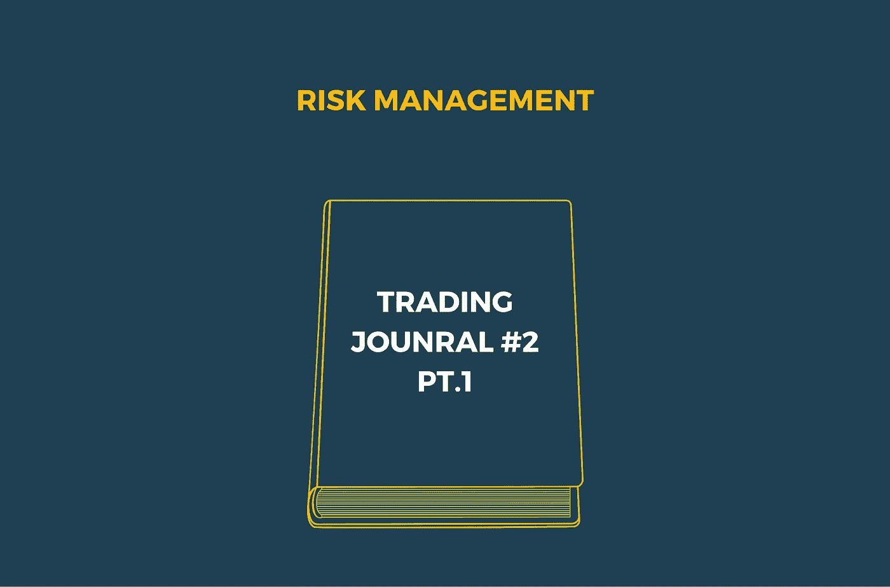
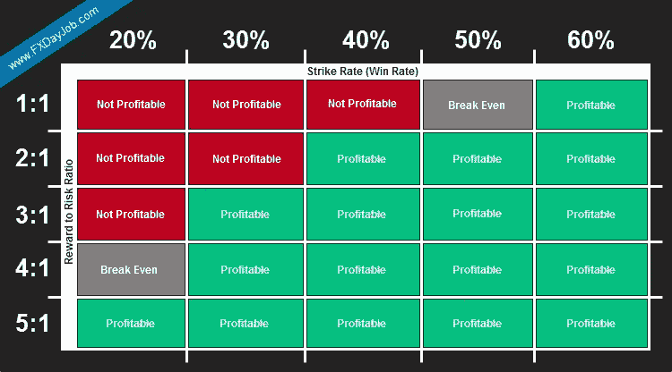
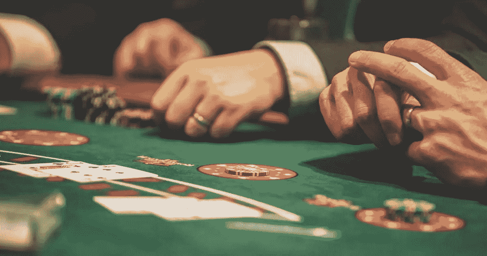

# 交易日志#2:风险管理(第一部分)

> 原文：<https://medium.com/coinmonks/trading-journal-2-risk-management-part-1-764936e2d708?source=collection_archive---------15----------------------->

大多数(如果不是全部)专业交易者会告诉你，风险管理是成功交易者最重要的方面。其他因素，如耐心、时机和经验也不应该被忽略，但是如果没有适当的风险管理，你可能拥有上述所有特征，但仍然会损失所有的钱。适当的风险管理不仅能防止你在单笔交易中损失太多，还能迫使你从纯粹的数学意义上思考交易——让你从交易中去除情绪，用算法思考。

在这篇文章中，我们将深入探讨风险管理，让你了解专业交易者是如何交易的。**将会涉及到一些数学知识，但我们会尽量减少，并致力于提供一个概念的整体概述，以帮助你的决策过程。**

这将是关于这个主题的几个帖子中的一个，这个帖子是对这个主题的介绍，稍后会有更详细和具体的帖子。

*注意:本文不应构成投资决策的基础，也不应被理解为财务建议。*

# 什么是风险管理？

当然，这个名字泄露了一切，但这比看起来要复杂得多。如果你在谷歌上搜索“风险管理”,你肯定会找到大量能够深入风险管理理论数学的链接，但是风险管理的数学和理论很快就会变得令人不知所措。

相反，让我们关注几个核心概念。在传统金融市场中，计算风险时要考虑各种不同的部门。因为各种传统资产(包括股票&债券、大宗商品、制造业等。)都是相互联系的，并在不同程度上相互依赖；当建立一项资产的风险预测时，公司通常会考虑影响每个市场的各种各样的风险。

例如，住房不仅取决于供求，还取决于木材、运输和物流等商品的价格、联邦利率和抵押贷款利率、违约率、消费者债务等等。所有这些都会影响更广泛的房地产市场，因此在建立风险模型时必须加以考虑。

**然而……**

加密货币市场与更广泛的经济有一些额外的分离度(就目前而言)。你可能听说过[比特币的价格在很大程度上与纳斯达克指数](https://www.bloomberg.com/news/articles/2022-04-11/bitcoin-s-correlation-with-big-tech-increases-to-record-chart)相关，因此在横盘或熊市期间，交易 BTC 就像交易 NDX。虽然这表明比特币受到传统市场波动的影响，但 crypto 从不睡觉，24/7/365 交易的事实意味着，当传统市场关闭时，crypto 继续移动。

正因为如此，**秘密交易者对影响特定资产类别的外部性更加绝缘。** BTC 的交易方式类似纳斯达克，主要是因为它的交易算法和基金也在纳斯达克交易，但 NDX 是一个指数这一事实意味着它比更具体的资产仓更有弹性。因此，我们的风险管理技术可以更多地强调技术和基本面指标。

# 第 1 部分:我们从哪里开始？

最明显的地方之一是从我们的情绪开始——正如我们在以前的文章中所说的，当交易时，我们想尽可能地把情绪从等式中去掉。**我们需要对自己完全诚实:我们来这里是为了赚钱，而且仅仅是为了赚钱。我们不是信徒，我们不是包包持有者，我们当然也不是月球人。**

当我们只关注我们的投资组合在我们偏好的法定面值中的价值时，我们可以更好地将自己从对资产表现良好的情感渴望中分离出来。如果你“相信”你的投资，要正确管理你的风险是极其困难的。当坏消息袭来，或者重要趋势被打破时，相信会使卖出变得更加困难。

一旦我们消除了交易中的情绪，接下来我们需要关注的是学习什么时候交易，更重要的是，什么时候不交易。

## 少交易多获利

没错——最难养成的习惯之一就是不交易。尽可能频繁地交易是很诱人的，尤其是在趋势市场中。然而，这是最快的赔钱方法之一。**优秀的交易者会告诉你，他们 90%以上的时间都在观望。**

那么，为什么进行更少的交易可以带来更多的利润呢？几个原因:

1.  **趋势市场**变化很快，很少恢复到初始状态，这意味着你需要提前。如果你不早，你就晚了，晚进场意味着承担额外的风险和更低的上涨潜力。
2.  动荡的市场优柔寡断，可以在真正的趋势出现之前将没有经验的交易者斩草除根。
3.  **过度交易**导致自己暴露在不必要的风险中。
4.  **进行低风险比交易**意味着你需要更高的履约率才能长期盈利(见上图)。

正如你在上面看到的，即使你拿你投资组合的很小一部分去冒险，如果你的交易不成功，你也会被砍成碎片。那么，你如何确保你的交易成功呢？那是一个不可能回答的问题。

相反，我们希望专注于确保足够多的 T4 交易成功，并且成功的程度足够多以继续盈利。你也许可以想象一种 R:R 的“边界”,人们应该以他们当前的罢工率为目标，这是我们将在我们的交易杂志中即将到来的风险管理系列中深入探讨的一个主题，但现在让我们讨论头寸规模。

## 玩多少钱

当开始交易时，要考虑的一个最基本的概念是风险回报比，也称为 R:R。这个比率很简单:你冒了多少风险，你能赚多少。

如果你交易比特币，止损比进场时低 1%，止盈比进场时高 3%，那么你的 R:R 比率是 3:1。然而，如果你一直进行 3:1 的交易，但 80%的时间都被止损，你还是在赔钱。另一方面，如果你坚持 1:1 交易，只有 40%的时间被止损，你仍然会赚钱。

所以，找到适合自己交易风格的理想平衡很重要。如果你做的是需要几天或几周才能完成的摇摆交易，更聪明的做法是寻找更有可能成功的高风险回报率交易。在这个范围内，你一生只能做这么多交易，所以你最好专注于最大化你的赢家。如果收益高得多，采用这种策略的人可能会冒更大的风险。

另一方面，如果你以更高的频率交易，你可能会寻找尽可能多的小赢家。因此，执行这种策略的人可能会寻求尽可能多的小胜利，风险很小，但也追求更少的“大赢家”

根据你的 R:R 比率，没有硬性规定你应该冒多大的风险，但是你交易的越多，每次交易的风险就越小。

仅仅因为你已经开始降低每笔交易的风险，并不意味着你会自动开始盈利。如前所述，你还需要保持一个适当的打击率，以保持漂浮。

在我们的下一篇文章中，我们将讨论更高级的策略，不仅是管理仓位大小，还有更高级的策略来提高你的成交率，确保你最大化盈利交易的数量。

敬请关注下一篇文章！同时，请务必关注我们的[博客](http://arctaurushq.medium.com)和[社交媒体](http://www.linktr.ee/arctaurus)，并查看我们的[网站](http://www.arctaurus.com)，了解我们即将推出的产品。

> 加入 Coinmonks [电报频道](https://t.me/coincodecap)和 [Youtube 频道](https://www.youtube.com/c/coinmonks/videos)了解加密交易和投资

# 此外，阅读

*   [coin loan Review](https://coincodecap.com/coinloan-review)|[you odler Review](/coinmonks/youhodler-4-easy-ways-to-make-money-98969b9689f2)|[block fi Review](https://coincodecap.com/blockfi-review)
*   [为《币安评论》获利贸易 PP](https://coincodecap.com/profittradingapp-for-binance)|为《XT.COM 评论》获利贸易 PP
*   [SmithBot 点评](https://coincodecap.com/smithbot-review) | [4 款最佳免费开源交易机器人](https://coincodecap.com/free-open-source-trading-bots)
*   [比特币基地机器人](/coinmonks/coinbase-bots-ac6359e897f3)|[edcedex 点评](/coinmonks/ascendex-review-53e829cf75fa) | [OKEx 交易机器人](/coinmonks/okex-trading-bots-234920f61e60)
*   [在印度如何购买比特币？](/coinmonks/buy-bitcoin-in-india-feb50ddfef94) | [WazirX 审核](/coinmonks/wazirx-review-5c811b074f5b)