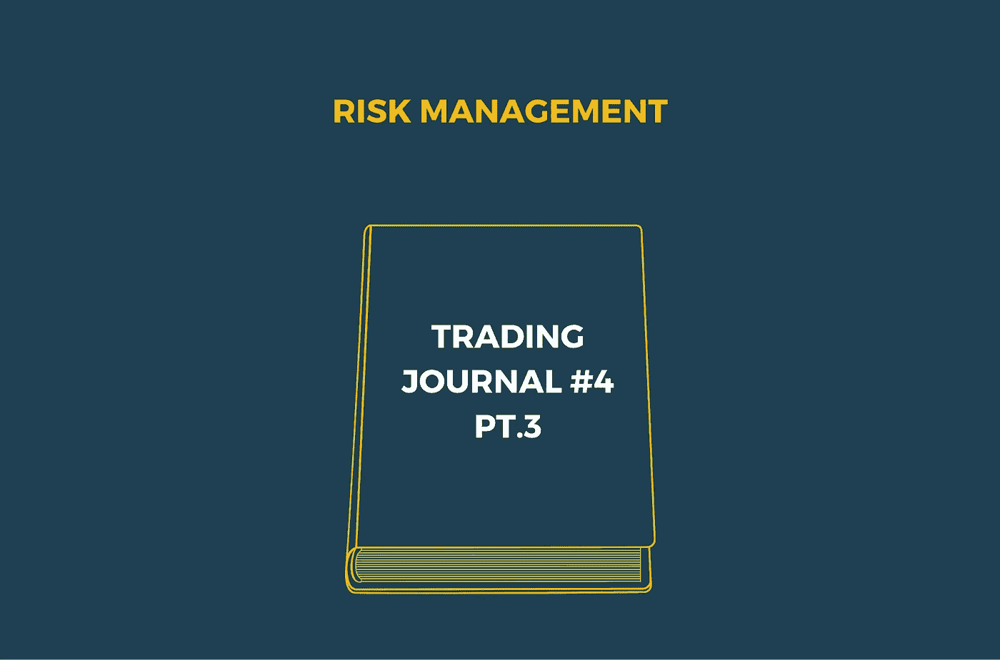
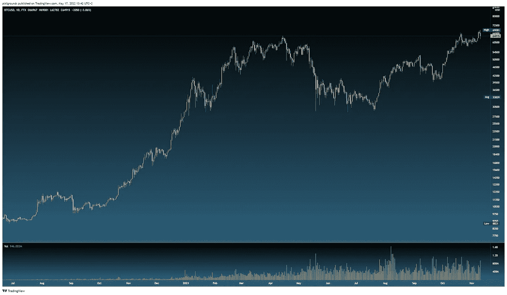
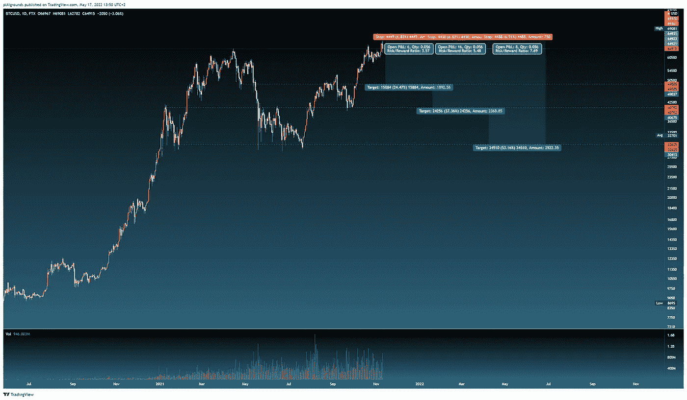

# 交易日志#4:风险管理(第三部分)

> 原文：<https://medium.com/coinmonks/trading-journal-4-risk-management-part-3-5d151b7b78a7?source=collection_archive---------36----------------------->

*注意:本文不应构成投资决策的基础，也不应被理解为财务建议。*

在我们的[上一篇文章](https://arctaurushq.medium.com/trading-journal-2-risk-management-part-2-667a1838e038)中，我们讨论了使用各种指标来评估你的表现和你所冒的风险。迄今为止，我们的大部分注意力都放在单边交易上:要么你做多，要么你做空，风险管理已经归结为头寸规模和 R:R 比率。

风险管理远不止这些，尤其是在投资组合分配方面。然而，我们首先是交易者，因此不关注投资组合的分配、平衡或调整。我们带着一套明确的条件进场交易，一旦这些条件被满足或无效，我们就离场交易。

风险管理的另一个重要方面是对冲。

套期保值是暴露于交易的多方以降低头寸风险的行为。一个最简单的例子是持有现货，同时做空同一资产的期货。例如，我可能有点不确定 BTC 下一步要做什么，所以我决定对冲:我可能已经持有一些 BTC，然后我开了一个空头头寸，这样我就准备好了任何方向的运动。

这里有相当多的东西需要考虑，所以让我们开始吧。

# 我们为什么要对冲？

在异常不确定的时期，对冲尤其有用。也许你持有的一项资产正处于历史高点，牛市已经接近尾声，没人知道这场盛宴还能持续多久。

**这将是一个考虑对冲的好时机。**通过继续持有现货头寸，你可以为价格继续上涨做好准备，但如果你同时建立了一个止损相对较紧的空头头寸，你可以在价格突然暴跌时将投资组合的损失降至最低。

对冲头寸很少长期开放(除非对冲[尾部风险](https://www.investopedia.com/terms/t/tailrisk.asp))。**相反，当一个头寸或资产开始越来越远离均值时，它们通常充当平衡物，例如，预计在不太遥远的将来会出现** [**均值回归**](https://www.investopedia.com/terms/m/meanreversion.asp) **。**

它们在地缘政治不确定时期也很有用，比如最近俄罗斯入侵乌克兰。精明的投资者会在正式入侵日期之前对冲飙升的石油和天然气价格，因为如果入侵真的发生(正如它所发生的那样)，价格波动是非常可能的。考虑到俄罗斯和乌克兰是巨大的粮食出口国，另一个显而易见的对冲措施是应对粮食价格飙升。

当然，在入侵发生之前，大多数人都没有预料到它会发生，因为对普京来说，这似乎近乎自杀，但我们在这里。后见之明是 20:20，但在入侵之前，一个聪明的投资者至少应该对入侵的实际发生有所准备。

# 我们应该什么时候对冲？

有许多方法可以对冲不确定性、波动性和黑天鹅事件。然而，由于我们专注于加密，我们将继续专注于这一领域。例如，每当一项资产达到历史新高时，通常会有很多兴奋——“我们都是天才，我们要去月球了！”—但正如最近所证明的那样，新的历史高点消失的速度可能比它们出现的速度更快。

在最近的牛市中，BTC 在 2021 年 4 月达到约 65，000 美元的峰值，随后暴跌超过-50%，仅在同年 11 月就创下了历史新高。让我们来看看:

11 月 10 日，我们看到 BTC 在重新测试之前的历史高点之前，已经触及了一个新的 ATH，大约 69，000 美元(尼斯)。我们当然知道接下来发生了什么，但假设我们不知道——这是一个重要拐点的好例子:要么之前的 ATH 充当支撑，BTC 在这里反弹并继续运行，要么它不是支撑，我们可能会在短期内看到它走低。

这是一个考虑对冲的绝佳场景。如果你持有现货 BTC 或多头头寸，你有极好的条件在这里做空。你的无效是非常明显的(一个超过 69k 美元的新 ATH ),你有许多短期、中期和长期下跌目标的选择。

在这种情况下，如果价格下跌，空头头寸可以弥补你在现货头寸上的任何潜在损失，如果 BTC 反弹并打破另一个 ATH，你的空头头寸就被平仓，你可以让你的现货头寸继续运行(直到另一个对冲机会出现)。

我们显然知道接下来会发生什么，但这种设置非常适合打开一个短路。**即使你的空头头寸是 1 倍杠杆，BTC 的任何下跌都会完全弥补你的现货头寸造成的任何损失**。因此，你面临的唯一风险是，如果你的空头头寸被止损，你的空头头寸可能会遭受大约 7%的损失。

如果没有做空，你的下跌潜力可能会更大，尤其是如果你让这个头寸带着很大(或不存在)的止损。

# 应该如何对冲？

投资组合经理或基金可能想用无数种方式对冲不确定性。最简单的方法之一是将你的投资组合分散到多个资产类别和行业。在交易中，我们更受限制，因为我们大部分时间都在进出头寸，而不是长期持有。也就是说，我们的投资组合从未完全暴露于资产，大部分时间是以现金为基础的。

幸运的是，我们有限的投资范围让我们对自己的选择更加清晰。第一种当然是在期货中建立相反的头寸，正如上面 BTC 的例子所描述的那样。

另一种方法是购买到期时间相对较长的看跌期权合同，允许你以比当前市场价格(略)低的 T2 执行价格出售你的 BTC，如果 BTC 低于你的期权执行价格，给你一些灵活性。它类似于永续掉期期货，但有固定的到期日。

对于普通投资者来说，使用期权可能很复杂，不应该用算法来完成。相反，出于本文的目的，我将此作为一个例子。

在大多数情况下，通过永久掉期做空是对冲头寸最简单、最直接的方式。确保你生活在一个允许期货合约等衍生品交易的国家，否则你将被困在 BTC 现货交易中。

关于套期保值还有很多要学的，要想了解更多信息，一定要查看资源，如 [this](https://www.investopedia.com/terms/h/hedge.asp) 比我们今天做的更深入。

这就是我们的风险管理系列！敬请关注下期帖子！同时，请务必关注我们的[博客](http://arctaurus.substack.com/)和[社交媒体](http://www.linktr.ee/arctaurus)，并查看我们的[网站](http://www.arctaurus.com/)了解我们即将推出的产品。

> 加入 Coinmonks [电报频道](https://t.me/coincodecap)和 [Youtube 频道](https://www.youtube.com/c/coinmonks/videos)了解加密交易和投资

# 另外，阅读

*   [Godex.io 审核](/coinmonks/godex-io-review-7366086519fb) | [邀请审核](/coinmonks/invity-review-70f3030c0502) | [BitForex 审核](https://coincodecap.com/bitforex-review)
*   [10 本关于加密的最佳书籍](https://coincodecap.com/best-crypto-books) | [英国 5 个最佳加密机器人](https://coincodecap.com/uk-trading-bots)
*   [ko only Review](https://coincodecap.com/koinly-review)|[Binaryx Review](https://coincodecap.com/binaryx-review)|[Hodlnaut vs CakeDefi](https://coincodecap.com/hodlnaut-vs-cakedefi-vs-celsius)
*   [MoonXBT vs Bybit vs 币安](https://coincodecap.com/bybit-binance-moonxbt) | [硬件钱包](/coinmonks/hardware-wallets-dfa1211730c6)
*   [火币交易机器人](https://coincodecap.com/huobi-trading-bot) | [如何收购 ADA](https://coincodecap.com/buy-ada-cardano) | [Geco。一次审查](https://coincodecap.com/geco-one-review)
*   [币安 vs 比特邮票](https://coincodecap.com/binance-vs-bitstamp) | [比特熊猫 vs 比特币基地 vs Coinsbit](https://coincodecap.com/bitpanda-coinbase-coinsbit)
*   [如何购买 Ripple (XRP)](https://coincodecap.com/buy-ripple-india) | [非洲最好的加密交易所](https://coincodecap.com/crypto-exchange-africa)