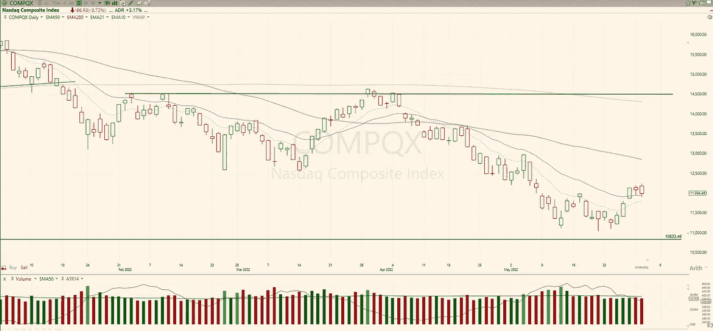

# 交易计划:2022 年 6 月 2 日

> 原文：<https://medium.com/coinmonks/trading-plan-2-june-2022-b5fdf2a9b806?source=collection_archive---------58----------------------->

纳斯达克(-0.72%)又是一个红色的一天，并保持在 EMA21 上方。这不是一个确认*本身*，但从这个区域的分解可能会使价格回到低点。除了关键的平均线和 11.000 点的支撑，观察昨天的高点和周五的低点寻找线索。

标准普尔 500 指数收盘下跌 0.75%，成交量低于平均水平。这似乎是一个在确立方向之前的盘整区域。看昨天的…