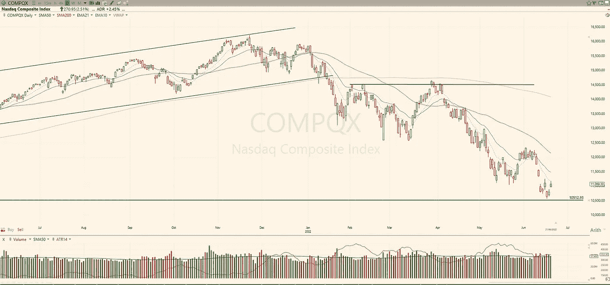

# 交易计划:2022 年 6 月 22 日

> 原文：<https://medium.com/coinmonks/trading-plan-22-june-2022-df8bc0e9f4b0?source=collection_archive---------48----------------------->

纳斯达克指数上涨了 2.15%，但成交量并不强劲。当天后半段表现疲软，似乎机构没有将资金投入市场。请关注 EME21 / SMA50 以及最近的支持和线索。

标普 500 (+2.45%)也有类似的走势。成交量不好，所以在我们看到反转的兴趣之前，最好保持看跌。短期反弹是可能的，但是…