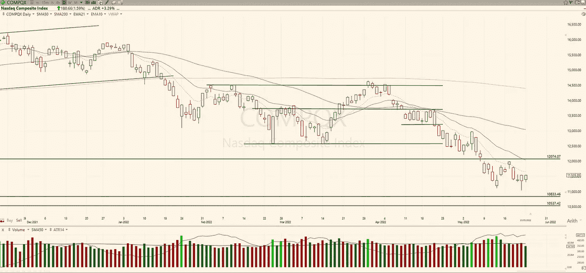

# 交易计划:2022 年 5 月 24 日

> 原文：<https://medium.com/coinmonks/trading-plan-24-may-2022-7c2ca2609806?source=collection_archive---------59----------------------->

纳斯达克(+1.59)经历了低交易量的一天。基本上和昨天没什么不同。交易者/投资者仍在等待一个方向。关注近期低点和 12000 区域。

SP-500 (+1.86%)战胜昨日高点的欲望更强。由于交易量低于平均水平，这一趋势可能无法持续。但是让我们看看体积出现的演变和时刻。双底…