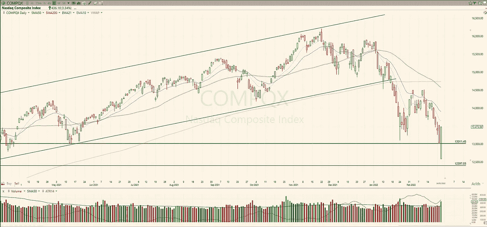

# 交易计划:2022 年 2 月 25 日

> 原文：<https://medium.com/coinmonks/trading-plan-25-february-2022-ab1e99049b45?source=collection_archive---------35----------------------->

我认为昨天是我看到的纳斯达克(3.34%)最大的反转蜡烛之一。去年 3 月的支持被拒绝，价格回到了实际基础。这是一个积极的迹象，收盘时高于 1 月的低点，成交量很大。

SP-500 (+1.50%)做了同样的重要成交量的反转动作。它似乎形成了一个双重模式，但我们需要的最后一部分是建立。无论如何，在…