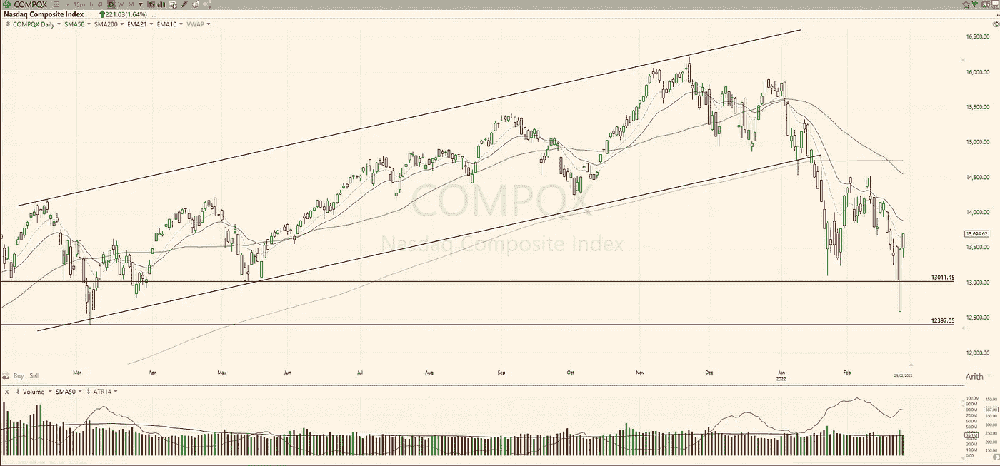

# 交易计划:2022 年 2 月 28 日

> 原文：<https://medium.com/coinmonks/trading-plan-28-february-2022-20908886a50f?source=collection_archive---------26----------------------->

在形成双底形态的途中，纳斯达克(+1.64%)遏制了向更高水平的移动。远不能说这是一个新的上升趋势，因为还没有强劲的交易量。

SP-500 良好的反转延续(+2.24%)，但成交量一般。如果没有形成模式，提前下注不是一个有利可图的解决方案。即使有形成双重形态的步骤，4500 点和 4600 点是水平…