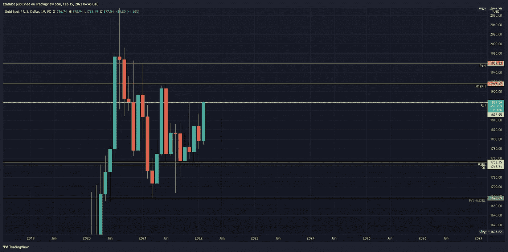

# 带着支持和阻力交易——设置你的交易

> 原文：<https://medium.com/coinmonks/trading-with-support-and-resistance-do-the-subtraction-89a1a99de3e6?source=collection_archive---------1----------------------->

当你生活中的事情不顺心时，开始做减法。 " —匿名

你说支持和抵抗对吗？你也谈到了枢轴，对吗？那么把所有的支点画出来，找出所有的支撑和阻力怎么样？行得通吗？没有。

实际上，我不想在这里谈论减法，但是当我昨天和我的一个朋友交谈时，我意识到，找到正确的支撑和阻力是任何交易的关键，不管你使用什么样的策略或指标，也不管你使用什么样的算法信号。

找到正确的支撑位和阻力位非常重要，即使你的输入可能是错误的，但你的结果仍然是有利可图的。为什么？嗯，作为一个拥有物理、数学和工程背景的科学人，我相信数据和结果，我不仅仅相信那些信号、指标、策略或其他东西，因为它们今天或一周一次有效。很多算法和信号或者所谓的 100%策略的问题在于，这一次有效，但天知道下一次是否有效。

在我开始写这些帖子之前，我已经编写了我的测试框架，并在 youtube、Instagram、telegram 上测试了最‘赚钱’的 37 种交易策略，发现大多数策略只对那个视频或帖子有效，根本不可靠。

我想要一些长期稳定且有利可图的东西，那么在写了这么多算法测试和机器学习预测之后，我找到了什么？如果你已经订阅了这个博客，你很快就会知道答案。我会给你留下的邮件写一个答案，它不会出现在媒体的帖子或其他媒体上，我会把结果回复给那些关注并订阅了邮件列表的人，只在邮件上。

说得够多了，让我们回到主题上来。

有哪些类型的支撑位和阻力位？

根据迈克尔的说法，支撑位和阻力位有两种分类:

Types of S&R levels

如果你使用 TradingView，那么我会为你更新一个指示器，当它还在开发和调试阶段，如果你试用并给出反馈，请点击这里。)

**12 个月高点和低点**

12 Month Highs and Lows (XAU/USD)

注意前一年交易的最高价和最低价。

注意:12 个月的高点和低点有两种类型，都编码在上面的指标中，你只需要启用你需要的那个。此外，该算法最初被编码成一个 python 脚本，该脚本也将很快提供。

12 Months Highs and Lows (by year)

Enable the one which you need

只要看看图表，看看 2021 年的蜡烛是如何尊重 2011 年的高点的。(你可以找到许多其他人，这不是我的工作来帮助你那些，那是你的)

你正在寻找给你一个高眼光设置的场景，显然，12 个月的高点和低点并没有真正设置一个整体，但它们是你必须注意的重要价格水平。

这是另一个价格对 12 个月高点和低点反应的例子:

你不仅可以使用前一年的高点和低点，还可以使用任何一个连续的 12 个月的时间段。

Previous Year High and Low

12 Months Rolling High and Low

我已经为上面的两个图表创造了一个想法，每个月我都会继续更新它。(我实际上为此创建了一个脚本，但 TradingView 禁止了该脚本，所以现在只能手动完成，但很快所有这些都将使用 Python 脚本自动完成)

**季度高点和低点**

我们之前讨论过，我很喜欢研究季度高点和低点。

你不仅可以使用前一季度的高点和低点，还可以使用任何连续三个月的时间段。

Previous Quarter High and Low + 3 months Rolling High and Low

**月度高点和低点**

你不仅可以使用上个月的最高价和最低价，还可以使用任何一个连续 20 天的时间段。20 天的高点和低点是动态水平，用来监控强有力的波动交易。

Previous Month High and Low + D20 RH/L

**周最高价和最低价**

您不仅可以使用前一周的最高价和最低价，还可以使用任何连续五[5]天的时段。五天的高点和低点是动态水平，用来监控持续的短期交易。

研究像这样的日线图和 4 小时图，你会发现不可思议的短线交易能够产生 50-100 或更多的点。(对于黄金，这被证明是 260-490 点)

**每日最高价和最低价**

你应该注意到，前一个交易日交易的最高价可以提供出色的短期阻力，如果交易价格再次达到这些水平。

前一交易日交易的最低低点提供了短期支撑。

你不仅可以使用前一天的最高价和最低价，还可以观察前三天的情况。

研究每日的高点和低点，你就能监控大多数银行和机构买卖利息的精确水平。

**亚洲时段高点和低点**

亚洲时段范围为接下来的伦敦时段交易设定了参数。

**伦敦时段高点和低点**

伦敦时段范围为随后的纽约时段交易设定参数。

**纽约时段高点和低点**

纽约时段范围为随后的新交易时段的交易设置参数。

**机构价格水平**

你有没有注意到市场是如何在一个整数上停止，并在这个整数上反转的？如果不是自己研究！

这是有原因的…机构和银行级别的交易者用这些级别来进场和出场。由于这些玩家对“市场”是必不可少的，他们不需要关心存在的无数奇数价格的条目。

机构交易者利用这些数字(每 100 点价格)，0.20，0.50 和 0.80 来选择时机和出场。当你考虑这些玩家而不是投机者推动市场时，这是非常有价值的…所以我们可以在当前趋势和这些自然 S&R 水平附近看时间交易。

注意:上述 100 点是相对于外汇市场而言的。它不适合黄金(XAU/美元)等金属或任何其他差价合约。我正在对这种符号和不同类型的市场进行研究。

> 加入 Coinmonks [电报频道](https://t.me/coincodecap)和 [Youtube 频道](https://www.youtube.com/c/coinmonks/videos)了解加密交易和投资

## 另外，阅读

*   [3 商业评论](/coinmonks/3commas-review-an-excellent-crypto-trading-bot-2020-1313a58bec92) | [Pionex 评论](https://coincodecap.com/pionex-review-exchange-with-crypto-trading-bot) | [Coinrule 评论](/coinmonks/coinrule-review-2021-a-beginner-friendly-crypto-trading-bot-daf0504848ba)
*   [莱杰 vs n rave](/coinmonks/ledger-vs-ngrave-zero-7e40f0c1d694)|[莱杰 nano s vs x](/coinmonks/ledger-nano-s-vs-x-battery-hardware-price-storage-59a6663fe3b0) | [币安评论](/coinmonks/binance-review-ee10d3bf3b6e)
*   [Bybit Exchange 审查](/coinmonks/bybit-exchange-review-dbd570019b71) | [Bityard 审查](https://coincodecap.com/bityard-reivew) | [Jet-Bot 审查](https://coincodecap.com/jet-bot-review)
*   [3 commas vs crypto hopper](/coinmonks/3commas-vs-pionex-vs-cryptohopper-best-crypto-bot-6a98d2baa203)|[赚取加密利息](/coinmonks/earn-crypto-interest-b10b810fdda3)
*   最好的比特币[硬件钱包](/coinmonks/hardware-wallets-dfa1211730c6) | [BitBox02 回顾](/coinmonks/bitbox02-review-your-swiss-bitcoin-hardware-wallet-c36c88fff29)
*   [BlockFi vs Celsius](/coinmonks/blockfi-vs-celsius-vs-hodlnaut-8a1cc8c26630)|[Hodlnaut 点评](/coinmonks/hodlnaut-review-best-way-to-hodl-is-to-earn-interest-on-your-bitcoin-6658a8c19edf) | [KuCoin 点评](https://coincodecap.com/kucoin-review)
*   [Bitsgap 审查](/coinmonks/bitsgap-review-a-crypto-trading-bot-that-makes-easy-money-a5d88a336df2) | [Quadency 审查](/coinmonks/quadency-review-a-crypto-trading-automation-platform-3068eaa374e1) | [Bitbns 审查](/coinmonks/bitbns-review-38256a07e161)
*   [密码本交易平台](/coinmonks/top-10-crypto-copy-trading-platforms-for-beginners-d0c37c7d698c) | [Coinmama 审核](/coinmonks/coinmama-review-ace5641bde6e)
*   [印度的加密交易所](/coinmonks/bitcoin-exchange-in-india-7f1fe79715c9) | [比特币储蓄账户](/coinmonks/bitcoin-savings-account-e65b13f92451)
*   [OKEx vs KuCoin](https://coincodecap.com/okex-kucoin) | [摄氏替代品](https://coincodecap.com/celsius-alternatives) | [如何购买 VeChain](https://coincodecap.com/buy-vechain)
*   [币安期货交易](https://coincodecap.com/binance-futures-trading)|[3 commas vs Mudrex vs eToro](https://coincodecap.com/mudrex-3commas-etoro)
*   [如何购买 Monero](https://coincodecap.com/buy-monero) | [IDEX 评论](https://coincodecap.com/idex-review) | [BitKan 交易机器人](https://coincodecap.com/bitkan-trading-bot)
*   [CoinDCX 评论](/coinmonks/coindcx-review-8444db3621a2) | [加密保证金交易交易所](https://coincodecap.com/crypto-margin-trading-exchanges)