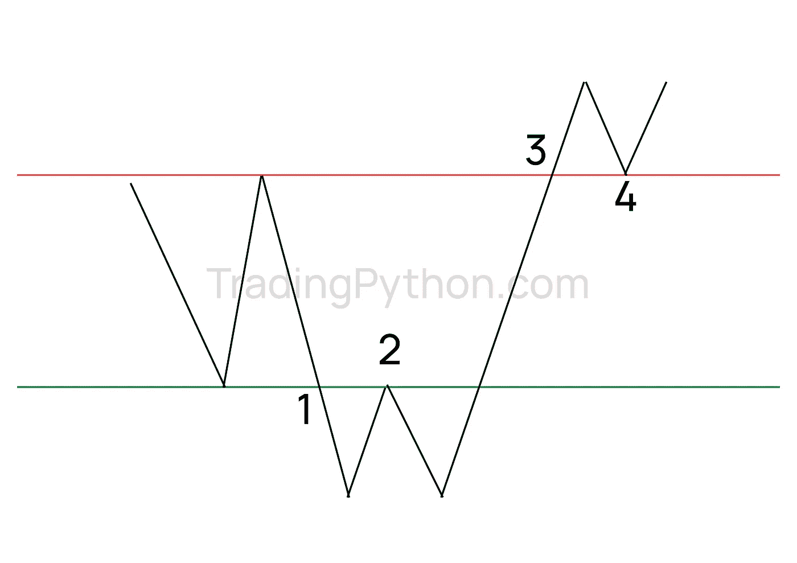
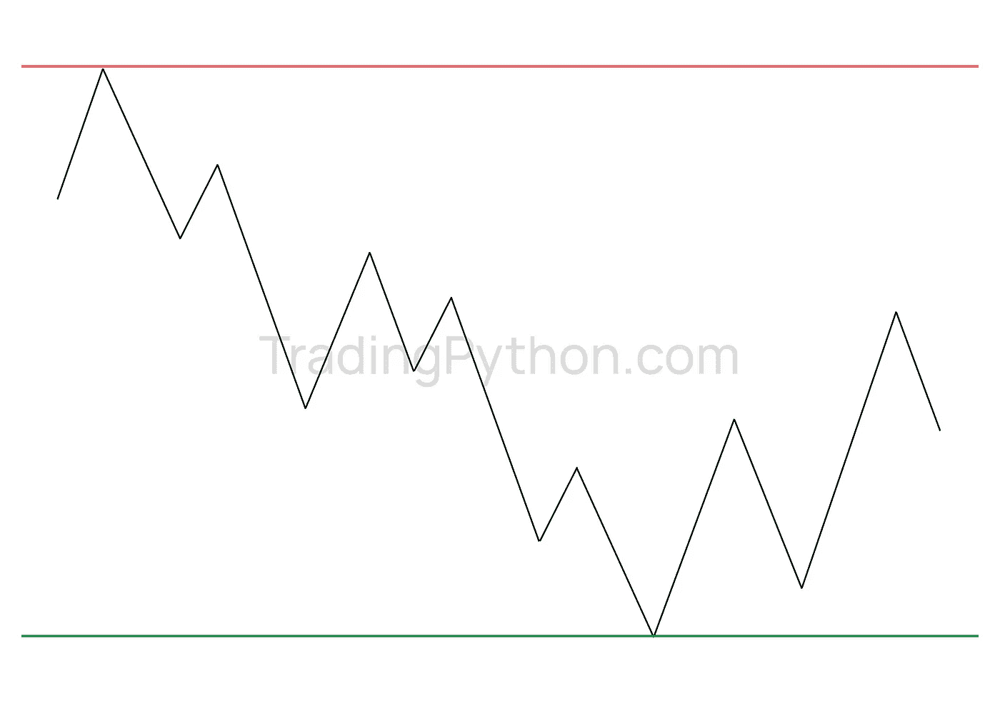

# 带着支持和阻力交易——为什么带着支持和阻力交易？

> 原文：<https://medium.com/coinmonks/trading-with-support-and-resistance-why-trade-support-resistance-96627c978e4b?source=collection_archive---------9----------------------->

Support and Resistance

无论你交易外汇、商品期货、期权还是股票，支撑和阻力都是大多数技术分析图表的基础。

毫无疑问，最重要和最可靠的指标是价格。很确切，没有滞后性，价格在一定水平。

价格不知道，如果它应该是超买或超卖，从而转向另一个方向。顺便说一句，这就是指标会把你引入歧途的地方。多年来，人们对技术指标非常着迷，事实上大多数交易平台都有技术指标。

当然，大多数技术指标的一个大问题是它们滞后于价格走势。我说的是 MACD、移动平均线、随机指标、相对强弱指标等等。深入研究每一个指标背后的数学公式已经超出了本次演讲的范围，但是可以说，精明的交易者需要非常清楚所有技术指标的基本限制，他们的使用应该非常谨慎。

从技术角度分析图表时，技术人员需要成为工具的主人，而不是工具的奴隶。技术指标只能用来确认价格告诉你的信息，而不是相反。例如，从数学的角度来看，很多时候随机指标是“超买”，然而，价格可以持续上涨很长时间。仅仅因为一个指标显示超买就卖出是愚蠢的。

我不是在暗示技术指标没有价值，所以请不要假设是这样的。我在交易中使用指标。我想说的是，如果你主要依靠，或者更糟，仅仅依靠技术指标，你就是在自找麻烦。正如我稍后将演示的那样，有很好的方法来使用它们。

另一方面，价格告诉你所有已经发生和正在发生的事情。这是有目共睹的。它是精确的，是即时的，没有滞后。你可以很容易地找出价格显示支撑或阻力的区域，以及价格巩固的区域。不是你认为它可能表示支持或抵制的地方，而是它实际上已经这样做的地方。

关键支撑位和阻力位的概念已经被我和其他交易者证明了，它提供了一致可靠的交易平台，我可以以此为基础进行交易。

请记住，仅仅因为指标“表明”价格应该这样或那样移动…对价格本身没有任何意义。作为交易者，你怎么能相信这些工具呢？进入 S&R……价格达到确定的高点和低点的概念对你的交易和你的指标的效率有很大的影响。换句话说，提前了解价格应该在哪里做出反应，可以提供惊人的优势，在市场处于“无人区”时，在黑暗中超越或长时间粘在屏幕上。

投机者不会改变市场……大型机构会，他们的行动基于关键价格水平。通过将你的交易限制在明确的价格支撑位和阻力位附近，你可以将你的交易与银行和大型机构的方向保持一致，希望能搭上他们的顺风车。

例如，如果你能够确定一个阻力位，在这个阻力位，价格有理由预期会反转，交易会更低…这将允许你作为交易者耐心等待…记住这个词！顺便说一下，保持耐心，什么都不做是一个交易头寸……而且它总是一个赢的头寸，因为你没有任何风险。

Support and Resistance

作为交易者，S&R 告诉了我们什么？

*   支撑位和阻力位确定了供求区域。
*   供应是图表上的一个区域，在这里卖家可能会压倒买家，导致市场下跌。在图表上，我们把这个叫做**阻力**。
*   需求是图表上的一个区域，买家可能会压倒卖家，导致市场上涨。在图表上，我们称之为**支撑**。
*   知道了这一点，在支撑位买入，在阻力位卖出才有意义。

# 确定关卡的强度

determine the strength of the level

如果价格突破这些区域，支撑可以变成阻力，阻力可以变成支撑。

在上图中，一旦价格跌破支撑位(1 ),它就成为阻力位(2 ),一旦价格突破阻力位(3 ),它就成为支撑位(4)。

**从长期来看，当市场跌至前期低点时，它比市场跌至前期高点时更重要。**

从短期来看，当市场交易到前期高点时，比交易到前期低点时更重要。

换句话说，一个支撑或阻力区域被“击中”的次数越多，它的意义就越大。支撑区和阻力区对于稳定的设置非常重要。

> 加入 Coinmonks [电报频道](https://t.me/coincodecap)和 [Youtube 频道](https://www.youtube.com/c/coinmonks/videos)了解加密交易和投资

## 另外，阅读

*   [Bookmap 点评](https://coincodecap.com/bookmap-review-2021-best-trading-software) | [美国 5 大最佳加密交易所](https://coincodecap.com/crypto-exchange-usa)
*   [如何在 FTX 交易所交易期货](https://coincodecap.com/ftx-futures-trading) | [OKEx vs 币安](https://coincodecap.com/okex-vs-binance)
*   [CoinLoan 评论](https://coincodecap.com/coinloan-review) | [YouHodler 评论](/coinmonks/youhodler-4-easy-ways-to-make-money-98969b9689f2) | [BlockFi 评论](https://coincodecap.com/blockfi-review)
*   [XT.COM 评论](https://coincodecap.com/profittradingapp-for-binance)币安评论 |
*   [SmithBot 评论](https://coincodecap.com/smithbot-review) | [4 款最佳免费开源交易机器人](https://coincodecap.com/free-open-source-trading-bots)
*   [比特币基地僵尸程序](/coinmonks/coinbase-bots-ac6359e897f3) | [AscendEX 审查](/coinmonks/ascendex-review-53e829cf75fa) | [OKEx 交易僵尸程序](/coinmonks/okex-trading-bots-234920f61e60)
*   [如何在印度购买比特币？](/coinmonks/buy-bitcoin-in-india-feb50ddfef94) | [瓦济克斯评论](/coinmonks/wazirx-review-5c811b074f5b)
*   [隐料斗替代品](/coinmonks/cryptohopper-alternatives-d67287b16d27) | [HitBTC 审查](/coinmonks/hitbtc-review-c5143c5d53c2)
*   [折叠 App 审核](https://coincodecap.com/fold-app-review) | [Kucoin 交易机器人](/coinmonks/kucoin-trading-bot-automate-your-trades-8cf0ca2138e0) | [Probit 审核](https://coincodecap.com/probit-review)
*   [如何匿名购买比特币](https://coincodecap.com/buy-bitcoin-anonymously) | [比特币现金钱包](https://coincodecap.com/bitcoin-cash-wallets)