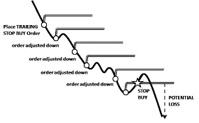

# 跟踪买入和跟踪卖出——它们到底是什么？

> 原文：<https://medium.com/coinmonks/trailing-buy-and-trailing-sell-what-the-heck-are-they-6745b813bd02?source=collection_archive---------49----------------------->

所以交易者是一个不同的品种。我们想买尽可能便宜的东西，也想卖尽可能多的钱。然而，找到这两个值总是一个很难达到的目标。

我们都经历过这种情况，认为#比特币将在 40000 点触底，并在其上下注。然后一个小时后，它回落到 35k 或 34k，我们让自己想进入更多，但我们在 40k 时全押。

很多时候，我们有市场买入和卖出，也有限价买入和卖出。如果你不知道这些是做什么的或者如何使用它们，请阅读我的其他文章，希望它们能帮助你。然而，有两个订单经常被忽视，但如果设置正确，有可能增加你获得“最佳性价比”的机会。

首先，我想解释的是，跟踪买卖有一个触发价格和一个反弹价格(或百分比)。当设置跟踪买入或卖出时，你需要弄清楚你想要的触发价格。所以你输入你的触发价格，然后你将解释订单中的最大反弹。

# 跟踪买入

对于这个例子，让我们用比特币来试试，如果我们想在 40k 建立一个追踪买入，10%的反弹意味着在 40k 他的价格将被触发。订单还不会触发，还需要再移动 10%才能正式买入。因此，如果 BTC 回到 44k，那么它将购买。

如果它继续下降呢？这就是乐趣的开始！如果价格持续下跌，并继续下跌到 3 万英镑，这是新的最低价，如果价格从 3 万英镑上涨 10%，那么就会发生买入。所以你的新价格是 33，000，而不是 40，000。

# 跟踪销售

同样的事情也会发生在追踪销售中，只是方向相反。假设你以 34k 的价格买了 BTC，想交易获利。你设定了 40k 的触发价格和 10%的反弹。因此，一旦 BTC 的价格达到 4 万英镑，你最少要卖 3.6 万英镑。然而，如果它继续下去，并爆发出一轮全面的牛市，你可能会获得更多的利润，而不仅仅是设置一个限价卖出。

# Pionex-内置交易机器人

为了使用这些功能，Pionex 是我通常使用的交换。然而，它们可以在许多不同的交易所找到，可以应用于你买卖的任何东西。如果你对这篇文章不清楚，请随时查看我为跟踪买卖功能制作的[视频](https://youtu.be/ivFrh0Flcb4)以及它是如何工作的！

YouTube 上的 grid bot Guru:[点击这里！](https://www.youtube.com/c/gridbotguru)

美国公民 pionex:[点击这里！](https://pionex.us/en-US/sign/ref/RnIZeirs)

全球公民 pionex:[点击这里！](https://www.pionex.com/en-US/sign/ref/zVt0KmHU)

报名参加比特币基地:[点击这里！](https://www.coinbase.com/join/wyatt_h)

> 加入 Coinmonks [电报频道](https://t.me/coincodecap)和 [Youtube 频道](https://www.youtube.com/c/coinmonks/videos)了解加密交易和投资

# 另外，阅读

*   [Bookmap 评论](https://coincodecap.com/bookmap-review-2021-best-trading-software) | [美国 5 大最佳加密交易所](https://coincodecap.com/crypto-exchange-usa)
*   最佳加密[硬件钱包](/coinmonks/hardware-wallets-dfa1211730c6) | [Bitbns 评论](/coinmonks/bitbns-review-38256a07e161)
*   [新加坡十大最佳加密交易所](https://coincodecap.com/crypto-exchange-in-singapore) | [购买 AXS](https://coincodecap.com/buy-axs-token)
*   [红狗赌场评论](https://coincodecap.com/red-dog-casino-review) | [Swyftx 评论](https://coincodecap.com/swyftx-review) | [CoinGate 评论](https://coincodecap.com/coingate-review)
*   [投资印度的最佳密码](https://coincodecap.com/best-crypto-to-invest-in-india-in-2021)|[WazirX P2P](https://coincodecap.com/wazirx-p2p)|[Hi Dollar Review](https://coincodecap.com/hi-dollar-review)