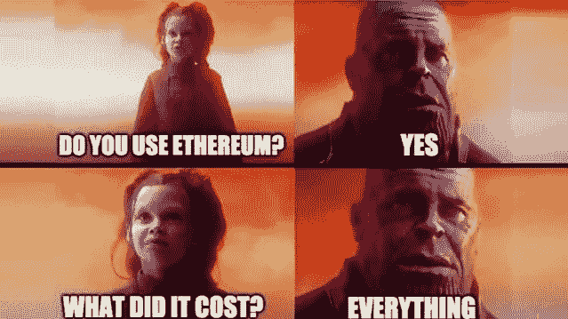
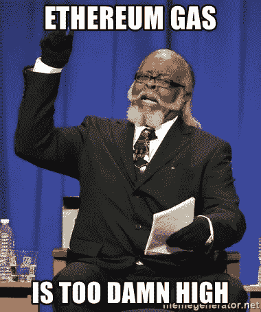
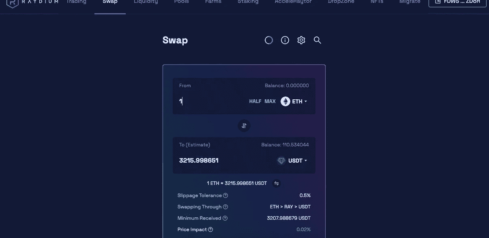
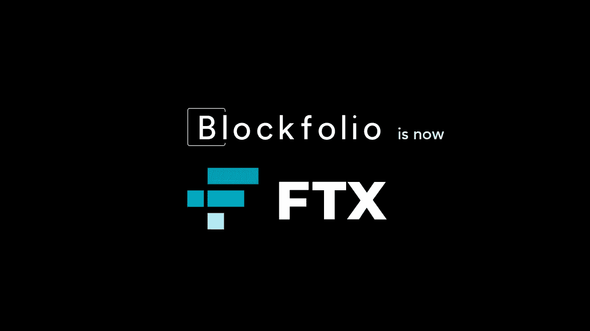

# 在主干网上传输以太网而不用支付荒谬的煤气费

> 原文：<https://medium.com/coinmonks/transfer-eth-on-mainnet-without-paying-ridiculous-gas-fee-d72cd4d35e55?source=collection_archive---------11----------------------->

以太坊 Mainnet 成了有钱人钱包的玩法。对于小鱼和散户来说，交易成本高得惊人。对于那些处理小数字的人来说，Mainnet 是不可触及的。

在 Mainnet 上获得以太坊要花很多钱，如果你只是想转移几百美元，那就变得非常昂贵。

想象一下，转让价值 100 美元的 ETH，并支付超过三分之一的天然气费用。在 Mainnet 上交易时，没有人能不支付高额的汽油费。然而，我有一个方法可以节省油费，同时可以从其他连锁店获得服务。

你猜怎么着，这几乎不用花钱。感兴趣，请继续阅读👇🏿

为了入门，我们轻装上阵吧。你所需要的只是一个像幻影一样的 Solana 钱包和一些 SOL 来支付交易，一个像 Metamask 一样的 web3 钱包来获得你的 ETH，你就可以开始了。(当然还有足够的资金在 SOL 上买 ETH)。

首先，给索拉纳做些 ETH。使用任何索拉纳 DEX，如雷迪姆或 FTX 亲获得对索拉纳醚。

一旦你在 Solana 上购买了一些 ETH，现在是时候在为你工作的神奇门户上获得它了。这款应用名为 FTX(以前的 Blockfolio)。安卓和 iPhone 都有。请随意使用我的推荐链接到[注册](https://link.blockfolio.com/9dzp/c1d7bd87)。

使用 Solana 网络将 ETH 从您的虚拟钱包转移到 FTX 地址。

**一旦资金进入 FTX，把它们转移到你的以太坊主网上。你猜怎么着？它是免费的。**

试试看，让我知道你的想法。也许，我也可以做个视频来帮忙。我希望这能对你有所帮助，并可能为你节省油费。

**万物区块链—** 追求简化元宇宙链的不同区块。

捐赠地址—0x e 9 f 581 e 005 cbb 94752 a 96198052088 f 206 AC 73 b 1
terra 156 dez wfl 55 zzck l5 ud 5tl 69 x 8 p 4 sh 5 zg3 vt 54 x

**下线**

[智囊团](https://app.usebraintrust.com/r/everything1/)，[循环](https://www.loop.markets?ref=39055)，[预研](https://www.presearch.org/signup?rid=2491437)，[奥德赛](https://odysee.com/$/invite/@Cyekmyster:3)，[币安](https://accounts.binance.com/en/register?ref=12626399)

**社交**

[Substack](https://everythingblockchain.substack.com/account?utm_source=menu-dropdown) ， [Twitter](https://twitter.com/cyekmyster) ， [Youtube](https://www.youtube.com/channel/UCkcc6EceEAu1sMoi2dKczCQ) ， [Medium](/@everythingblockchain) ， [Reddit](https://www.reddit.com/user/cyekmyster)

本文提供的任何或所有信息仅用于教育目的，不得视为投资建议。在正确呈现任何信息方面的任何失误都是我们的责任。我们否认与使用此内容相关的任何责任。

> 加入 Coinmonks [电报频道](https://t.me/coincodecap)和 [Youtube 频道](https://www.youtube.com/c/coinmonks/videos)了解加密交易和投资

# 另外，阅读

*   [如何开始通过加密贷款赚取被动收入](https://coincodecap.com/passive-income-crypto-lending)
*   [Coldcard 评论](https://coincodecap.com/coldcard-review) | [BOXtradEX 评论](https://coincodecap.com/boxtradex-review)|[uni swap 指南](https://coincodecap.com/uniswap)
*   [比特币基地 vs 瓦济克斯](https://coincodecap.com/coinbase-vs-wazirx) | [波洛涅克斯 vs 比特雷克斯](https://coincodecap.com/poloniex-vs-bittrex) | [购买流量令牌](https://coincodecap.com/buy-flow-token)
*   [阿联酋 5 大最佳加密交易所](https://coincodecap.com/best-crypto-exchanges-in-uae) | [SimpleSwap 评论](https://coincodecap.com/simpleswap-review)
*   [购买 Dogecoin 的 7 种最佳方式](https://coincodecap.com/ways-to-buy-dogecoin) | [ZebPay 评论](https://coincodecap.com/zebpay-review)