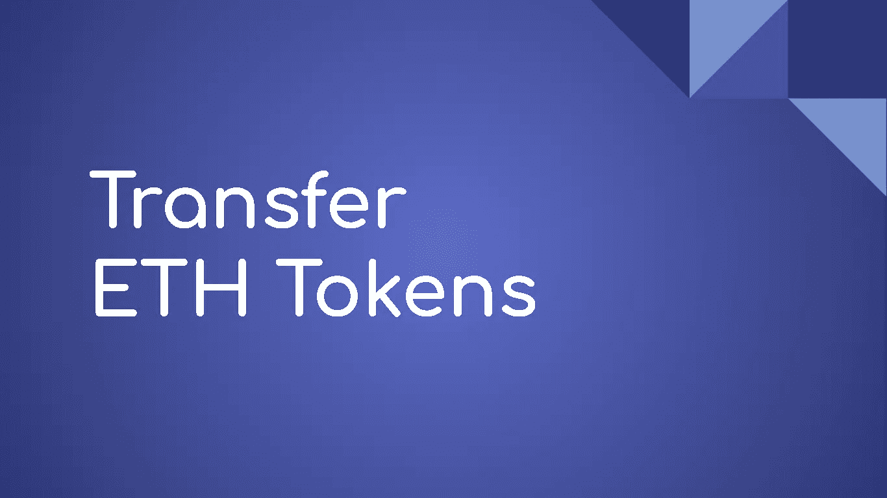
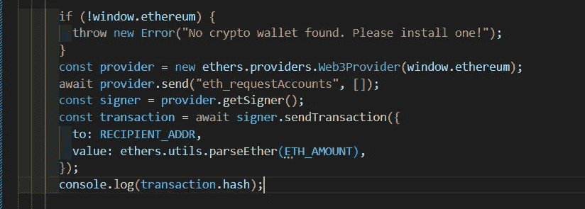

# 转移以太网令牌

> 原文：<https://medium.com/coinmonks/transfer-eth-tokens-dd1596cbed16?source=collection_archive---------22----------------------->

## 区块链系列

## 如何使用 Ethers.js 库传输 ETH 令牌

本文介绍了如何使用 Ethers.js 库将 ETH 令牌从一个钱包转移到另一个钱包。



## Ethers.js

[Ethers.js](https://docs.ethers.io/v5/) 库用于与以太坊区块链交互。

```
Import Ethers.js
---------------------------import {ethers} from ‘ethers’
```

## 代码片段



Credit: Author

以太坊提供商在网络浏览器中以 **window.ethereum** 的名称出现。提供商提供网络连接。 **Web3Provider** 包装了 Web 浏览器中可用的提供者。然后，提供商可以向用户发送连接钱包的许可请求。一个**签名者**持有私钥，可以对交易进行签名。

```
RECIPIENT_ADDR -> wallet address of the user to whom we wish to transfer the ETH.ETH_AMOUNT -> amount of Ether to send.
```

**ethers . utils . parse Ether()**将乙醚转换为魏。

我们还可以使用**ethers . utils . get address(RECIPIENT _ ADDR)**来验证地址格式。

## 祝转学愉快！

> 加入 Coinmonks [电报频道](https://t.me/coincodecap)和 [Youtube 频道](https://www.youtube.com/c/coinmonks/videos)了解加密交易和投资

# 另外，阅读

*   [加密交易机器人](/coinmonks/crypto-trading-bot-c2ffce8acb2a) | [OKEx vs 币安](https://coincodecap.com/okex-vs-binance)
*   [币安 vs FTX](https://coincodecap.com/binance-vs-ftx) | [最佳(索尔)索拉纳钱包](https://coincodecap.com/solana-wallets)
*   [如何在 Uniswap 上交换加密？](https://coincodecap.com/swap-crypto-on-uniswap) | [A-Ads 评论](https://coincodecap.com/a-ads-review)
*   [加密货币储蓄账户](/coinmonks/cryptocurrency-savings-accounts-be3bc0feffbf) | [YoBit 评论](/coinmonks/yobit-review-175464162c62)
*   [Botsfolio vs nap bots vs Mudrex](/coinmonks/botsfolio-vs-napbots-vs-mudrex-c81344970c02)|[gate . io 交流回顾](/coinmonks/gate-io-exchange-review-61bf87b7078f)
*   [CoinFLEX 评论](https://coincodecap.com/coinflex-review) | [AEX 交易所评论](https://coincodecap.com/aex-exchange-review) | [UPbit 评论](https://coincodecap.com/upbit-review)