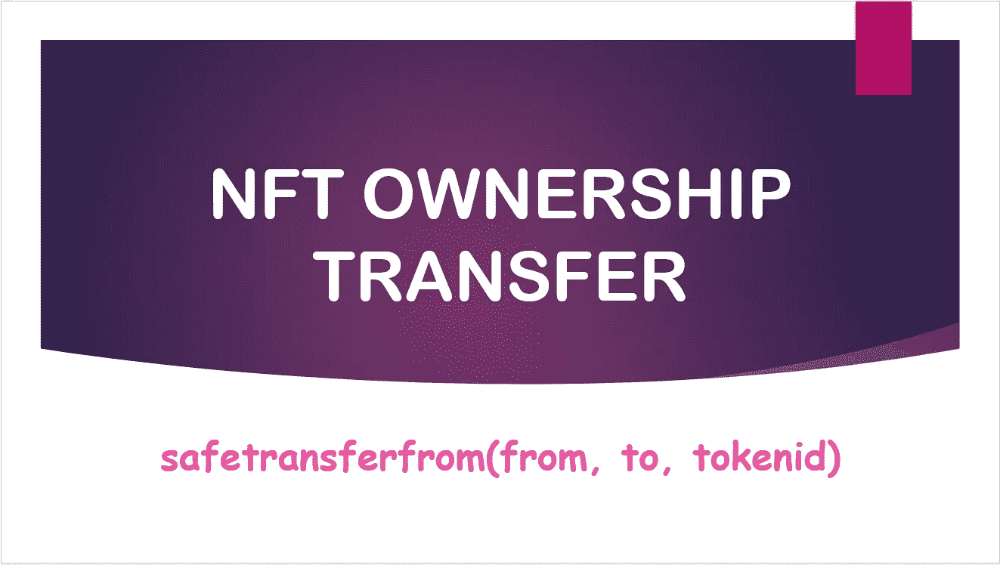
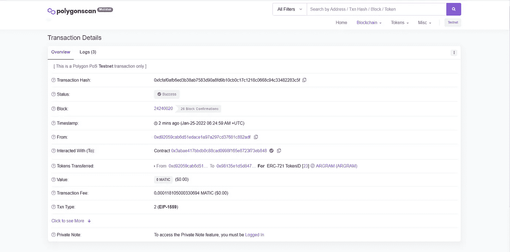

# 转让 NFT 的所有权

> 原文：<https://medium.com/coinmonks/transfer-ownership-of-an-nft-e0699c029fcf?source=collection_archive---------6----------------------->

## NFT 系列

## 关于如何将 NFT 的所有权从一个钱包地址转移到另一个钱包地址的指南

*在本文的上下文中，我们试图使用 ERC-721 智能契约的****ethers . js****库和****safetransform(from，to，tokenId)*** *方法，在服务器端将 NFTs 从一个地址安全地传输到另一个地址。作为其中一部分的所有交易都在 Polygon Mumbai Testnet 上进行。*



## 先决条件

***1。在任何区块链网络上部署您的 ERC-721 智能合同***

[](https://coinsbench.com/erc-721-nft-smart-contract-deployment-using-hardhat-97c74ce1362a) [## ERC-721 (NFT)智能合同部署—使用安全帽

### 关于如何编写和部署 ERC-721 标准智能合同的指南

coinsbench.com](https://coinsbench.com/erc-721-nft-smart-contract-deployment-using-hardhat-97c74ce1362a) 

**②*。根据部署的智能合同*** 制造一台 NFT

[](/coinmonks/mint-an-nft-in-a-decentralized-manner-using-alchemy-ethers-js-pinata-apis-da69a3b83d84) [## 以分散的方式制造 NFT——使用 Alchemy，Ethers.js & Pinata APIs

### 如何在 alchemy、ethers.js 和 pinata 的帮助下分散铸造 NFT 的指南

medium.com](/coinmonks/mint-an-nft-in-a-decentralized-manner-using-alchemy-ethers-js-pinata-apis-da69a3b83d84) 

现在让我们看看如何将 NFT 从一个钱包地址转移到另一个钱包地址！

## 第一步:买一些假 MATIC

由于区块链交易必然要付汽油费，我们需要收集一些假的 MATIC 来转移 NFT。

从这里弄点假的 MATIC:[https://faucet.polygon.technology/](https://faucet.polygon.technology/)。

其他可用的自动水龙头:

1.  [https://faucet.pearzap.com/](https://faucet.pearzap.com/)
2.  [https://matic.supply/](https://matic.supply/)
3.  [https://www.coinclarified.com/tools/faucets/polygon](https://www.coinclarified.com/tools/faucets/polygon)
4.  [https://faucet.firebird.finance/](https://faucet.firebird.finance/)

## 第二步:创建。环境文件

```
API_URL = “RPC Node URL"PRIVATE_KEY = "sendor's metamask private key"PUBLIC_KEY = "sendor's metamask wallet address"CONTRACT_ADDRESS = "deployed contract address"USER_ADDRESS = "recipient's wallet address"
```

## 步骤 3:创建 nft-trasnfer.js 文件

将以下内容复制到文件中。

指定你铸造一枚 NFT 后将获得的 NFT 代币。

*safetransformfrom*是一个重载函数。在 ethers.js 中，调用重载函数的语法不同于非重载函数。这里可以参考[。](https://docs.ethers.io/v5/single-page/#/v5/migration/web3/-%23-migration-from-web3-js--contracts--overloaded-functions)

```
**const { ethers } = require("ethers");
const contract = require("../artifacts/contracts/ArGram.sol/ArGram.json");
const {
   API_URL,
   PRIVATE_KEY,
   PUBLIC_KEY,
   CONTRACT_ADDRESS,
   USER_ADDRESS
} = process.env;****const provider = new ethers.providers.JsonRpcProvider(API_URL);
const wallet = new ethers.Wallet(PRIVATE_KEY, provider);**//Get gas price **const gasPrice = await provider.getGasPrice();**//Grab contract ABI and create an instance **const nftContract = new ethers.Contract(
   CONTRACT_ADDRESS,
   contract.abi,
   wallet
);**//Estimate gas limit **const gasLimit = await nftContract.estimateGas["safeTransferFrom(address,address,uint256)"](PUBLIC_KEY, USER_ADDRESS, tokenId, { gasPrice });**//Call the safetransfer method **const transaction = await nftContract["safeTransferFrom(address,address,uint256)"](PUBLIC_KEY, USER_ADDRESS, tokenId, { gasLimit });**//Wait for the transaction to complete **await transaction.wait();****console.log("Transaction Hash: ", transaction.hash);**
```

您将得到如下响应:

```
Transaction Hash: 0xfcfaf0afb6ed3b38ab7583d90a8fd9b10cb0c17c1218c0668c94c33482283c5f
```

你可以在 mumbai [polygonscan](https://mumbai.polygonscan.com/) 上核实交易。



Transaction on Polygon Mumbai

太好了！您已成功转移您的 NFT！

祝你转会愉快！

> 加入 Coinmonks [电报频道](https://t.me/coincodecap)和 [Youtube 频道](https://www.youtube.com/c/coinmonks/videos)了解加密交易和投资

# 另外，阅读

*   [加密复制交易平台](/coinmonks/top-10-crypto-copy-trading-platforms-for-beginners-d0c37c7d698c) | [五大 BlockFi 替代方案](https://coincodecap.com/blockfi-alternatives)
*   [CoinLoan 点评](https://coincodecap.com/coinloan-review)|[Crypto.com 点评](/coinmonks/crypto-com-review-f143dca1f74c) | [火币保证金交易](/coinmonks/huobi-margin-trading-b3b06cdc1519)
*   [Bybit vs 币安](https://coincodecap.com/bybit-binance-moonxbt)|[stealth x 回顾](/coinmonks/stealthex-review-396c67309988) | [Probit 回顾](https://coincodecap.com/probit-review)
*   [顶级付费加密货币和区块链课程](https://coincodecap.com/blockchain-courses)
*   [CBET 评论](https://coincodecap.com/cbet-casino-review) | [库科恩 vs 比特币基地](https://coincodecap.com/kucoin-vs-coinbase) | [拜比特 vs 比特币基地](https://coincodecap.com/bybit-vs-coinbase)
*   [如何在加拿大购买加密货币？](https://coincodecap.com/how-to-buy-cryptocurrency-in-canada)