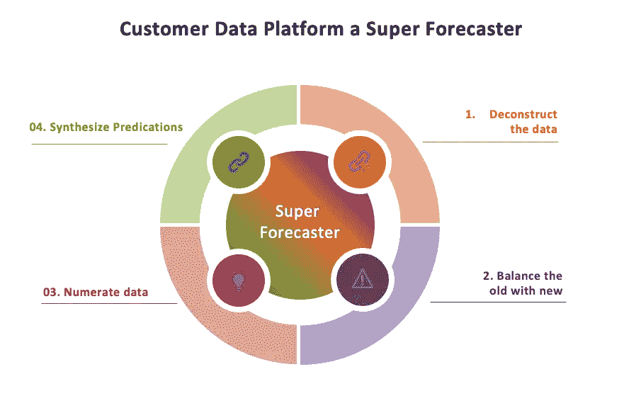

# 将客户数据平台(CDP)转变为超级预测者

> 原文：<https://medium.com/coinmonks/transform-customer-data-platform-cdp-into-super-forecaster-1f7d1988a5d1?source=collection_archive---------4----------------------->

互联客户体验的基础是准确预测客户的行动，即“最佳下一步行动(BNA)”。预测人类行为通常被归类为组织设置中的客户或用户行为。我们有信心“最佳下一步行动”将成为 CX 的基础吗？

预测的结果呢？

我们能根据事实证据预测结果吗？

为了解决当今客户的多样化需求，我们需要一个“超级预测者”。我们能否将客户数据平台转变为超级预测器，从而允许？

预测最佳的下一步行动

预测最佳下一步行动的结果

客户数据平台作为一个超级预测器，将允许营销人员不仅预测“最佳下一步行动”，而且预测营销人员将如何处理最佳下一步行动以及最重要的是什么。这将允许营销人员尽可能精确地做出预测。

**将客户数据平台转变为拥有更大更好数据的超级预测者**

一个成功的组织最大的资产是“数据”。数据驱动营销的主要瓶颈是缺乏完整的数据。是的，缺乏完整的数据，组织拥有大量的第一方数据、第二方数据和第三方数据。第一方数据利用最不充分，主要是因为数据缺乏完整性，并且过度依赖小样本来推断不同客户的特征。

客户数据平台对营销之外的数据的可访问性将在不同数据集之间创建经验关系。

***客户数据平台(预测+预测结果)=超级预测师***

*图 1:将 CDP 转变为超级预测者*

**01。构建和解构数据**

数据的完整性一直是个问题。客户数据平台的真正潜力在于它能够构建和解构数据，从而产生关于以下方面的见解

**协调**:人们可以构建和解构数据，根据从不同数字接触点和渠道获取的数据创建协调，以优化后续行动。

**相关性**:解构“客户 360——简档&偏好”,了解上下文，以构建“最佳后续行动”的意图。

**自适应:**解构数据，寻找一个个体与另一个客户有何不同，令人困惑！将客户识别为不同的客户群体或客户类型。验证通用业务规则是否适用于所有客户类型。

在部署客户数据平台时，这种能力对您的数据策略非常重要，因为它为您提供了询问数据完整性问题的基本理由。所以下次，当你处理客户 360 平台和讨论时，看看你或你的团队或客户数据平台是否有能力解构数据。

**02。平衡新旧**

我强调更大和更好的数据，而打开超级预测是有目的的。对我来说，我们有一个术语“实验”,它是新旧数据的融合。我们经常根据现有的数据(旧的)联系客户，并根据客户的反应(新的)进行跟进。

我的客户数据平台是否能让我以可控的方式将新数据合并到最新预测中？

我的客户数据平台是否赋予我忽略无关数据的能力？

经常以小增量更新，让您充分利用您的实验策略。这为新数据如何有助于优化客户体验提供了指导。增量更新让您了解数据集之间的条件依赖性以及做出精确决策的独立性。这也将挖掘出数据集的哪些部分是你知道的，哪些是你不知道的。最后

你可以忽略不相关的数据

可为更好的体验确定的数据集

同步您的发现

**03。计算数据**

从“贝叶斯的核心洞察力”中学习——解构和平衡数据使组织有机会逐步建立精确的预测，即与意图相匹配的行动。为了计算数据，我们必须将意图分解成

**最初的驱动因素**:产品本身或服务、顾客的需求或偏好等基本因素驱动着顾客的行为

**中间驱动因素**:顾客和品牌之间过去的互动，如整体顾客体验、顾客满意度、忠诚度和使用模式，可以帮助决定行动

**显式驱动因素**:最重要的一组数据是显式观察到的行为数据，如购买、访问、浏览历史、点击等，这是决定行动所需的最重要信号。

**04。综合预测**

“蜻蜓眼预测”看到多张图片并将它们合成为一张图片，因此客户数据平台必须提供

不仅是“最佳下一步行动”,还有在什么情况下可能会更好

能够根据意图区分行动，最确定、确定、可能和不可能

客户采取“最佳下一步行动”的不确定程度

综合预测需要协调来自数据管理不同阶段的数据，即

数据收集到汇总

聚合到统一

统一到激活

激活到接收

对账接待

这无疑让组织更好地了解在什么情况下什么会起作用，即“最佳下一步行动的结果”。

在我结束之前，这是客户数据平台的早期阶段，有更多的领域需要开拓和探索，有更多的法律需要建立。重要的是，CDP 不应仅仅被视为客户 360，而是新一代“超级预测者”平台，具有以下优势

更大更好的数据

数据的完整性

接触接触渠道

访问成熟的营销自动化平台

最后，客户数据平台将使我们有机会培养能够推动预测实践改进的数据。

兴奋地接受你的意见[蒂姆·麦克维](https://medium.com/u/7421f19f3267?source=post_page-----1f7d1988a5d1--------------------------------)乔·伯杰 保罗·奥布莱恩 布拉德·海恩斯

> 交易新手？尝试[加密交易机器人](/coinmonks/crypto-trading-bot-c2ffce8acb2a)或[复制交易](/coinmonks/top-10-crypto-copy-trading-platforms-for-beginners-d0c37c7d698c)