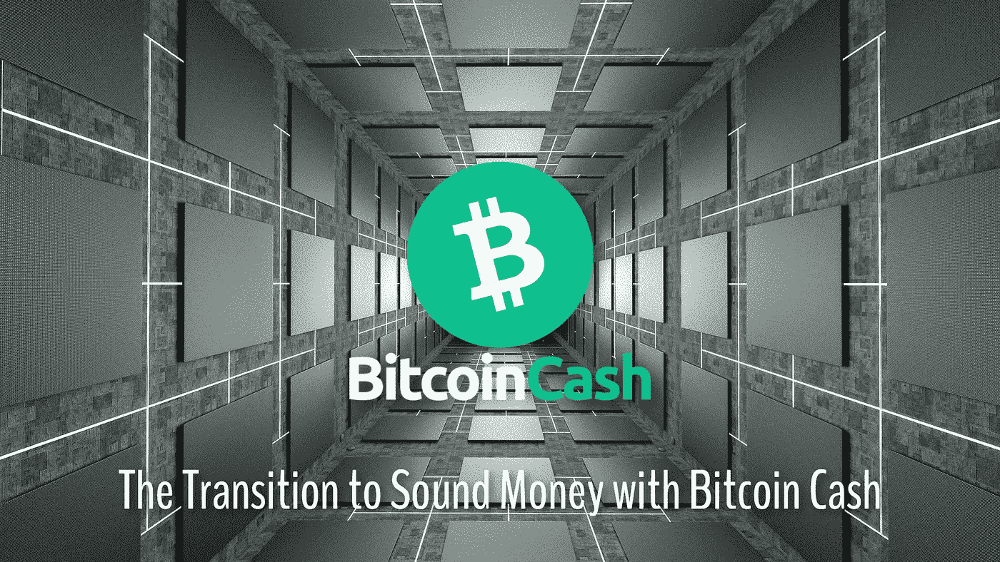

# 用比特币现金向健全货币过渡

> 原文：<https://medium.com/coinmonks/transition-to-sound-money-with-bitcoin-cash-bb7cfe5e8b1c?source=collection_archive---------45----------------------->

*Cover Photo: by “* [*Thor_Deichmann*](https://pixabay.com/users/thor_deichmann-2306827/)*” on* [*Unsplash*](https://pixabay.com/illustrations/tunnel-architecture-space-station-5021975/) *(modified)*

当我第一次研究比特币时，我遇到了多个从 2010 年到 2015 年的早期视频，比特币爱好者解释了比特币如何给全球支付和商业带来变革。

一些视频也包含价格预测，尽管重要的是压倒性的一致意见，即采用是最重要的，价格上涨将是一个…