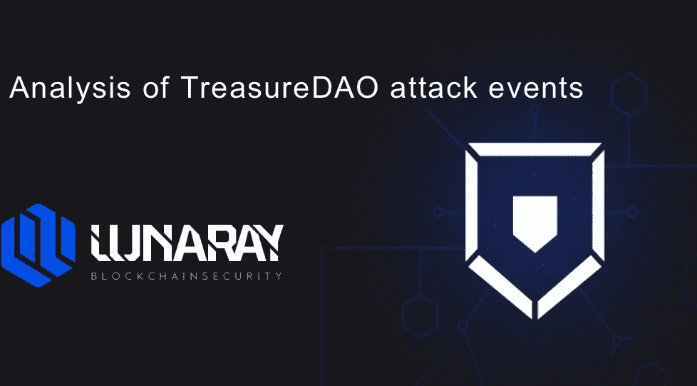
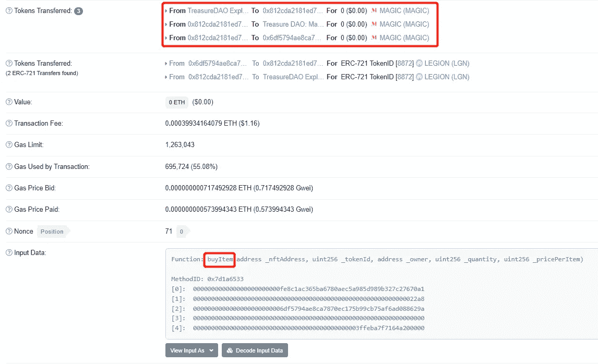
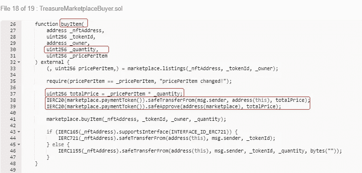
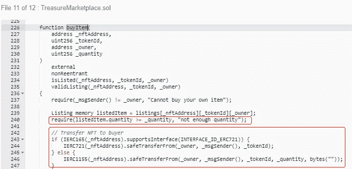
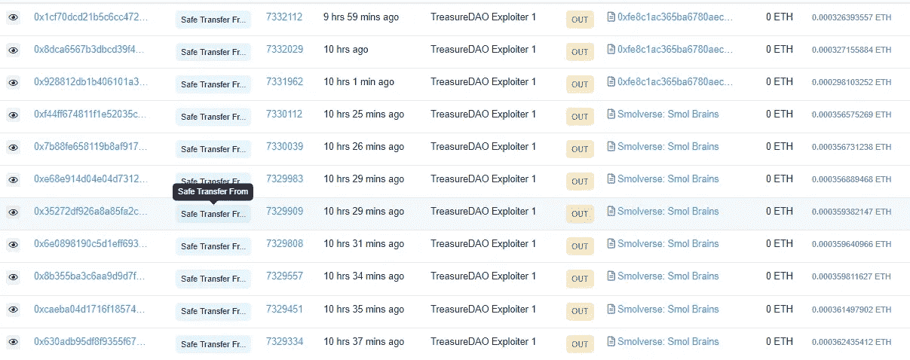

# 宝岛黑客已经开始归还被盗的 NFT

> 原文：<https://medium.com/coinmonks/treasuredao-hackers-have-started-returning-stolen-nfts-fecac32cdb10?source=collection_archive---------40----------------------->

> 本文将解释和分析宝岛黑客是如何开始归还被盗的 NFT 的
> 
> 欢迎关注并与我们讨论
> 
> 作者:[support@lunaray.co](mailto:support@lunaray.co)

## 0x01 事件背景

Treasure 通过开放和可组合的方式将 NFTs、DeFi 和游戏结合在一起，为元宇宙的发展搭建了桥梁。宝岛被黑，100 多枚 NFT 代币被盗，价值约 140 万美元。

## 0x02 事件分析

通过初步跟踪分析，攻击者的钱包地址:

 [## 地址 0x 9 B1 ACD 4336 ebf 7656 f 49224d 14 a 892566 FD 48 e 68 | Arbiscan

### 地址 0x 9 B1 ACD 4336 ebf 7656 f 49224d 14 a 892566 FD 48 e 68 页面允许用户查看交易、余额、代币持有量…

arbiscan.io](https://arbiscan.io/address/0x9b1acd4336ebf7656f49224d14a892566fd48e68) 

攻击交易:

 [## Arbitrum 事务哈希(Txhash)详细信息| Arbiscan

### 0xb 169 e 20 b 45 c 6 a5 b 7 e 5726 c 812 af 73 c0b 48996 a4 db 04 b 076d 6 ef 484 ca 5a 300d 36 1 天前 2 小时(2022 年 3 月 3 日 12:40:51 AM +UTC)…

arbiscan.io](https://arbiscan.io/tx/0xb169e20b45c6a5b7e5726c812af73c0b48996a4db04b076d6ef484ca5a300d36) 

出现漏洞的官方合同地址:

**TreasureMarketplaceBuyer**

[https://arbiscan . io/address/0x 812 CDA 2181 ed7 c 45 a 35 a 691 E0 c 85 e 231d 218 e 273 # code](https://arbiscan.io/address/0x812cda2181ed7c45a35a691e0c85e231d218e273#code)

**财资市场**

 [## 合同地址 0x 2 E3 b 85 f 85628301 A0 BCE 300 dee 3 a6b 04195 a 15 ee | Arbiscan

### spdx-license-identifier:MIT pragma solidity ^0.8.0；导入"../utils/context . sol "；/* * * * @开发合同模块…

arbiscan.io](https://arbiscan.io/address/0x2e3b85f85628301a0bce300dee3a6b04195a15ee#code) 

## 0x03 攻击详细信息

从攻击交易中可以清楚地看到，攻击者调用**TreasureMarketplaceBuyer**契约中的 **buyItem** 方法获取 NFT，攻击者提供的购买资金为 0。这里需要注意的是， **buyItem** 方法中的第四个 parameter _quantity 是作为 0 传递的。

分析 **buyItem** 方法可以明确，这里的 _quantity 参数，也就是购买数量，是用户输入的，但是在第 37 行的计算中，价格和购买数量都乘以零，最后的价格也是零。用户已完成零资金购买。让我们继续分析攻击者如何将零资金购买的 NFT 转移到他的账户。转账后，这里调用市场契约中的 **buyItem** 方法。

上图中 buyItem 方法中的两个判断条件，首先是判断 NFT 所有者的异同，然后是判断 NFT 的数量。由于攻击者传递零参数，所以很容易绕过这里的判断。NFT 的收购是零成本成功的。攻击者利用该漏洞多次调用 buyItem 方法，以零成本获得大量 NFT 令牌。
目前，财宝已经发布公告，称交易已经被冻结，攻击者也正在归还 NFT。

## 0x04 总结

虽然攻击者通过合同用 0 资金购买 NFT，但随后逐渐归还所获得的 NFT 令牌。暂时不确定是不是测试人员做的，希望用户和官方不要有什么大的经济损失。从本次攻击事件来看，攻击者抓住了 0 资金购买 NFT 的合同缺乏限制，导致通过该漏洞获得大量 NFT 代币。因此，针对上述合同漏洞，我们的技术安全团队给出以下建议:

## 0x05 安全建议

建议合同应严格判断用户输入的采购数量的合理性

提议的合同限制了零资金购买非功能性交易的可能性

*   建议严格区分 ERC721 和 ERC1155 协议的 NFT 令牌，以避免混淆。

> *加入 Coinmonks* [*电报频道*](https://t.me/coincodecap) *和* [*Youtube 频道*](https://www.youtube.com/c/coinmonks/videos) *了解加密交易和投资*

# 另外，阅读

*   [如何在 Uniswap 上交换加密？](https://coincodecap.com/swap-crypto-on-uniswap) | [A-Ads 审查](https://coincodecap.com/a-ads-review)
*   [加密货币储蓄账户](/coinmonks/cryptocurrency-savings-accounts-be3bc0feffbf) | [YoBit 评论](/coinmonks/yobit-review-175464162c62)
*   [Botsfolio vs nap bots vs Mudrex](/coinmonks/botsfolio-vs-napbots-vs-mudrex-c81344970c02)|[gate . io 交流回顾](/coinmonks/gate-io-exchange-review-61bf87b7078f)
*   [CoinFLEX 评论](https://coincodecap.com/coinflex-review) | [AEX 交易所评论](https://coincodecap.com/aex-exchange-review) | [UPbit 评论](https://coincodecap.com/upbit-review)
*   [AscendEx 保证金交易](https://coincodecap.com/ascendex-margin-trading) | [Bitfinex 赌注](https://coincodecap.com/bitfinex-staking) | [bitFlyer 评论](https://coincodecap.com/bitflyer-review)
*   [Bitget 回顾](https://coincodecap.com/bitget-review)|[Gemini vs block fi](https://coincodecap.com/gemini-vs-blockfi)cmd |[OKEx 期货交易](https://coincodecap.com/okex-futures-trading)
*   [AscendEx Staking](https://coincodecap.com/ascendex-staking)|[Bot Ocean Review](https://coincodecap.com/bot-ocean-review)|[最佳比特币钱包](https://coincodecap.com/bitcoin-wallets-india)
*   [霍比评论](https://coincodecap.com/huobi-review) | [OKEx 保证金交易](https://coincodecap.com/okex-margin-trading) | [期货交易](https://coincodecap.com/futures-trading)