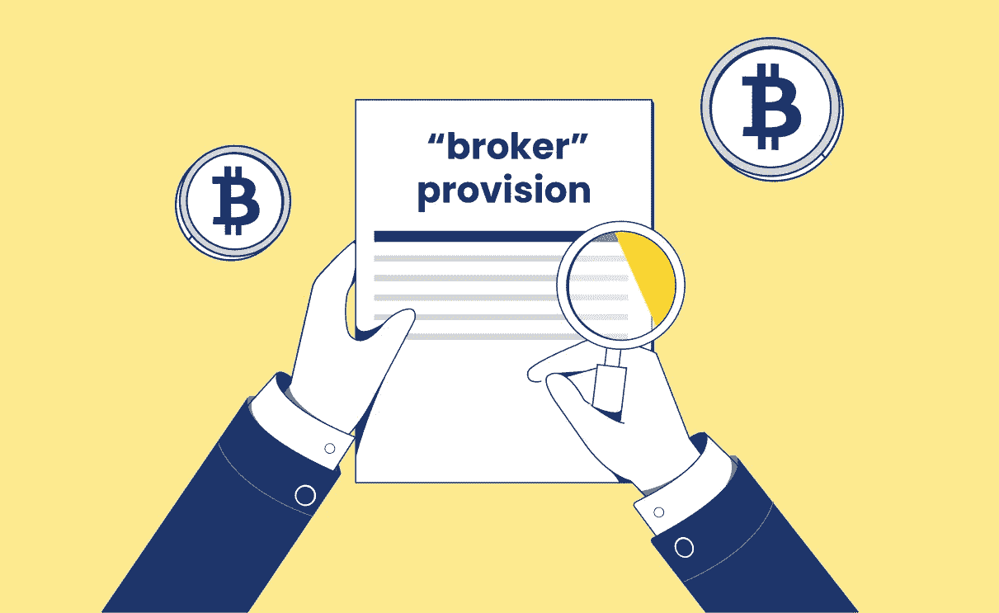

# 财政部将严格适用要求报告的“经纪人”条款

> 原文：<https://medium.com/coinmonks/treasury-will-narrowly-apply-the-broker-provision-that-requires-reporting-53ce6ea9ef33?source=collection_archive---------80----------------------->

2022 年 2 月，美国财政部发布了一封信，称它不会狭隘地适用 2021 年 11 月成为法律的基础设施法案中的经纪人报告条款，该条款对被视为“经纪人”的加密投资者提出了繁重的税务报告要求。

经纪人的指定将迫使公司——无论大小——收集和披露客户的详细信息，包括姓名和地址、销售总收入以及任何资本收益或损失。几个月来，行业和贸易协会一直认为，加密货币领域的某些群体，如利益相关者和矿工，无法获得这种信息，这将使加密税收合规性极其困难，如果不是不可能的话。

彭博新闻最先报道了这封信，并认为这是财政部负责立法事务的助理部长 Jonathan Davidson 所为。据**篇，信上写明:**

***“…该部门的观点是‘不能获得对 IRS 有用的信息的附属方不在经纪人报告要求的范围内。’这种语言表明，使用挖掘或赌注来验证加密交易的人，以及软件和硬件提供商，将能够避免这些要求。”***

**文章接着指出，财政部将在未来发布自己的拟议法规，以描述其对定义“经纪人”一词的看法。这封信缓解了加密行业团体和公司此前表达的许多担忧。**

# **无论税法如何变化，Cointelli 都会为您提供保障**

**不管美国财政部将来如何解释“加密经纪人”这个术语，都无关紧要——因为 [Cointelli](https://cointelli.com/how-cointelli-works) 已经涵盖了这一切。我们的加密专家和注册会计师(CPAs)团队定期搜索美国税法，以了解政府提出的最新更新、修订或变更。**

**此外， [Cointelli](https://cointelli.com/features) 有助于报税员遵守业内最可靠的自动化加密交易传输流程，支持比许多其他竞争对手多得多的主要加密交换，并具有完整的数据导入功能。Cointelli 支持的交易所包括比特币基地、币安和 KuCoin 等大公司，但也包括许多更小众的交易所。**

**此外，Cointelli 还支持至少 15 种区块链，包括主要的比特币、以太坊，甚至 Dogecoin。Cointelli 不仅确保将您的加密交易的最可靠数据传输到其在线税务解决方案中，而且一旦计算完成、复核并加载到税务文档中，Cointelli 就可以与市场上最受欢迎的税务和会计软件同步并协同工作。**

**因为许多加密货币税务软件平台在与这些应用程序一起工作时受到限制，所以重要的是要找出加密税务软件是否与 [*TurboTax*](https://youtu.be/fceftWqAw2o) 等一起工作，或者与注册会计师使用的软件一起工作。Cointelli 提供了与以上两者的兼容性以及更多。它以一种形式生成您的税务报告，可以直接上传到 *TurboTax* 和 *TaxAct、*，还可以通过电子邮件将您的税务报告直接发送给您的会计师，只需点击“发送给会计师”按钮。**

**虽然财政部决定限制加密“经纪人”条款的应用，从而降低了某些加密投资者的纳税申报要求，但 Cointelli 通过[使您的整个纳税准备和申报流程](https://cointelli.com/blog/best-crypto-tax-software)比您想象的更简单，从而减少了您的压力和担忧。**

***免责声明:本帖仅供参考，不应被解释为或依赖于替代财务、法律或税务专业人士的建议。此外，本内容仅涉及美国公民和居民的美国联邦所得税后果，不涉及可能与受特殊规则约束的特定人员(如经销商或贸易商)相关的税务后果。您应该咨询您自己的财务、法律或税务专业人士，以报告和提交您的加密税或根据您的特定情况做出决定。法律、法规或现有法律的解释可能会发生变化，这可能会对未来或追溯产生不利影响。这篇文章的内容可能会有变化。***

> **加入 Coinmonks [电报频道](https://t.me/coincodecap)和 [Youtube 频道](https://www.youtube.com/c/coinmonks/videos)了解加密交易和投资**

# **另外，阅读**

*   **[Bookmap 点评](https://coincodecap.com/bookmap-review-2021-best-trading-software) | [美国 5 大最佳加密交易所](https://coincodecap.com/crypto-exchange-usa)**
*   **最佳加密[硬件钱包](/coinmonks/hardware-wallets-dfa1211730c6) | [Bitbns 评论](/coinmonks/bitbns-review-38256a07e161)**
*   **[新加坡十大最佳加密交易所](https://coincodecap.com/crypto-exchange-in-singapore) | [购买 AXS](https://coincodecap.com/buy-axs-token)**
*   **[红狗赌场评论](https://coincodecap.com/red-dog-casino-review) | [Swyftx 评论](https://coincodecap.com/swyftx-review) | [CoinGate 评论](https://coincodecap.com/coingate-review)**
*   **[投资印度的最佳密码](https://coincodecap.com/best-crypto-to-invest-in-india-in-2021)|[WazirX P2P](https://coincodecap.com/wazirx-p2p)|[Hi Dollar Review](https://coincodecap.com/hi-dollar-review)**