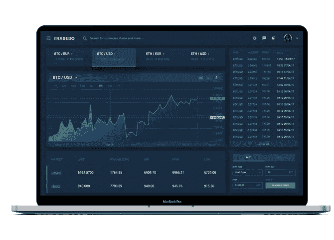
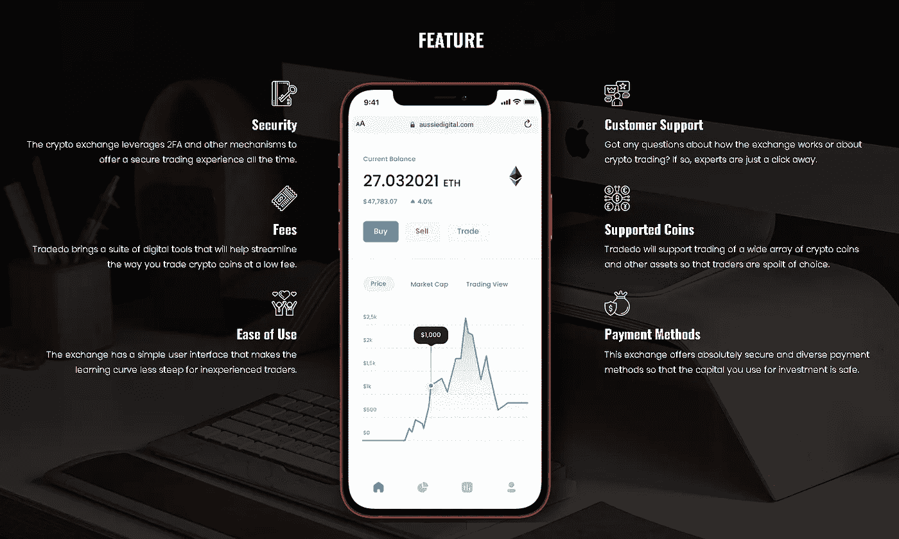

# TRADEDO 交易交易所——完成节点测试

> 原文：<https://medium.com/coinmonks/trededo-trading-exchange-finished-node-testing-bf593e457b7e?source=collection_archive---------32----------------------->

Tradedo

Aussie Digital 的交易交易所 Tradedo 使商家和购物者能够利用领先的加密硬币，只需点击几下鼠标就可以买卖服务和产品。

Tradedo 是 Aussie Digital 的本地交易交换平台，具有革新加密交易的潜力。从拥有一个用户友好的界面到成为一个安全的交易平台，Tradedo 让加密交易者，甚至是新手，完全有信心交易加密资产，没有任何麻烦。

FEATURE

该平台将允许交易者方便快捷地购买最受欢迎的加密硬币。该生态系统的原生硬币 AUDCoin 将在 Tradedo 上用于购买其他加密资产。澳新数码背后的创造者将 Tradedo 称为生态系统的“引擎室”。现在，让我们快速看一下使这个加密交易门户成为商业中最好的门户之一的一些亮点。

在 Tradedo，您将获得无缝、安全的加密交易体验。该交易所没有加密交易领域常见的问题。无论是低取款限额，还是妥协的安全性或糟糕的客户支持，Tradedo 都可以帮助交易者轻松克服这些常见的缺点。Tradedo 的这些亮点使其成为有史以来最以客户为中心的交易生态系统之一。

**Tradedo 已经过缺陷测试，现在刚刚完成节点测试，只等着它与金融生态系统其他部分的最终整合**

**一切完成后，我们会做一个新闻发布会。**

请继续关注我们的最新消息。

我们的信息:
网站:[https://www.aussiedigital.io/](https://www.aussiedigital.io/)
脸书:[https://www.facebook.com/aussiedigital/](https://www.facebook.com/aussiedigital/)
推特:[https://twitter.com/aussie_digital](https://twitter.com/aussie_digital)
电报:[https://t.me/AUDOfficialGroup](https://t.me/AUDOfficialGroup)
Youtube:[https://www.youtube.com/channel/UCGoncZDbjH21YOi4i4YwroA](https://www.youtube.com/channel/UCGoncZDbjH21YOi4i4YwroA)
insta gram:[https://www.instagram.com/aussiedigital.io/](https://www.instagram.com/aussiedigital.io/)
Github:[https://github.com/aussiedigitalio](https://github.com/aussiedigitalio)
Reddit:[https://www.reddit.com/r/aussiedigital_25b/](https://www.reddit.com/r/aussiedigital_25b/)