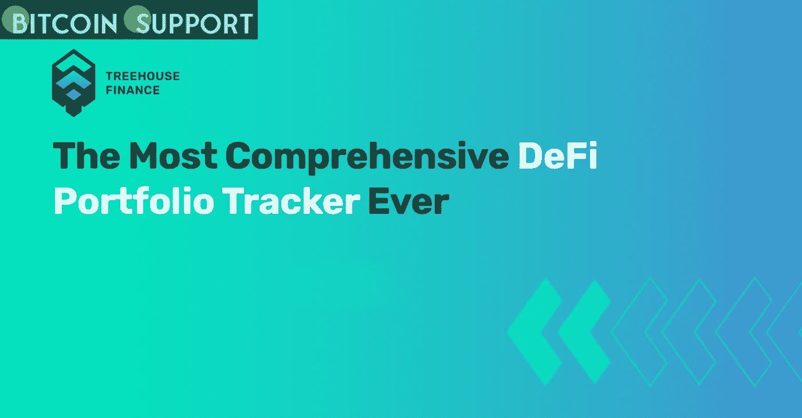

# DeFi 分析公司 Treehouse 筹集了 1800 万美元的种子资金

> 原文：<https://medium.com/coinmonks/treehouse-a-defi-analytics-company-raises-18-million-in-seed-capital-aa3dbe967ba0?source=collection_archive---------69----------------------->

**Visit our website:-** [**https://bitcoinsupports.com/**](https://bitcoinsupports.com/)

Treehouse 的使命是为散户投资者提供必要的工具，使他们能够对 DeFi 资产做出明智的决策。去中心化金融(DeFi)分析业务 Treehouse 已经筹集了 1800 万美元的种子资金，以进一步推进其金融普惠的使命。

Treehouse 周三报道称，这轮融资由一家“未披露身份的大型金融科技投资者”牵头，其他几家投资者也参与了融资，包括币安、光速、温特穆特和 Jump Capital。

米拉娜创投、万通创投、币安、全球创始人资本、Moonvault Capital、GSR、K3 创投、LeadBlock Partners、Coinhako、Bitpanda、Pintu 都参与了融资。Treehouse 的使命是为投资者提供必要的基础设施，使他们能够对其 DeFi 资产做出明智的决策。DeFi 是指在区块链上进行的不使用传统中介的贷款、交易和其他金融业务。

公司主打产品 Harvest，解构用户数据，为用户提供风险指标、盈亏等历史数据，目标是建立 DeFi 数据分析的标准。

Harvest 将利用这笔资金扩大其区块链和协议覆盖范围，并为零售和机构用户开发更多产品。

**访问我们的网站:-**[**https://bitcoinsupports.com/**](https://bitcoinsupports.com/)

**免责声明:以上为作者观点，不应视为投资建议。读者应该自己做研究。**

> 加入 Coinmonks [电报频道](https://t.me/coincodecap)和 [Youtube 频道](https://www.youtube.com/c/coinmonks/videos)了解加密交易和投资

# 另外，阅读

*   [3 商业评论](/coinmonks/3commas-review-an-excellent-crypto-trading-bot-2020-1313a58bec92) | [Pionex 评论](https://coincodecap.com/pionex-review-exchange-with-crypto-trading-bot) | [Coinrule 评论](/coinmonks/coinrule-review-2021-a-beginner-friendly-crypto-trading-bot-daf0504848ba)
*   [莱杰 vs n rave](/coinmonks/ledger-vs-ngrave-zero-7e40f0c1d694)|[莱杰 nano s vs x](/coinmonks/ledger-nano-s-vs-x-battery-hardware-price-storage-59a6663fe3b0) | [币安评论](/coinmonks/binance-review-ee10d3bf3b6e)
*   [Bybit 交易所评论](/coinmonks/bybit-exchange-review-dbd570019b71) | [Bityard 评论](https://coincodecap.com/bityard-reivew) | [Jet-Bot 评论](https://coincodecap.com/jet-bot-review)
*   [3 commas vs crypto hopper](/coinmonks/3commas-vs-pionex-vs-cryptohopper-best-crypto-bot-6a98d2baa203)|[赚取加密利息](/coinmonks/earn-crypto-interest-b10b810fdda3)
*   最好的比特币[硬件钱包](/coinmonks/hardware-wallets-dfa1211730c6) | [BitBox02 回顾](/coinmonks/bitbox02-review-your-swiss-bitcoin-hardware-wallet-c36c88fff29)
*   [block fi vs Celsius](/coinmonks/blockfi-vs-celsius-vs-hodlnaut-8a1cc8c26630)|[Hodlnaut 审核](/coinmonks/hodlnaut-review-best-way-to-hodl-is-to-earn-interest-on-your-bitcoin-6658a8c19edf) | [KuCoin 审核](https://coincodecap.com/kucoin-review)
*   [Bitsgap 审查](/coinmonks/bitsgap-review-a-crypto-trading-bot-that-makes-easy-money-a5d88a336df2) | [Quadency 审查](/coinmonks/quadency-review-a-crypto-trading-automation-platform-3068eaa374e1) | [Bitbns 审查](/coinmonks/bitbns-review-38256a07e161)