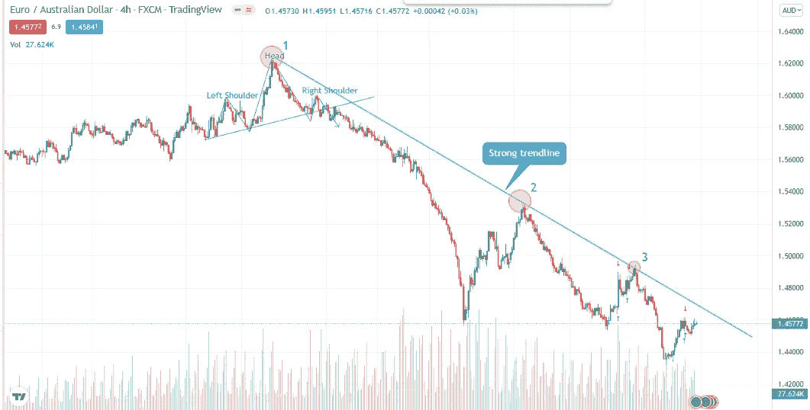
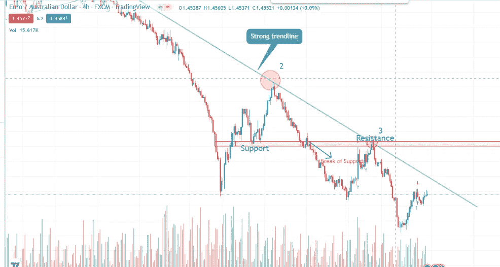
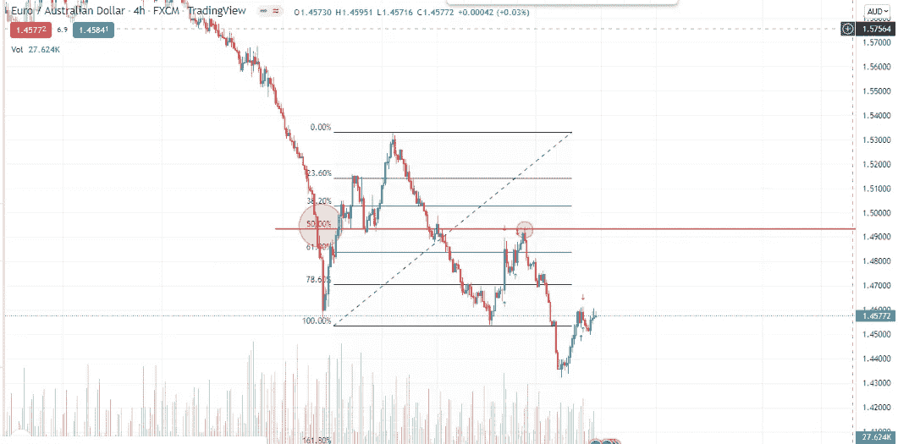

# 趋势线的支撑和阻力以及斐波纳契回撤技术

> 原文：<https://medium.com/coinmonks/trendline-support-and-resistance-and-the-fibonacci-retracement-technique-9c04e6fe7dc4?source=collection_archive---------10----------------------->

我现在谈论的技术不是一种新的先进技术，它能提供 100%的准确性，而是一种系统化的交易计划，它是从技术分析的开始就遵循的综合技术。买/卖资产的趋势线、支撑位和阻力位以及斐波纳契回撤的形态使我们对我们持有的头寸更有信心。我们在这里做的事情是获得买卖信号，有多个确认，有适当的风险比率，并充分利用交易。让我来说明我上面所说的

**1。趋势线交易者的观点**

我们可以看到一个主要的看跌市场对欧元/澳元的抛售压力。在价格重新测试趋势线后可以看到更多的动力，这就像一个阻力。当价格重新测试趋势线时，尊重趋势线交易策略的交易者做空。

**2。支撑位和阻力位交易者的观点**

在支撑位被打破后，卖方现在更有信心做空，但是价格应该重新测试支撑位以形成阻力，并确认打破和重新测试的概念。趋势线交易者在第 3 点持有大部分空头头寸，这证实了熊市趋势结构。然而，支撑和阻力交易者现在也在第 3 点持有空头头寸，因为有一个主要阻力区，这使得价格更加看跌。

**3。斐波纳契回撤交易者的观点**

主要使用斐波那契交易技术来预测价格行为的交易者也在黄金比例的 50%回撤处建立空头头寸。在这里，所有三个趋势线交易者支持和阻力交易者以及斐波纳契交易者根据趋势建立空头头寸。我们可以学到的是，跟着趋势走，它越是从大多数交易技术中得到确认，交易就越有可能盈利。这一切都不要忘记把必要的止损永远不要忘记 DONT 赔钱的规则。

想跟我学学技术分析吗？:[让我们从今天开始](https://www.fiverr.com/anjerry356/teach-you-technical-analysis-for-stock-market-crypto-and-forex?context_referrer=search_gigs&source=main_banner&ref_ctx_id=1d1780dbc61d45887e7d40deeffbc2d4&pckg_id=1&pos=44&context_type=auto&funnel=1d1780dbc61d45887e7d40deeffbc2d4&seller_online=true&imp_id=9da19408-55a3-4249-87e1-cb55d5e88b8b)

> 加入 Coinmonks [电报频道](https://t.me/coincodecap)和 [Youtube 频道](https://www.youtube.com/c/coinmonks/videos)了解加密交易和投资

# 另外，阅读

*   [3 商业评论](/coinmonks/3commas-review-an-excellent-crypto-trading-bot-2020-1313a58bec92) | [Pionex 评论](https://coincodecap.com/pionex-review-exchange-with-crypto-trading-bot) | [Coinrule 评论](/coinmonks/coinrule-review-2021-a-beginner-friendly-crypto-trading-bot-daf0504848ba)
*   [莱杰 vs n rave](/coinmonks/ledger-vs-ngrave-zero-7e40f0c1d694)|[莱杰 nano s vs x](/coinmonks/ledger-nano-s-vs-x-battery-hardware-price-storage-59a6663fe3b0) | [币安评论](/coinmonks/binance-review-ee10d3bf3b6e)
*   [Bybit Exchange 审查](/coinmonks/bybit-exchange-review-dbd570019b71) | [Bityard 审查](https://coincodecap.com/bityard-reivew) | [Jet-Bot 审查](https://coincodecap.com/jet-bot-review)
*   [3 commas vs crypto hopper](/coinmonks/3commas-vs-pionex-vs-cryptohopper-best-crypto-bot-6a98d2baa203)|[赚取加密利息](/coinmonks/earn-crypto-interest-b10b810fdda3)
*   最好的比特币[硬件钱包](/coinmonks/hardware-wallets-dfa1211730c6) | [BitBox02 回顾](/coinmonks/bitbox02-review-your-swiss-bitcoin-hardware-wallet-c36c88fff29)