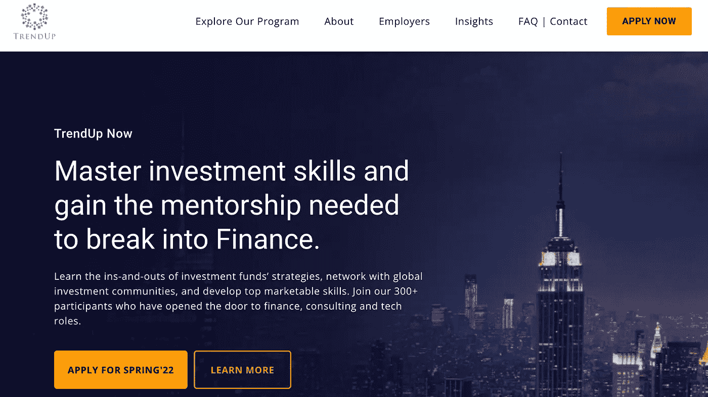

# 趋势现在:一个深入的审查

> 原文：<https://medium.com/coinmonks/trendup-now-an-in-depth-review-5c12f20e53ef?source=collection_archive---------3----------------------->

> 什么是 TrendUp Now 计划？它是如何工作的？值得吗？在这篇文章中，我分享了我个人对这个项目的体验，并给你一个深入的了解和一些重要的建议。

Screenshot of TrendUp Now’s homepage

# 概观

**总结:** [TrendUp Now](http://www.trendupnow.org) 是一个在线的、选择性的、结构化的程序，训练你的投资策略。如果你是表现最好的人之一，你将能够进入他们的网络，在买方公司实习，获得专家指导，并帮助招聘。如果你想发展投资策略技能并进入该领域，这是一个很好的项目，但不能代替努力工作。

**时间承诺:**每个 L-course 是三周，所以一共 9 周；再加上大约 9 周的 SRP 实习。非常适合有全职工作或者是全职学生。大多数异步、同步会话通常在 1-2 个周六上午进行，时间很少超过 1 小时。

参与者简介:年轻专业人士(二三十岁的人)、高年级学生(大学三年级和四年级学生)和研究生的混合体。也有一些年长的参与者。各种各样的背景，不仅是金融/商业，但这肯定是占主导地位的。绝大多数是男性。

**优点**

*   这份材料引人入胜，切中要害。指导老师是顶尖的专业人士，他们也非常可爱和平易近人。他们不会在他们认为不重要的内容上浪费时间。
*   良好的节奏:这是点播材料和一些现场会议之间的良好组合。截止日期很容易遵守，它的设计与全职工作或学校兼容。
*   在一个充满诈骗“机会”和互联网专家的世界里，这是由真正的专家领导的少数项目之一。与大学课堂不同的是，这些材料植根于现实，具有可操作性。你还可以和顶级专业人士进行一对一的交流。
*   如果你雄心勃勃并且表现出色，你会得到回报。通过他们的关系网，你可以得到一份实习工作，这将使你脱颖而出。除非你有关系，否则很难得到这种实习机会。
*   这可能是提高你作为投资金融领域候选人吸引力的最快方法，因为你不仅能得到培训，还能得到指导、专业经验和招聘指导。

**缺点**

*   被 L1 大学录取并不能保证你能进入 L3，更不用说 SRP 了。每个级别都充当一个过滤器。
*   在 SRP 中，实习机会是有限的。如果你成功进入 SRP，他们可以保证给你一份实习工作，这很好，但是如果你正在寻找一份非常具体的实习工作，你可能会在等待名单上滞留一段时间。
*   参与者绝大多数是美国男性。如果你是女性，或者来自不同的国家，你可能是唯一的一个。

# 我的故事

那是 2021 年的春天。我已经在银行工作两年了。那是我大学毕业后的第一份工作。我主修金融专业，并一直在从事银行工作，因为我非常喜欢金融市场。我喜欢做出投资决策的智力挑战，喜欢被证明是对的或错的肾上腺素激增；探索的无限机会，研究的领域，追求的策略。不幸的是，我的银行工作与此完全不同。这很无聊，我觉得我需要拓展业务，开始探索其他选择，最好是在对冲基金领域。

所以我开始申请对冲基金、家族理财室、自营交易公司的职位；甚至 VC 和 PE。众所周知，打入这个领域极具挑战性。两件事通常会有很大的不同:之前的相关经验和人脉。虽然我的银行经历显然不是无关紧要的，但它与“投资策略”并不相关。我也没有什么人脉，大多数 20 出头的人都没有。

我申请了数百份工作，但没有一份有趣的工作实现，所以我只是呆在我的银行工作。我申请的一份工作是 TrendUp 现在正在招募的一个基金。我被拒绝了，但这是为数不多的有人愿意告诉我为什么被拒绝了的工作之一。招聘人员给了我一些如何提高我的候选资格的建议，并提到如果我对这个领域感兴趣，我可以尝试申请 [TrendUp Now](http://www.trendupnow.org) L-program(我后来发现我的几个同事已经通过了预先审查并获准入学，但我没有，所以我必须申请并等待他们的决定)。我不知道会发生什么，但决定试一试。几天后，他们录取了我。当我做这个决定时，网上关于这个项目的意见和信息很少，所以我的经验是:

## **L1 球场**

被该项目录取后，你开始 L1 课程。这是一个为期 3 周的课程，用作初步筛选。节奏不是很快，所以它非常适合做全职工作，就像我的情况一样。我们专注于基本面分析(对公司的定量和定性分析)、技术分析(实际上是一种介绍，因为这不是他们分析证券的首选方式)、事件驱动(某些事件如何影响股票，非常有趣)、波动性(你如何从运动的幅度而不是方向中获利)，以及杠杆(最大化回报及其风险/回报状况的不同方式)。)

在第一次同步介绍会议(这些会议通常是几个星期六的早上)之后，讲师会带你浏览课程和计划，你就可以开始了。大部分材料是异步的(视频和幻灯片由团队的讲师录制，讲师通常是对冲基金经理)。我喜欢这份材料的一点是，它切中要害，还夹杂着相关的轶事。一点也不无聊，因为老师，至少是我的老师，既博学又迷人。还有测试你知识的内部测验，以及他采访一些基金专家以加深你知识的可选视频。为此，你可以按照自己的步调前进，但要遵守一些内部期限。

除了这些，在 L1 还有:

*   ***与对冲基金经理的一对一会谈*** 。这基本上是你脱颖而出的机会，因为这是他了解你和你的目标的一种方式。我的建议是不要害羞，分享你的故事和目标。我的导师是亚历克斯·利伯菲尔德，他非常平易近人，所以这感觉就像是和朋友的一次随意交谈，而不是和 HFM 的一次令人生畏的面试。考虑到这些人的时间是多么昂贵，单单这一点就已经值得注册了。问问他之后你能不能在 LinkedIn 上加他然后做。
*   ***快速股票推介环节*** 。这是你在一个小组中向讲师推销一个做多和做空股票的想法。然后，他会以建设性的方式分享他对你想法的看法。我建议你不要选择显而易见的股票，并展示你如何知道应用你在 L1 学到的东西。确保你使用一个以上的分析学派。听取其他参与者的想法也很有趣，事实上，我从那次会议中得到了一些好的交易想法。
*   ***技能考核*** 。这是一个定时测验，测试你的知识和对 L1 材料中几种刺激的反应时间。在你看完材料之前不要这样做，否则你很可能会失败，并且确保你回答得非常快，因为时间过得非常快。
*   ***L1 期末考试*** 。这将测试你对 L1 材料的了解。大部分是选择题，但不是普通的基于记忆的测验。主要是学以致用。也是定时的，但是这里有足够的时间从容完成这个。在你复习完所有的材料之前，不要尝试那样做。

课程结束后，他们会评估你的表现。这可能是压力最大的时候，因为你不知道自己与其他参与者相比表现如何。**在我的团队中，大约 65–70%的人晋级并被允许去 L2** 。为了做出决定，他们会考虑评估分数，还有一系列其他指标，以及你的总体情况和适合度。小心过度自信:我团队中的一个家伙认为他已经知道所有的东西，然后表现严重不佳，没有被邀请继续。虽然 L1 的一些内容听起来很熟悉，但他们希望你达到一个高标准，所以值得回顾一切并认真对待。

## **L2 球场**

以前的形式在 L2 继续。也是 3 周，这一周主要关注衍生品和交易策略，但也让你有机会写一篇研究文章并发表，从而发展你的分析师技能。

这里的材料是专有的，所以我不能详细讨论，但它侧重于方向性和市场中性策略，特别是期权及其独特的特征(theta，vega，delta 等)。我发现它非常有趣，因为它向我介绍了一种非常不同的分析机会和交易的方法。大开眼界，也许是我最喜欢的部分。这些想法很多都是可以直接操作的，我觉得用它们在我的个人交易中很舒服。

除了材料和内部测验，您还有:

*   与对冲基金经理的第二次一对一会谈**。你们在这里已经相互认识，所以这次会议与 L1 的会议有着不同的氛围。更多的是讨论你在交易挑战中的表现和一些策略，并回答你的问题。虽然 L1 一对一的目的是了解你，但我觉得他想了解你如何进行战略思考，以及你如何应用你所学到的东西。**
*   ***交易时段*** 。在 L2 课程进行到一半的时候，会有一个同步的课程，讲师会先带你了解他在寻找什么样的方面，然后再介绍课程中讨论的一些策略，以及如何在经纪环境中操作。他还介绍了一个交易挑战活动，在这个活动中，你可以模拟一些讨论过的策略，也可以记录策略日志。
*   ***研究文章*** 。这是 L2 的*可选*组成部分之一，尽管我确信他们被贴上这样的标签是为了进一步筛选候选人并测试他们的承诺。这是一个很好的机会，因为你可以写关于一个股票想法的原创研究，然后他们编辑并发表，这可以给你的简历带来巨大的提升。这里的截止日期很灵活，如果你被选中继续，你通常可以在 L3 期间完成文章。
*   ***L2 期末考试*** 。就像 L1 期末考试一样，这测试你对课程材料的知识。格式相同，但比 L1 考试难。

就像 L1 一样，完成后，你必须等待几天，直到你发现你是否被允许继续。在我的同学中，**大约 75–80%的 L2 参与者进入了 L3** ，这个数字高于 L1 到 L2 的比例。

## **L3 课程**

在 L 计划的最后一门课程中，分析师和交易者会走到一起。它从期货介绍开始，解释未来策略(基本面驱动和以交易为中心)，讨论交易和投资组合管理，市场心理学和对冲基金策略。还有对对冲基金如何组织、关键要素等的深入探究。

除了第二个交易挑战，这里最重要的方面可能是所谓的 ***对冲基金策略研讨会*** 。你被安排在一个大约有 4 名其他参与者的小组中，你需要共同努力，提出一个深入的股票想法，以及一个可行的交易策略。这是应用你在 3 门课程中学到的所有知识以及与其他参与者交流的好方法。然后，你和你的团队将这个想法提交给 HFM 和分析师，他们会对你的想法和表现给予反馈。我做得很开心，这是一个把所有事情联系在一起的好方法。我的建议是在你的小组中起带头作用，组织会议等，并在你的演讲中脱颖而出。

然后就是 ***L3 期末考试*** 。这一项非常重要，因为你需要通过这一项才有资格免费参加 CFOA 期货期权分析师考试。通过 L3 考试还可以让你被考虑加入专业化&招聘计划(SRP)。

那么什么是 CFOA 和 SRP 呢？

## **注册期货及期权分析师(CFOA)**

从 L3 毕业后大约一个月，你就有资格免费参加这个考试。这是一个限时 1 小时的多项选择题考试，重点是期权和期货。它与其他类似的考试不同，因为它更注重应用而不是理论。事实是，如果你已经成功到达 L3，通过 CFOA 的几率很高。事实上，TrendUp 表示，90%的候选人第一次就通过了考试，第二次就 100%通过了。但要小心:这些数字有点误导，因为它们是从完成 L3 的人中得出的，所以这并不意味着这是一个简单的考试。但事实上，L3 毕业和 CFOA 约会之间通常不到一个月，这意味着内容仍然非常新鲜。由于这个原因，我不建议推迟 CFOA。

CFOA 在技术上由国际衍生品交易委员会管理，但 TrendUp 在 2021 年购买了考试的独家权利，这意味着目前只有那些得到 TrendUp 授权的考生才能参加考试。[据雅虎财经](https://finance.yahoo.com/news/icfdts-certified-futures-options-analyst-125800913.html)报道，随着独立候选人也能够参加考试，这种情况在未来将会改变。如果通过，大约一个月后，您将收到证书和在线证书记录(ICFDT 数据库的 QR)。虽然这不是 CFA，但它肯定有助于突出你在期权和期货方面的知识，并从中脱颖而出。

## **专业化和招聘计划(SRP)**

这是皇冠上的宝石，也是大多数趋势参与者的最终目标。在 L3 一对一会议期间，如果他们认为你有机会被选中，他们会告诉你这件事*。我不想对你撒谎:这并不容易。他们通常每个团队有 6-8 个职位，这并不多，而且通常保留给 L3 班级的前 20%。根据讲师的说法，在决定谁获得 SRP 职位时，需要考虑以下因素:*

*   你在 L1、L2 和 L3 的表现。这意味着分数、参与度等，基本上是他们关于你的所有表现数据。
*   你的“适合度”。我不确定什么才算“合适”，但我怀疑这是教育背景、技能、职业经验和年龄的综合结果。

SRP 申请的一个好处是，即使你在 L3 毕业后没有获得 SRP 职位，如果你符合条件，你会被放在等待名单中，并且你的申请会在每一轮中被自动重新考虑(大约一年 3-4 次)。当我在 L3 之后进入时，我的一个朋友在一年后接到了电话。这种情况时有发生，所以被列入候补名单不仅仅是“被拒绝”的委婉说法。

至于 SRP 实际上需要什么，它受 NDA 保护，所以我不能说太多(没有潜在的诉讼风险！)，但它本质上是一个 10 周的项目，旨在训练你，为你在投资金融领域找到工作做准备。SRP 的一个关键要素是，他们将你与买方公司的实习联系起来。这些机构可以是对冲基金、家族理财室或自营交易公司。你可以选择申请不同类型的实习机会(有偿、无偿、F2F、远程、以分析师为中心、以交易员为中心等)。我建议你在这里尽可能地开放你的选择，因为这个领域的实习机会非常难得，你也不想因为他们找不到完全适合你的工作而被排在等候名单上。

在大约三个月的时间里，我的任务是帮助基金分析师和项目经理处理一些项目，包括交易和股票分析。你可以在团队中工作，你有自己的导师，你有招聘人员，你有招聘准备和模拟面试，与专业人士进行不同的“知识专业化”会议等。就像在 L 课程中一样，你被观察着，他们希望你充分利用这一点。请注意，当时我仍在银行做全职工作，但我能够表现出色，并真正了解相关人员。

在 SRP 之后，我的个人资料改变了。我不再是成千上万想成为刺猬的人之一。我受过相关的培训，在这个领域有丰富的经验，还有强大的关系网。从这个项目毕业后大约 5 个月，我被一家投资公司雇佣了。虽然这是我自己找到的工作，但我毫不怀疑，如果我没有参加这个项目，就不会被考虑。它让我发展了我的知识和技能，也许最重要的是，获得了那种总是很难获得的“相关专业经验”。
在我的同一群人中，另一个人实际上通过 TrendUp 直接在欧洲获得了一个职位，因为这是 TrendUp 正在招募的一个基金的职位。他们定期向 SRP 参与者发送工作邀请，如果你感兴趣，你可以填写一份“意向书”。

## 结果

总而言之，如果你真的想进入这个领域，这是一个很好的项目。但是这不能代替你的努力工作，所以不要认为如果你被这个项目录取了，你会自动得到一份工作。你需要通过三个 L 级别，脱颖而出，这样你才能被 SRP 选中，充分利用这一点，尽可能多地申请工作和社交网络。生活中没有什么是可以保证的，所以请记住这一点，但这肯定会给你一个推动力，对我来说，这就是我成功转向投资金融所需要的。