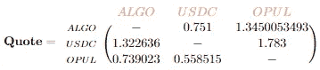

# 带加密指数的三角套利:第一部分

> 原文：<https://medium.com/coinmonks/triangular-arbitrage-with-crypto-dexs-part-one-add36b136bf1?source=collection_archive---------0----------------------->

建造一个套利机器人比他们告诉你的要难


Photo by [愚木混株 cdd20](https://unsplash.com/@cdd20?utm_source=medium&utm_medium=referral) on [Unsplash](https://unsplash.com?utm_source=medium&utm_medium=referral)

# 简介—印钞机能正常工作吗？

套利是利用市场上资产价格差异的做法。由于货币价格的波动，套利在外汇交易中已经使用了很长时间。Investopedia 对此有一个很好的介绍——[https://www.investopedia.com/terms/a/arbitrage.asp](https://www.investopedia.com/terms/a/arbitrage.asp)

加密市场中也存在套利机会。事实上，套利，尤其是在分散的交易所，是受到鼓励的。套利是市场对其定价的低效，套利通过将资产带回到其预期水平而使这些价格再次“有效”。

# 套利的类型

## 外汇 Arb

套利的一个例子是在交易所之间。例如，我可以在比特币基地 Pro 上购买 1BTC 英镑，假设我在比特币基地上以 32，051.44 英镑购买 1 个比特币，我将我的 1 个比特币转移到币安，并在那里以 32，067.76 英镑出售。我赚了 16.32 英镑。这里有很多因素，比如转会费、滑点、差价等等，但这是基本原则。

## 三角形 Arb


Example of Triangular Arbitrage (Image By Author)

三角套利是一种进行 3 次或 3 次以上互换来获利的方法。上面的例子说明，假设我们从 1 个 BTC 开始，我们将它换成 14 个 ETH。我们以 45，000 USDC 的价格出售 14 个 ETH，然后用它来购买 1.082 BTC。这产生了 0.82 BTC 的利润。

# 这个计划

我真的很喜欢 ALGO——我不是一个骗子或什么的，不是说要买一些，但我只是觉得它真的很容易使用，便宜又快捷。我的计划是使用 tiny man(Algorand 上的大型 DEX)来看看我是否能找到任何三角机会。流程看起来有点像这样。


Flow of Tinyman Arb Bot

我不想一直得到所有可用资产排列的交换报价。大约有 1200 种不同的资产组合(准确地说是 1224936 种)。如果我只是对每个排列进行暴力破解，那将会有超过一百万次的网络调用，这将会非常慢。我想计算每笔交易的所有报价，并创建一个如下所示的矩阵。


Example Matrix (Image by Author)

其中 y 轴是要交换的资产，x 轴是要接收的资产。如下所示，如果你把 ALGO 作为 A1，把 USDC 作为 A2，那么 1 个 ALGO 对应 0.751 个 USDC。



Matrix Quotes (Image by Author)

这解决了必须为路径获取多个引号的一些问题，并允许在矩阵中快速查找。我只是将互换汇率乘以赌注，即 10 个算法到 USDC 给了我 10*0.751 = 7.51 USDC。

我实际上设法让这个工作，缺点是，我运行了 2 天，没有可能的套利机会。有些接近了，请为下面的关闭互换默哀一分钟——这是使用 20 ALGO 作为输入。

```
Path (0, 31566704, 312769) Close to Profit!First Swap Quote: SwapQuote(swap_type='fixed-input', amount_in=ALGO('20'), amount_out=USDC('14.394919'), swap_fees=ALGO('0.06'), slippage=0.01)Second Swap Quote: SwapQuote(swap_type='fixed-input', amount_in=USDC('14.25097'), amount_out=USDt('14.260552'), swap_fees=USDC('0.042752'), slippage=0.01)Third Swap Quote: SwapQuote(swap_type='fixed-input', amount_in=USDt('14.117947'), amount_out=ALGO('19.402954'), swap_fees=USDt('0.042353'), slippage=0.01)Final Amount Of ALGO('19.208925')--------------------------------------------------------------------Path (0, 226701642, 404044168) Close to Profit!First Swap Quote: SwapQuote(swap_type='fixed-input', amount_in=ALGO('20'), amount_out=YLDY('6096.563343'), swap_fees=ALGO('0.06'), slippage=0.01)Second Swap Quote: SwapQuote(swap_type='fixed-input', amount_in=YLDY('6035.59771'), amount_out=Nekos('1242639.8739'), swap_fees=YLDY('18.106793'), slippage=0.01)Third Swap Quote: SwapQuote(swap_type='fixed-input', amount_in=Nekos('1230213.4752'), amount_out=ALGO('19.212889'), swap_fees=Nekos('3690.6404'), slippage=0.01)Final Amount Of ALGO('19.020761')
```

你可能已经注意到了，路径是数字，而不是 ALGO-USDC 等。这是因为大多数 DEX 使用 ASA ID 作为其池标识符。这些只是资产 id([https://developer.algorand.org/docs/get-details/asa/](https://developer.algorand.org/docs/get-details/asa/))

# 问题

这个概念证明充满了问题，我把自己困在一个角落里，没有意识到这有多困难，以及需要考虑多少因素。

*   这很慢，迭代数百万个排列并首先获得报价需要时间，更不用说对相同的互换进行多次矩阵查找了
*   流动性会扭曲事物。如果我得到一个用 1 goBTC 换 USDC 的报价，由于美元价值的差异，资金池中可能没有足够的流动性来支持它。也就是说，1 goBTC(价值 40，000 美元)将只兑换 200 USDC(价值 200 美元)，因为池中没有足够的 USDC 来全部兑换，这扭曲了矩阵中的报价
*   包括其他交换将意味着必须使用 3D 矩阵，这很好，但会增加复杂性，并且查询会更加困难。
*   我只做了长度为 3 的排列，增加这个长度会使性能更差，但我想看看 5+交换的可能性——费用和滑点会对此产生更大的影响，但这一切都很有趣！

# 新方法

代码有效，但它找不到任何有利可图的交易，并且受到性能问题的困扰。

我不得不进行彻底的重构，以支持多个交易所，并提高速度，否则永远不会盈利。

我将在第 2 部分继续这个话题！

如果你对代码感兴趣，请欣赏我最终设法开始用这个机器人获得一些不错的利润。在这种情况下，我会把自己放在第一位，不会发布代码，因为我知道这将使机会更难利用。

> *加入 Coinmonks* [*电报频道*](https://t.me/coincodecap) *和* [*Youtube 频道*](https://www.youtube.com/c/coinmonks/videos) *了解加密交易和投资*

# 另外，阅读

*   [Bookmap 评论](https://coincodecap.com/bookmap-review-2021-best-trading-software) | [美国 5 大最佳加密交易所](https://coincodecap.com/crypto-exchange-usa)
*   最佳加密[硬件钱包](/coinmonks/hardware-wallets-dfa1211730c6) | [Bitbns 评论](/coinmonks/bitbns-review-38256a07e161)
*   [新加坡十大最佳加密交易所](https://coincodecap.com/crypto-exchange-in-singapore) | [收购 AXS](https://coincodecap.com/buy-axs-token)
*   [红狗赌场评论](https://coincodecap.com/red-dog-casino-review) | [Swyftx 评论](https://coincodecap.com/swyftx-review) | [CoinGate 评论](https://coincodecap.com/coingate-review)
*   [投资印度的最佳加密软件](https://coincodecap.com/best-crypto-to-invest-in-india-in-2021)|[WazirX P2P](https://coincodecap.com/wazirx-p2p)|[Hi Dollar Review](https://coincodecap.com/hi-dollar-review)
*   [加拿大最佳加密交易机器人](https://coincodecap.com/5-best-crypto-trading-bots-in-canada) | [库币评论](https://coincodecap.com/kucoin-review)