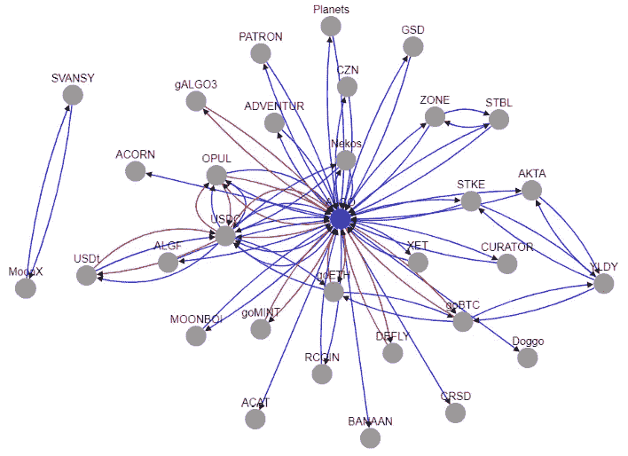
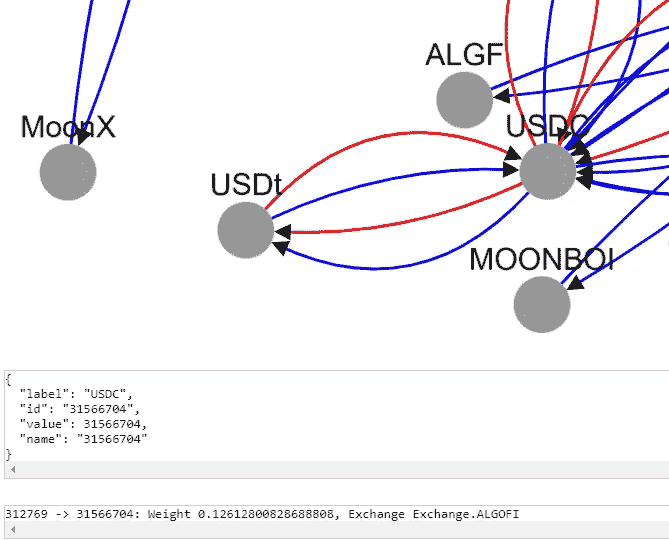
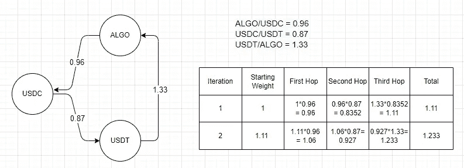
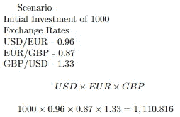
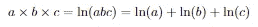
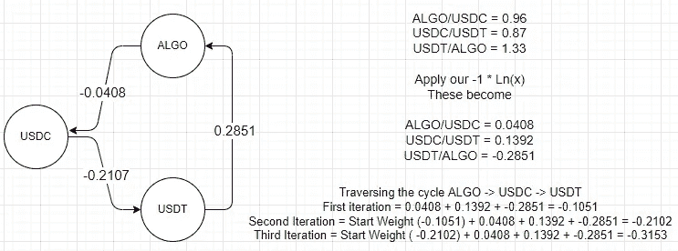
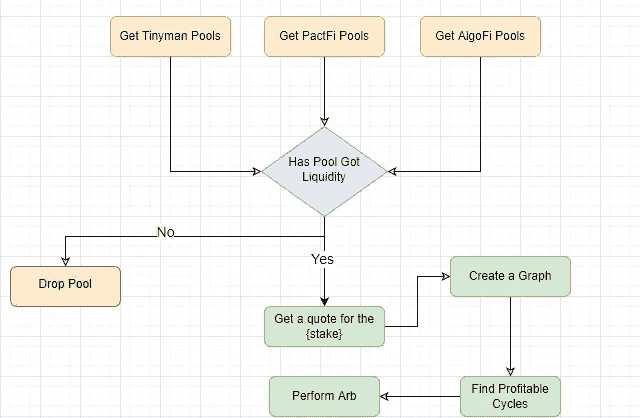

# 带加密指数的三角套利:第二部分

> 原文：<https://medium.com/coinmonks/triangular-arbitrage-with-crypto-dexs-part-two-f6e6ff66fb87?source=collection_archive---------1----------------------->

图和密码有什么关系！？

自从我上次更新以来已经有一段时间了，我经历了很多事情，我彻底改造了整个套利机器人，让它工作得更有效率。这个更新将涵盖很多，所以我可能要做 3 个部分。这一部分将是如何让这样的东西大规模工作的本质和细节。

# 概述

在上一部分中，我讨论了从 DEX(在本例中是 Tinyman)获取资产池，并将每个资产的报价放入一个矩阵中。然后，我将计算资产的每个排列，并使用矩阵来获得报价，即

```
Path (0, 31566704, 312769) Close to Profit!First Swap Quote: SwapQuote(swap_type='fixed-input', amount_in=ALGO('20'), amount_out=USDC('14.394919'), swap_fees=ALGO('0.06'), slippage=0.01)Second Swap Quote: SwapQuote(swap_type='fixed-input', amount_in=USDC('14.25097'), amount_out=USDt('14.260552'), swap_fees=USDC('0.042752'), slippage=0.01)Third Swap Quote: SwapQuote(swap_type='fixed-input', amount_in=USDt('14.117947'), amount_out=ALGO('19.402954'), swap_fees=USDt('0.042353'), slippage=0.01)Final Amount Of ALGO('19.208925')
```

这里的问题是，收集池是通过分页 API 完成的，对于 Tinyman，您可以为 575 个池的每个请求获得 10 个池！这是 58 个请求，然后我不得不再次向 Algorand 区块链请求池对象，即 58 * 2 个请求，116 个。如果每个网络请求花费 1 秒钟，那就是 2 分钟，而我甚至还没有得到报价！

矩阵查找是在最坏的立方时间，在大 O 中，这是 O(n ),不会扩展。

# 异步获取

当我第一次开始这个项目时，它更多的是一个概念验证，我并不期望赚钱，但现在我已经部署了它，我需要更快的查找，这意味着我必须异步进行。如果您没有接触过异步 python，那么您就错过了。这是一个关于 https://www.youtube.com/watch?v=2IW-ZEui4h4[的很棒的视频](https://www.youtube.com/watch?v=2IW-ZEui4h4)

基本上，我可以同时发出所有 58 个 HTTP 请求。然后，我使用多处理池来调用区块链并检索池对象。

我已经为 AlgoFi 和 PactFi 复制了这种行为，Algorand 上的另外两个 DEX。然后，我使用与获取池对象相同的多重处理技巧来获取报价。

# 图论和套利

现在我可以把这些都放进一个矩阵里，我可以把我的 2D 矩阵转换成三维，第三维就是交换。我没有那样做，这看起来更像是一个图形问题，我没有进行矩阵查找，而是遍历了一条路径，节省了多次矩阵查找。

## 把它想象成一个图表

没有比视觉化更好的方式来解释这一点，所以这里是图表上的 AlgoFi 和 PactFi 交换(Tinyman 有点太大了..)



Swap Network

PactFi 边缘为红色，AlgoFi 边缘为蓝色。您可以通过池的连接来查看哪些池可用。

我还可以单击一条边和一项资产。我很快会谈到重量。



## 作为图形问题的套利

现在，我已经得到了所有交易所、资产和报价的图表。我需要找到套利机会。这一节不会详细介绍，因此需要对图论有所了解。

问题归结为找到图中的某个地方，在那里我遍历 X 边，我将结束比开始时更多的源节点。例如，如果我从 1 个 ALGO 开始，我需要找到一个路径，在遍历后，我得到大于 1 个 ALGO。我需要找到正循环，在这些循环中，路径的成本随着你穿越的次数增加而增加。



Exchange Rate Positive Loop Example

正如你在上面看到的，每一次我们遵循这个循环，我们都在增加我们的起始重量，也就是我们的量。这是一个正循环。

## 输入贝尔曼-福特

不幸的是，没有检测正循环的算法，对于最短路径问题，正循环永远不会被发现，因为你试图降低成本或最小化重量。另一个问题是没有最短路径算法乘以权重，而是加法。

幸运的是，我们可以使用一些数学技巧来帮助我们。贝尔曼-福特是一种算法，在给定每条边 X 权重的情况下，找到源和目标之间的最短路径。它通过添加路径的权重来获得总路径权重。Bellman-Ford 可以检测负循环，这对于我们的用例非常有用。它通过寻找趋向负无穷大的路径来检测负循环，而我们寻找的是趋向无穷大的路径。贝尔曼·福特之所以这样做，是因为如果一个循环趋向负无穷大，那么最短路径永远也找不到，它只会一直遍历这个循环。

因此，利用这些数学技巧，我们可以将目前寻找套利的方法(乘以每个汇率)改为使用加法，这就是贝尔曼-福特所使用的方法。以下面的套利机会为例。



如果我们对每个汇率取 Ln(自然对数),我们可以把它变成 ln(a) + ln(b) + ln(c)



Natural Log Example

然后，如果我们将每个对数乘以-1，我们现在使用负循环来计算是否有套利机会。



Bellman Ford Example

你可以看到，当我们遍历这个周期时，我们越来越接近负无穷大，这正是我们试图检测到的信号套利。

贝尔曼-福特的执行时间是 O(V*E)其中 V 是顶点，E 是边。比我们之前的矩阵查找快多了。

# **最终产品**

为了将这一切结合在一起，当前的流程如下。



输出看起来有点像这样

```
Found a winning Cycle… (404044168, 0, 404044168) via [<Exchange.ALGOFI: 2>, <Exchange.TINYMAN: 1>] with profit 0.19299999999999962
```

然后，代码将创建事务并启动。这里还有一些工作要做——一个更好的方法是在 AlgoFi 上获得一笔快速贷款，并用它来增加初始投资额并获得更高的回报。这将是下一部分！

> 加入 Coinmonks [电报集团](https://t.me/joinchat/Trz8jaxd6xEsBI4p)，了解加密交易和投资