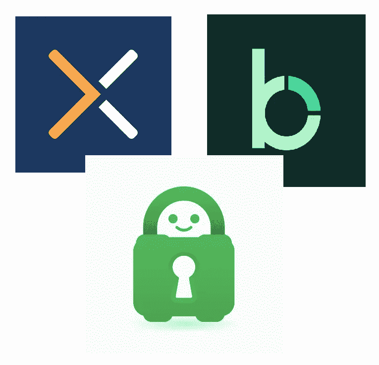
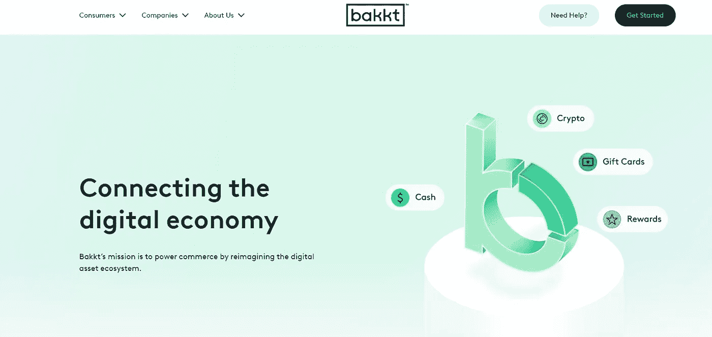
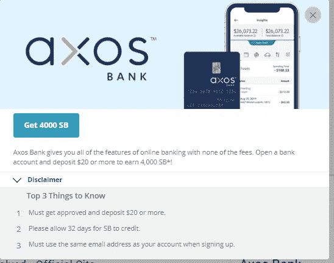
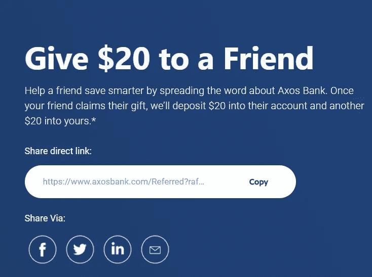
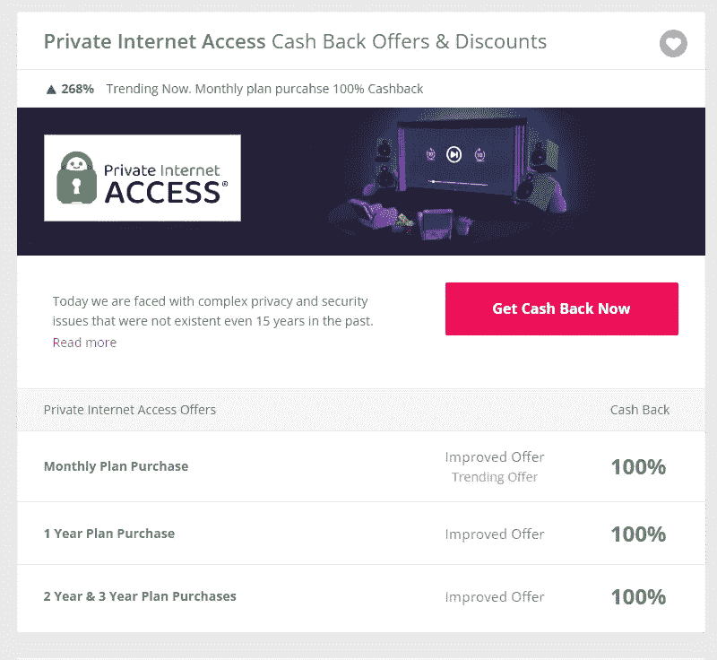

# 三重威胁—我在过去一周利用的交易(免费 55 美元和 3 年 VPN)

> 原文：<https://medium.com/coinmonks/triple-threat-deals-i-took-advantage-over-the-past-week-free-55-usd-and-3-years-of-vpn-d33274e2a781?source=collection_archive---------30----------------------->

# 三重威胁交易

我知道这个市场的情况一直很糟糕，所以我想我应该分享一下我在上周发现的一些交易，希望这些交易至少可以帮助减轻市场最近的一些打击。

# # 1——Bakkt——购买 50 美元比特币，免费获得 15 美元

这个非常简单，如果你一次性购买价值 50 美元的 BTC，你将免费获得 15 美元。你所要做的就是下载[应用](https://www.bakkt.com/promotional-terms#sms)并加载你的账户。存款和价值 15 美元的$BTC 邮政的促销活动非常快，但像许多其他平台一样，如果你正在进行银行转账，可能需要几天才能结算。从我读过的所有评论来看，稳定等待期可能是最令人讨厌的事情，但总体来说，我还没有看到有人在进出资金时遇到困难。你可以在这里查看完整的促销条款。请注意，此优惠将于 7 月 6 日到期。

# # 2——Axos 银行——存款 20 美元，免费获得 40 美元的[奖金](https://www.swagbucks.com/register?rb=10826501&cmp=72&cxid=1200-twitter)

我以前写过很多关于 Swagbucks 的其他交易，这次也不例外。如果你还没有注册一个 Swagbucks 账户，那么注册是完全免费的，如果你使用一个推荐链接(这里是我的)，你可以再免费获得 10 美元来开设一个新账户。如果你喜欢像这样的签约奖金，通过 Swagbucks 获得的奖金通常比其他公开宣传的奖金要高。作为参考，Axos 目前不使用 Swagbucks 的注册奖金为 20 美元:

简而言之，Swagbucks 是一个网站/应用程序，在那里你可以完成报价并以 SB 的形式获得现金返还，可以通过 paypal 或折扣礼品卡以 0.01 美元的价格在 1SB 中交易。我已经使用 Swagbucks 好几年了，从没遇到过提款的问题。如上所述，在新开设的 Axos 银行账户中存入 20 美元后，您可以获得价值 40 美元的 Swagbucks。我真的不知道这个什么时候到期，所以请注意，你越早这样做越好，因为报价可以随时撤回。要访问 Swagbucks 中的这个或任何其他报价，您只需打开帐户，在 Swagbucks 搜索工具栏中搜索“Axos ”,报价就会直接出现。

# #3 —专用互联网接入 VPN —通过[topcashback.com](https://www.publish0x.com/%20https:/www.topcashback.com/ref/jaik83)获得长达 3 年 VPN 计划的 100%返现

我自己没有注册这个，因为我已经有一个 VPN 计划，但如果你现在没有 VPN，那么这可能是一个真正值得考虑的好交易。这笔交易在 topcashback.com 的[上独家发布。如果你不熟悉 topcashback，比如 swagbucks，它是免费注册的，你可以从无数不同的在线公司如沃尔玛、百思买等获得现金返还。几年前我个人使用过私人互联网接入 VPN，不记得有过任何问题——我想我只是因为 NordVPN 当时提供了更好的交易而改变了计划。如果你坚持完成这笔交易，只要确保你在 30 天内不取消订阅(虽然我不知道你为什么会取消，因为它是免费的)，然后最终你的返现将记入你的 topcashback 帐户。在那里，您可以选择通过 ACH 银行转帐或通过折扣礼品卡获得付款。这项交易也没有列出到期时间，所以如果你想利用免费的 VPN 服务，我建议你赶快扣动扳机。](https://www.publish0x.com/%20https:/www.topcashback.com/ref/jaik83)

## 比如听到这样的交易？请在下面的评论中告诉我，一定要在推特上关注我:【https://twitter.com/CryptosWith

免责声明:请不要认为这是任何财务建议，因为它只是为了教育和娱乐的目的。像往常一样，请做你自己的研究，找到什么投资可能是最适合你的。

> 加入 Coinmonks [电报频道](https://t.me/coincodecap)和 [Youtube 频道](https://www.youtube.com/c/coinmonks/videos)了解加密交易和投资

# 另外，阅读

*   [CoinDCX 评论](/coinmonks/coindcx-review-8444db3621a2) | [加密保证金交易交易所](https://coincodecap.com/crypto-margin-trading-exchanges)
*   [红狗赌场评论](https://coincodecap.com/red-dog-casino-review) | [Swyftx 评论](https://coincodecap.com/swyftx-review) | [CoinGate 评论](https://coincodecap.com/coingate-review)
*   [Bookmap 点评](https://coincodecap.com/bookmap-review-2021-best-trading-software) | [美国 5 大最佳加密交易所](https://coincodecap.com/crypto-exchange-usa)
*   [如何在 FTX 交易所交易期货](https://coincodecap.com/ftx-futures-trading) | [OKEx vs 币安](https://coincodecap.com/okex-vs-binance)
*   [CoinLoan 评论](https://coincodecap.com/coinloan-review) | [YouHodler 评论](/coinmonks/youhodler-4-easy-ways-to-make-money-98969b9689f2) | [BlockFi 评论](https://coincodecap.com/blockfi-review)
*   [XT.COM 评论](https://coincodecap.com/profittradingapp-for-binance)币安评论 |