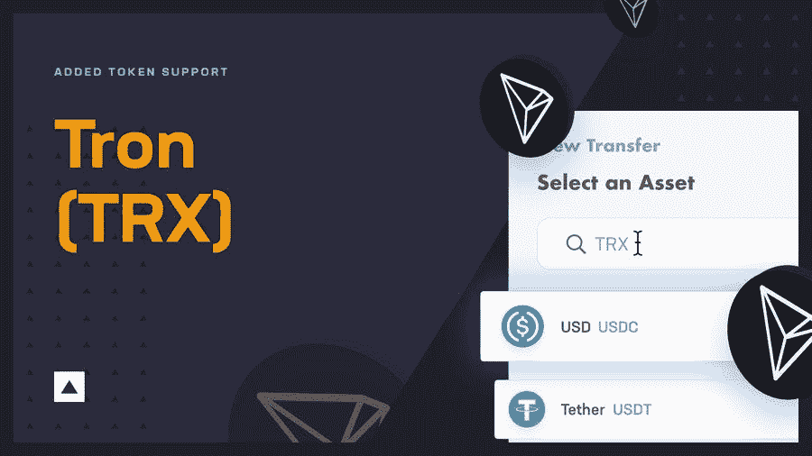
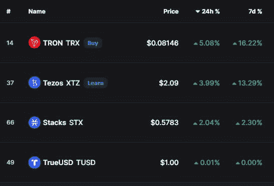

# TRON 记录了两位数的增长，帐户数量接近 1 亿

> 原文：<https://medium.com/coinmonks/tron-records-double-digit-gains-as-number-of-accounts-approaches-100-million-a6279d048226?source=collection_archive---------75----------------------->

随着加密货币市场继续在熊市和牛市之间交替，它的一些资产正在录得显著的成绩——包括去中心化、开源的区块链操作系统 Tron (TRX)。

事实上，根据 CoinMarketCap 月 24 日的数据，TRON 在周涨幅和日涨幅方面表现出色，在市值排名前 100 位的加密货币中领先，24 小时内上涨 5.08%，与前一周相比上涨 16.22%。

就目前情况来看，TRON 的价格为 0.08146 美元。

根据最新的创道周刊报道，创主网上的账户总数已经接近 1 亿——更准确地说是 93653586 个。此外，在 5 月 16 日至 5 月 22 日的一周内，新增账户 1，476，689 个。

与此同时，网络交易总量达到 32.1 亿笔，其中仅上周一周就新增交易 3359 万笔。区块链本身锁定的总价值(TVL)现已达到 92 亿美元。

最后，TRON 区块链高度超过 4079 万，整个网络共有 5963 个节点。TRON DAO 于 3 月 24 日在其 Twitter 频道上发布了这一数据的摘要。

# 创和它的其他成功

有趣的是，Tron 本身以前也上过头条——在 4 月下旬，Finbold 报道它与 Decred (DCR)一起领先 100 强，根据 CoinMarketCap 的数据，两者都在 24 小时内取得了显著的进步。

3 月初，Finbold 还报告称，Tron 衡量交易和智能合约活动的数量稳步上升，后者占区块链所有交易的 60%以上。

同样值得注意的是，Fireblocks 是一个用于建立数字资产业务的一体化平台，最近与 Tron 建立了合作伙伴关系，支持其区块链(TRX 本土资产)和 TRC-20 硬币，正如该平台在 5 月 24 日宣布的那样。

> 加入 Coinmonks [电报频道](https://t.me/coincodecap)和 [Youtube 频道](https://www.youtube.com/c/coinmonks/videos)了解加密交易和投资

# 另外，阅读

*   [加拿大最佳加密交易机器人](https://coincodecap.com/5-best-crypto-trading-bots-in-canada) | [Bybit vs 币安](https://coincodecap.com/bybit-binance-moonxbt)
*   [阿联酋 5 大最佳加密交易所](https://coincodecap.com/best-crypto-exchanges-in-uae) | [SimpleSwap 评论](https://coincodecap.com/simpleswap-review)
*   [购买 Dogecoin 的 7 种最佳方式](https://coincodecap.com/ways-to-buy-dogecoin) | [ZebPay 评论](https://coincodecap.com/zebpay-review)
*   [最佳期货交易信号](https://coincodecap.com/futures-trading-signals) | [流动性交易所评论](https://coincodecap.com/liquid-exchange-review)
*   [火币加密交易信号](https://coincodecap.com/huobi-crypto-trading-signals) | [Swapzone 审查](/coinmonks/swapzone-review-crypto-exchange-data-aggregator-e0ad78e55ed7)
*   最佳[密码交易机器人](https://coincodecap.com/best-crypto-trading-bots) | [购买索拉纳](https://coincodecap.com/buy-solana) | [矩阵导出评论](https://coincodecap.com/matrixport-review)