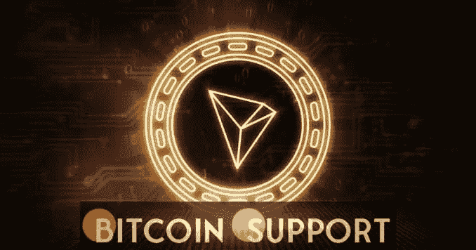
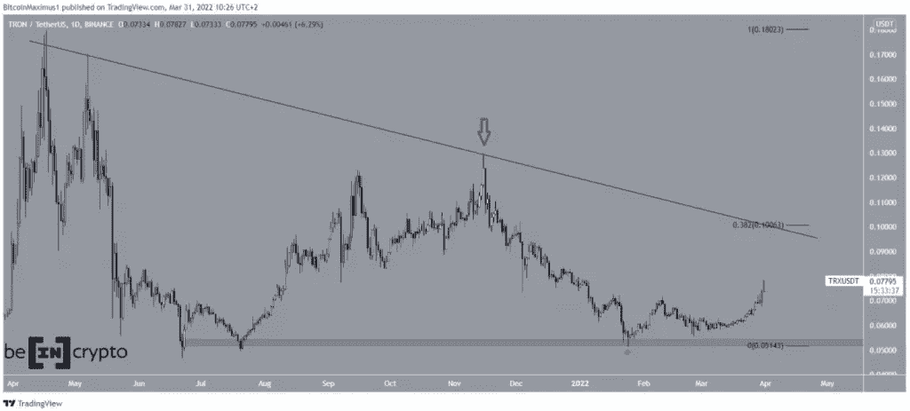
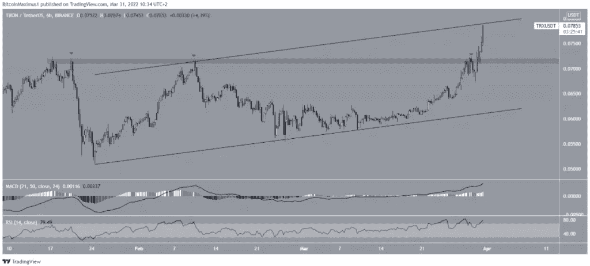
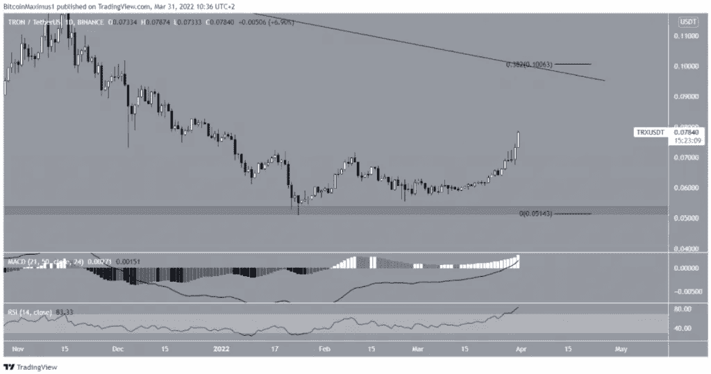
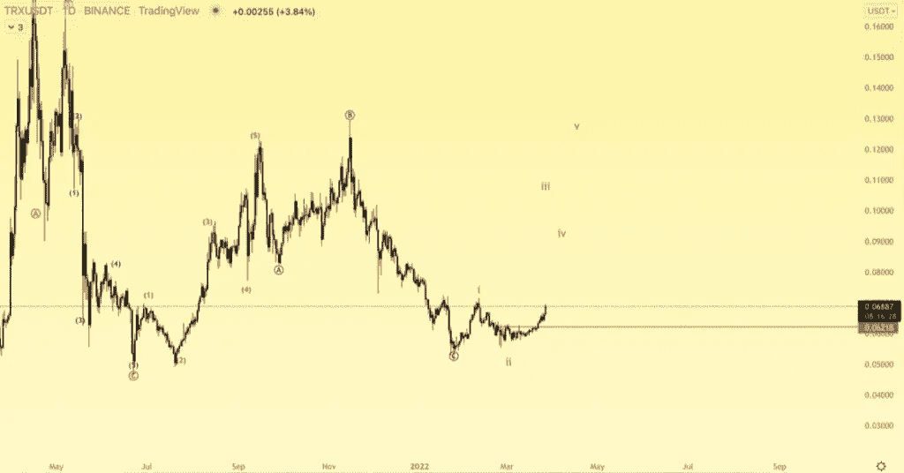
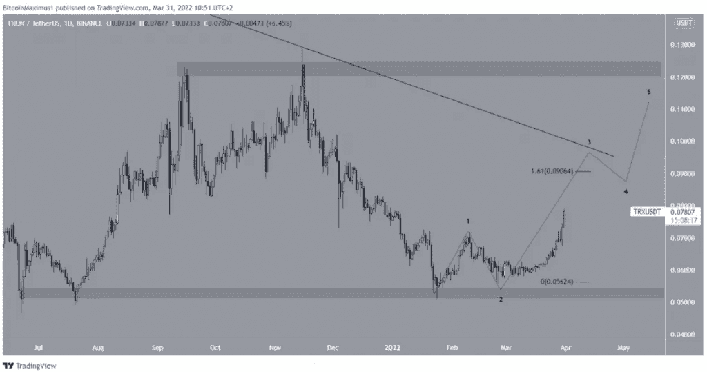

# 创(TRX)年内新高

> 原文：<https://medium.com/coinmonks/tron-trx-hit-a-new-high-for-the-year-2cc0e639c64a?source=collection_archive---------40----------------------->

**Visit our website:-** [**https://bitcoinsupports.com/**](https://bitcoinsupports.com/)

自 1 月 24 日以来，创(TRX)一直在上涨。3 月 31 日，创下年度新高。

TRX 价格在 2021 年 4 月 17 日创下 0.18 美元的历史新高时，跌破了一条下行阻力线。6 月 22 日，价格跌至 0.046 美元。

11 月 15 日，TRX 反弹，但创出比之前更低的高点。这使得下降的阻力线起作用(红色箭头)。

在接下来的下跌之后，TRX 在 0.052 美元的水平支撑区域反弹(绿色图标)并开始向上移动。

在 0.10 美元，下一个阻力位是。纤维回撤阻力:这是 0.382 纤维回撤水平，这是下降的阻力线遇到。

**Visit our website:-** [**https://bitcoinsupports.com/**](https://bitcoinsupports.com/)

正在进行的 TRX 突破

看起来 TRX 已经突破了 0.0715 美元的阻力区域，该区域自 1 月 16 日以来一直存在。最后，在三次尝试获取失败后，价格爆发。

从 1 月 24 日开始，一个上升的平行通道已经到位。然后，价格触及通道的阻力线。突破这一点将有望加快增长速度。

**Visit our website:-** [**https://bitcoinsupports.com/**](https://bitcoinsupports.com/)

日线时间框架内也有不错的技术指标。他们认为价格有机会突破通道，继续上涨到至少 0.10 美元。

**Visit our website:-** [**https://bitcoinsupports.com/**](https://bitcoinsupports.com/)

**波数分析**

交易员@AltstreetBet 发了一张 TRX 的图表。他说，他预计上升趋势可能会在第三波中加速。

**Visit our website:-** [**https://bitcoinsupports.com/**](https://bitcoinsupports.com/)

看起来自从那条推特之后，TRX 又上升了。这可能是从 1 月 24 日开始的五波向上运动(黑色)的第三波，并且从那以后一直在上升。测量第一波的长度，第三波至少应该是 0.09 美元。它也许能到达下降的抵抗线。

之后浪五可以突破该线，一路到 0.125 美元阻力区。这是可能发生的事情。

**访问我们的网站:-【https://bitcoinsupports.com/】**

****免责声明:以上为作者观点，不应视为投资建议。读者应该自己做研究。****

> **加入 Coinmonks [电报频道](https://t.me/coincodecap)和 [Youtube 频道](https://www.youtube.com/c/coinmonks/videos)了解加密交易和投资**

# **另外，阅读**

*   **[3 商业评论](/coinmonks/3commas-review-an-excellent-crypto-trading-bot-2020-1313a58bec92) | [Pionex 评论](https://coincodecap.com/pionex-review-exchange-with-crypto-trading-bot) | [Coinrule 评论](/coinmonks/coinrule-review-2021-a-beginner-friendly-crypto-trading-bot-daf0504848ba)**
*   **[莱杰 vs n rave](/coinmonks/ledger-vs-ngrave-zero-7e40f0c1d694)|[莱杰 nano s vs x](/coinmonks/ledger-nano-s-vs-x-battery-hardware-price-storage-59a6663fe3b0) | [币安评论](/coinmonks/binance-review-ee10d3bf3b6e)**
*   **[Bybit Exchange 审查](/coinmonks/bybit-exchange-review-dbd570019b71) | [Bityard 审查](https://coincodecap.com/bityard-reivew) | [Jet-Bot 审查](https://coincodecap.com/jet-bot-review)**
*   **[3 commas vs crypto hopper](/coinmonks/3commas-vs-pionex-vs-cryptohopper-best-crypto-bot-6a98d2baa203)|[赚取加密利息](/coinmonks/earn-crypto-interest-b10b810fdda3)**
*   **最好的比特币[硬件钱包](/coinmonks/hardware-wallets-dfa1211730c6) | [BitBox02 回顾](/coinmonks/bitbox02-review-your-swiss-bitcoin-hardware-wallet-c36c88fff29)**