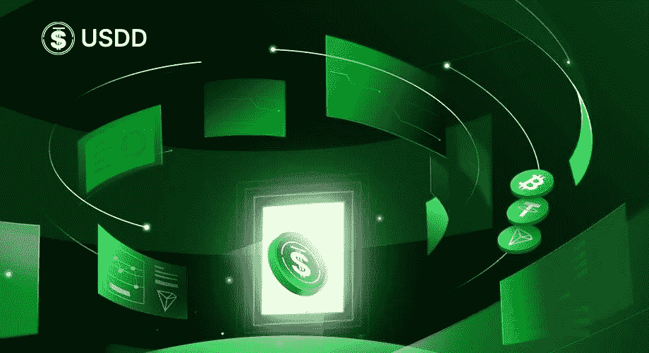
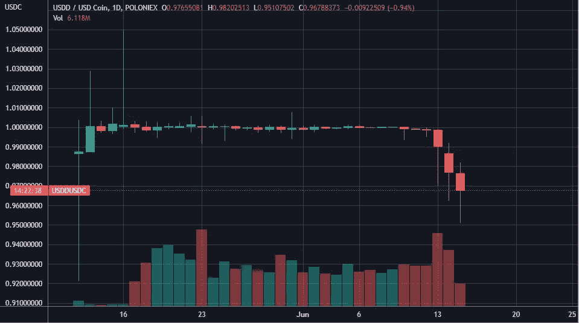
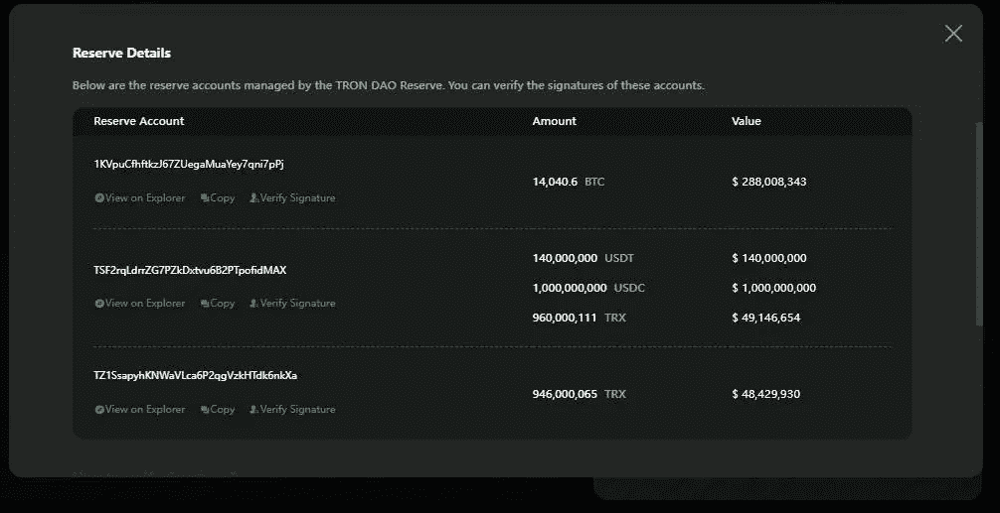
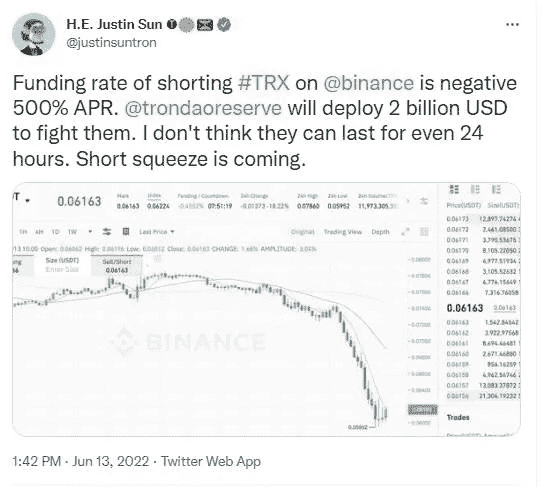
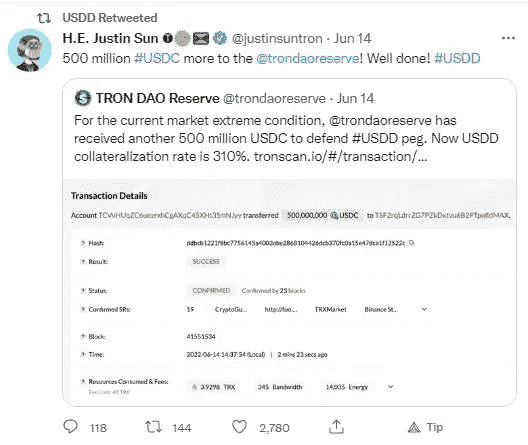

# 创的分散式 USDD 稳定币已经两天没有保持 1 美元的汇率了！！

> 原文：<https://medium.com/coinmonks/trons-decentralised-usdd-stablecoin-has-failed-to-maintain-its-1-peg-for-2-days-dbdd1651e999?source=collection_archive---------46----------------------->

[图像来源](/@usddio/usdd-upgrades-into-the-first-over-collateralized-decentralized-stablecoin-20907b81aec9)

# Tron 公司最近推出的 USDD 稳定币很难维持 1 美元的汇率

[Image Source](https://www.tradingview.com/x/lAFqHJzJ/) USDD has not succeeded in maintaining its dollar peg since June 13th

自 6 月 13 日星期一以来，创的分散稳定的 USDD 币交易低于 1 美元……这很有趣。在我的上一篇文章中，我已经讨论了这个新创建的 USDD 稳定币，它是作为算法稳定币推出的，功能类似于[崩溃死亡算法稳定币 UST](/coinmonks/game-is-over-for-ust-yet-another-algorithmic-stablecoin-usdd-has-entered-the-crypto-ecosystem-480ec1f580ee) 。

然而，USDD 不再是一种算法稳定的货币，因为它的操作模式已经改变，然而在过去的几天里，USDD 的交易低于 1 美元。

# USDD 市场自称是世界上最高度集中的分散稳定货币

贾斯汀·孙仍然是 Tron 区块链公司 USDD 的负责人。现在，USDD 作为一种分散的、世界上抵押率最高的稳定硬币被推向市场，这种稳定硬币由 BTC 的特隆储备资产以及 USDC 和 USDT 的集中稳定硬币支持。

目前，USDD 的超额抵押率超过了 310%，而最低超额抵押率将永远是 130%。所有的马厩储备都由创道管理。

你可以在创道的网站上查看这些 USDD 的详细资料—【https://tdr.org/#/】T4

[Source](https://tdr.org/#/)

人们应该注意到，USDD 背后有大量中央集权的稳定国家支持，即 USDD 和 USDT。

这些过度整理的细节也可以在区块链中得到验证，细节写在创道的网站上。

# 创道项目本身作为一个储备，保持主要稳定硬币的流动性

从各方面来看，Tron Dao 似乎是 Tron 的稳定硬币银行，为 Tron 区块链中的稳定硬币提供良好的 APY——USDC、USDT、USDD、TUSD 和 USDJ，同时为所有这些稳定硬币提供流动性。

# 超级过度整理的 USDD 已经有两天无法恢复其 1 美元的联系汇率

Tron 的 USDD 也是一种跨链不可知的稳定币，通过其跨链协议 BitTorrent Chain 在其他主要的区块链以太坊和币安智能链上流通。

尽管如此，USDD 的挂钩汇率仍低于 1 美元，不知何故，这让一些人感到担忧，他们持有的 UST 股票让我的股票血本无归！！

显然，所有这一切都不是为了让 USDD 的汇率回到 1 美元……耸耸肩。

# 有消息称，USDD 与美元脱钩是因为卖空者做空 TRX

USDD 失去联系汇率制的主要原因，是 Tron 在币安交易所的[做空，因为尽管 USDD 有抵押品支持，但它仍然是通过燃烧价值 1 美元的 TRX 获得的，所以 Tron 的做空价格下跌影响了 USDD 的联系汇率制稳定性。](https://cryptobriefing.com/trons-usdd-stablecoin-still-below-1-despite-2b-cash-injection/)

事情变得有趣起来，因为 Justin Sun 宣布，他将通过注入 20 亿美元发起做空行动来打击 TRX 的卖空者。

[Source](https://twitter.com/justinsuntron/status/1536260267117527040?s=20&t=mzuH9cX_A5OPfLYWVmarNA)

## 如果卖空者在做空中输给了 TRX，就会发生做空

这意味着当卖家押注 TRX 的价格下跌时，孙正义通过创道试图通过购买来抬高 TRX 的价格。
因此，如果创道的努力成功，那么卖空者将被迫平仓，以高于他们在卖空 TRX 时借入 TRX 时的价格买入它。

卖空者借入 TRX，然后卖出，用这笔钱做空它，押注其价格下跌。他们打算在 TRX 价格下跌时，通过以更低的价格回购 TRX 来偿还借入的资金，同时利用他们的做空策略获得回报来赚取利润。

然而，为打击卖空者而注入的 20 亿美元并没有恢复 USDD 的联系汇率制度。

# USDD 强大的过度担保支持应该足以保护 USDD 的联系汇率

然而，由于创道超过 300%的抵押储备支持流通的 USDD，我认为 USDD 有很好的缓冲来维持其联系汇率。

此外，创道正在收购更多的资产，如 6 月 14 日的 5 亿 USDC，以捍卫 USDC 的联系汇率制，所以他们似乎有很多资本来对抗所有这些脱钩危机。天气，这将工作必须看到！！

[Source](https://twitter.com/justinsuntron/status/1536690372201562112?s=20&t=nMrBohNShlh67M03zjPKDA)

让我们看看会发生什么… crypto 总是有一些令人兴奋的东西。USDD 显然不会像我们一样面临死亡螺旋风险，因为 USDD 通过过度抵押担保物回来了，尽管它是由燃烧的 TRX 铸造的，它是一种混合的过度抵押分散稳定币。

> 加入 Coinmonks [电报频道](https://t.me/coincodecap)和 [Youtube 频道](https://www.youtube.com/c/coinmonks/videos)了解加密交易和投资

# 另外，阅读

*   [SmithBot 评论](https://coincodecap.com/smithbot-review) | [4 款最佳免费开源交易机器人](https://coincodecap.com/free-open-source-trading-bots)
*   [比特币基地僵尸工具](/coinmonks/coinbase-bots-ac6359e897f3) | [AscendEX 审查](/coinmonks/ascendex-review-53e829cf75fa) | [OKEx 交易僵尸工具](/coinmonks/okex-trading-bots-234920f61e60)
*   [如何在印度购买比特币？](/coinmonks/buy-bitcoin-in-india-feb50ddfef94) | [瓦济克斯评论](/coinmonks/wazirx-review-5c811b074f5b)
*   [隐翅虫替代品](/coinmonks/cryptohopper-alternatives-d67287b16d27) | [HitBTC 审查](/coinmonks/hitbtc-review-c5143c5d53c2)
*   [CBET 评论](https://coincodecap.com/cbet-casino-review) | [库科恩 vs 比特币基地](https://coincodecap.com/kucoin-vs-coinbase)
*   [Fold App 审核](https://coincodecap.com/fold-app-review) | [Kucoin 交易机器人](/coinmonks/kucoin-trading-bot-automate-your-trades-8cf0ca2138e0) | [Probit 审核](https://coincodecap.com/probit-review)