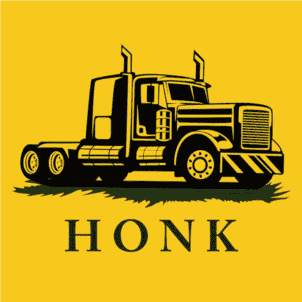
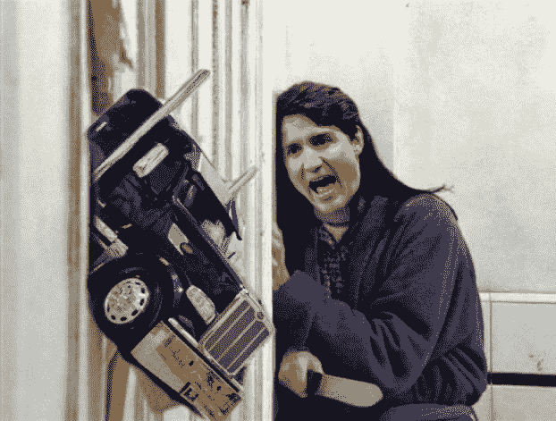
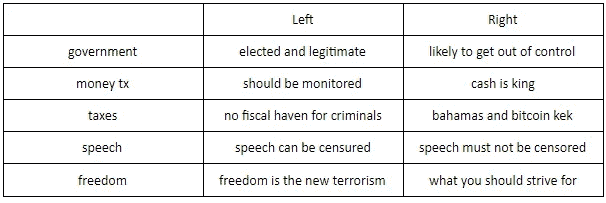
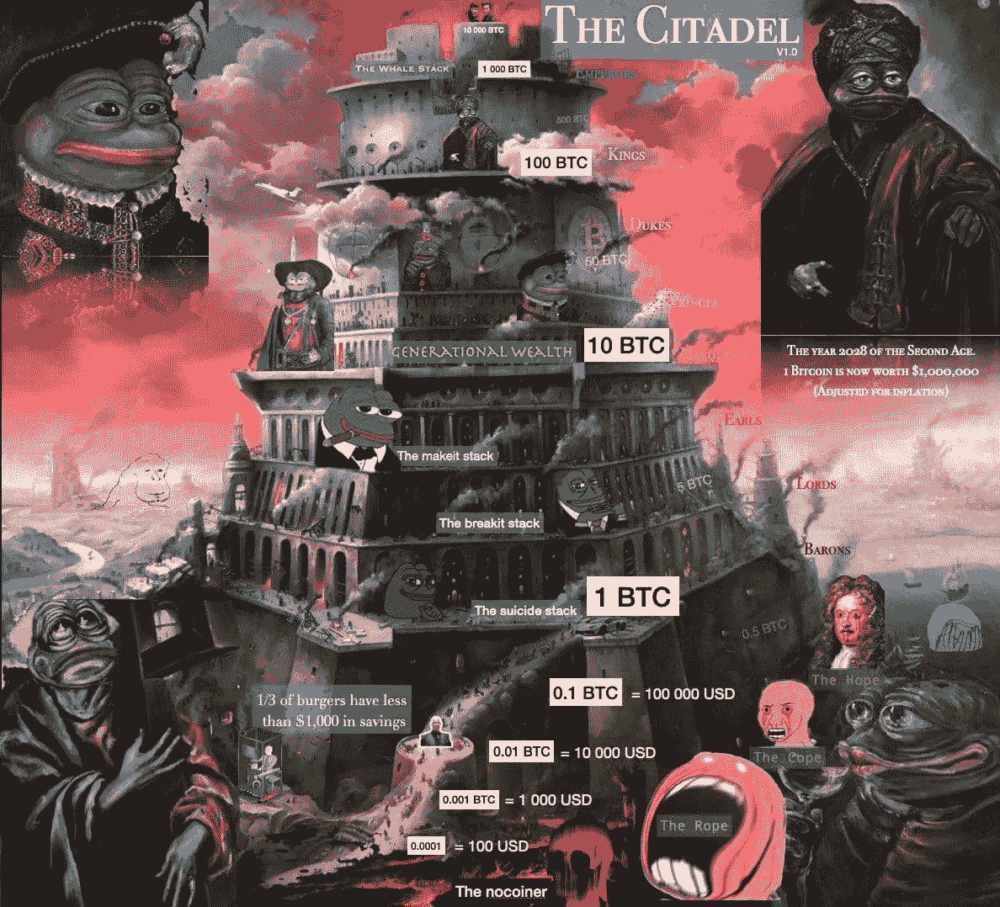

# 卡车司机的钱去按喇叭

> 原文：<https://medium.com/coinmonks/trucker-money-goes-honk-honk-8d920397c45e?source=collection_archive---------8----------------------->

*或者比特币的自然极化*

无论你有密码、比特币还是法定货币，你都应该努力问自己(和其他人)一个简单的问题:为什么是比特币？这个问题可以在理论和更实际的层面上解决。

按照理论，任何给定的纪录片或 youtube 视频都可以完成这项工作。比特币从 2008 年金融危机的灰烬中出现，作为普通银行家的替代选择，这些银行家不把你的最佳利益放在心上，最终通过赌博和不断从央行纾困窃取你的钱，这慢慢侵蚀了法定货币，引发了通货膨胀等。

但是在真正的战场上，在你的日常生活中，为什么是比特币？

**资本管制 *à美洲***

一些加拿大卡车司机为我们提供了一个案例研究:

他们封锁了渥太华的主要商业道路，抗议疫苗授权和护照。这引发了加拿大总理贾斯廷·特鲁多和卡车司机(500 到 1000 人)的逃亡，并从那时起“占领”了渥太华。他们整天按喇叭，人们发疯了。基本上是更响亮的黄色背心..

2 月 6 日，该市市长宣布进入紧急状态，这一政治事业/运动的支持者开始通过 GoFundMe (GFM)等互联网平台汇款，资助卡车司机。几天后，加拿大政府成功冻结了这笔众筹资金。事情是这样展开的:

*   GFM 被命令冻结这些资金，并将资金转用于更适当的用途。加拿大的互联网爆炸了，GFM 承诺实际退还捐款人的钱(据我们所知，目前情况并非如此)。所以卡车司机没钱。
*   卡车司机然后使用 GiveSendGo (GSG)筹集资金，但同样的故事，加拿大政府冻结了资金。有意思的是，在 GSG 筹集的 1000 万英镑中，有 100 万英镑在冻结前实际上已经汇入了道明(多伦多道明)的个人银行账户。
*   安大略省高级法院仍然设法在几个小时内冻结了这些个人银行账户，因为它们会助长渥太华街头的“犯罪行为”。请注意，根据最近的数据泄露，一半的捐款来自美国，一些来自政府地址，如美国宇航局的地址，如果你问我们，这是滑稽的。

如果你是美国人，这种情况会让你想起 21 世纪初反恐怖资金政策的巅峰时期，如果你的电话联系人中有阿卜杜勒，你的钱可能会被没收。如果你是欧洲人，你可能从未经历过如此强大的资本控制。如果你是中国人，这就是你的日常生活。如果你是一名加拿大卡车司机，你会求助于加密，更具体地说是比特币。

**比特币作为一种安全的选择**

在一周内，50 万美元的比特币被捐赠到由卡车司机，或者更确切地说是他们的政治领导人控制的比特币地址。截至目前，那些比特币还没有动，也没有兑换回美元，这就带来了另一个问题:货车司机们拿着那枚比特币“养钱”能干什么？从技术上讲，如果他们的个人银行账户被国家冻结/监控/控制，那么来自 coinbase 这样的交易所(你可以在那里将这些比特币兑换回美元)的任何美元都可以被冻结。他们将感谢最近政府权力的扩大，将卡车司机定性为潜在的恐怖分子。

因此，除非加拿大商店开始接受比特币直接购买食品杂货，例如通过闪电网络，否则比特币货币可能无法立即支持这场运动。然而，这是一种保险。如果情况进一步恶化，对卡车司机来说，这意味着破产和坐牢，理论上，一旦脱离国家“控制”，他们就可以获得这些比特币。

看起来，面对西方日益增长的政治两极分化(在 covid、肤色、性取向、电影表现等方面)，比特币虽然本质上不在政治范围内，但却越来越政治化。当你观察左右两边的话语时，你会注意到比特币在这个经过充分研究和科学的表格中的位置。

因此，除非加拿大商店开始接受比特币直接购买食品杂货，例如通过闪电网络，否则比特币货币可能无法立即支持这场运动。然而，这是一种保险。如果情况进一步恶化，对卡车司机来说，这意味着破产和坐牢，理论上，一旦脱离国家“控制”，他们就可以获得这些比特币。

看起来，面对西方日益增长的政治两极分化(在 covid、肤色、性取向、电影表现等方面)，比特币虽然本质上不在政治范围内，但却越来越政治化。当你观察左右两边的话语时，你会注意到比特币在这个经过充分研究和科学的表格中的位置。

这既简单又愚蠢，因为这就是两极分化带给你的:在每一个社会问题上的双重选择。加拿大副总理在 2 月 14 日将这一切联系在一起，称卡车司机非法占领渥太华，扰乱供应链，是恐怖分子，并通过破坏经济使人们更加贫穷。在这些事件发生前几周，特鲁多还称他们是恐同者、种族主义者和变性者。两极分化的极致。普通人现在是罪犯/恐怖分子，渥太华的情况表明，法定货币永远不会完全安全。

这是我的钱包，有很多像它一样的，但这只是我的

如果你读过过去 5 年比特币的头条新闻，应该会有印象。比特币的历史一直与犯罪联系在一起，有时是正当的(丝绸之路)，有时不是(通过比特币网络的非法资金实际上不如国际银行为洗钱支付的费用)。

如果这种趋势继续下去，为什么不呢，要么是因为越来越多的罪犯正在使用比特币，要么是因为各州认为越来越多的人是罪犯(你可以自己拿主意)。不管怎样，钱应该被国家控制到像中国模式所希望的那样，资金因为你的政治观点和行动而被瞬间冻结吗？

随着中央银行数字货币(CBDC)取代现金的到来，几乎所有的货币交易都将受到监控。这可以允许自动禁止花钱能力，但也可以引入可编程的钱(在一个月内花掉这笔钱，否则它就会过期)。从这个意义上说，今天对分散资金的斗争就是明天对极权经济的斗争。如果你生活在意大利或法国等更保守的国家，现金可能需要更长时间才能消失，但越来越少的机构和市场会接受它(正如你已经看到杂货店拒绝账单和支票)。

作为一个努力工作并试图保存你加班创造的价值的个人，你需要问自己这样一个问题:我如何以一种不能被审查的方式储存价值？卡车司机实验可以帮你搞清楚。你的银行账户可能会被冻结，你可能会被罚款，如果你不支付这些罚款，最终你的房子将被没收(就像反通行证澳大利亚人的房子被没收，因为他们拒绝支付他们的 covid 罚款)。最终，超越空间、时间和政治制度的唯一价值储存手段是比特币。你是唯一能打开你钱包的人，唯一知道那 24 个字的人。

这个思想实验是一个延伸，因为你永远不会成为一个加拿大卡车司机，你很可能会在你的一生中与不同的政治体制保持一致，这很好。你不需要与法定货币开战，事实上，两者很可能在一个两个王国类型的土地上共存，具有讽刺意味的是，这为 citadel meme 提供了一些线索。

你甚至不需要把你的钱兑换成比特币，因为我的上帝，它值 44000 美元，这看起来太疯狂了。这不是金融建议，底线是没有人知道比特币的价值，更不用说其他分散货币了(以太坊，Monero，说出你的包，我们会帮你卖掉它)。让我们假设你足够聪明，能够算出比特币的适当价值。然而，现在必须确定的是，比特币有价值。在一个政府审查客观上不断升级的世界里，作为不受审查的货币的价值。

我们在渥太华观察到的是战争的早期，你应该预料到来自 G20 政府的更多羞辱，因为那是他们唯一可以使用的规则。就像在任何战争中一样，最早入伍的士兵从来都不是聪明的受过教育的人，他们躲在后面保护他们将要失去的东西。他们是你喜欢嘲笑的平民，精神错乱者，乡下人，无名小卒，他们没有什么可失去的(插入— *但是他们的锁链* —如果你是共产主义同情者的话)。

> *加入 Coinmonks* [*电报频道*](https://t.me/coincodecap) *和* [*Youtube 频道*](https://www.youtube.com/c/coinmonks/videos) *了解加密交易和投资*

# 另外，阅读

*   [3 商业评论](/coinmonks/3commas-review-an-excellent-crypto-trading-bot-2020-1313a58bec92) | [Pionex 评论](https://coincodecap.com/pionex-review-exchange-with-crypto-trading-bot) | [Coinrule 评论](/coinmonks/coinrule-review-2021-a-beginner-friendly-crypto-trading-bot-daf0504848ba)
*   [莱杰 vs n rave](/coinmonks/ledger-vs-ngrave-zero-7e40f0c1d694)|[莱杰 nano s vs x](/coinmonks/ledger-nano-s-vs-x-battery-hardware-price-storage-59a6663fe3b0) | [币安评论](/coinmonks/binance-review-ee10d3bf3b6e)
*   [Bybit Exchange 审查](/coinmonks/bybit-exchange-review-dbd570019b71) | [Bityard 审查](https://coincodecap.com/bityard-reivew) | [Jet-Bot 审查](https://coincodecap.com/jet-bot-review)
*   [3 commas vs crypto hopper](/coinmonks/3commas-vs-pionex-vs-cryptohopper-best-crypto-bot-6a98d2baa203)|[赚取加密利息](/coinmonks/earn-crypto-interest-b10b810fdda3)
*   最好的比特币[硬件钱包](/coinmonks/hardware-wallets-dfa1211730c6) | [BitBox02 回顾](/coinmonks/bitbox02-review-your-swiss-bitcoin-hardware-wallet-c36c88fff29)
*   [BlockFi vs 摄氏度](/coinmonks/blockfi-vs-celsius-vs-hodlnaut-8a1cc8c26630) | [Hodlnaut 点评](/coinmonks/hodlnaut-review-best-way-to-hodl-is-to-earn-interest-on-your-bitcoin-6658a8c19edf) | [KuCoin 点评](https://coincodecap.com/kucoin-review)
*   [Bitsgap 评审](/coinmonks/bitsgap-review-a-crypto-trading-bot-that-makes-easy-money-a5d88a336df2) | [Quadency 评审](/coinmonks/quadency-review-a-crypto-trading-automation-platform-3068eaa374e1) | [Bitbns 评审](/coinmonks/bitbns-review-38256a07e161)
*   [加密复制交易平台](/coinmonks/top-10-crypto-copy-trading-platforms-for-beginners-d0c37c7d698c) | [Coinmama 审核](/coinmonks/coinmama-review-ace5641bde6e)