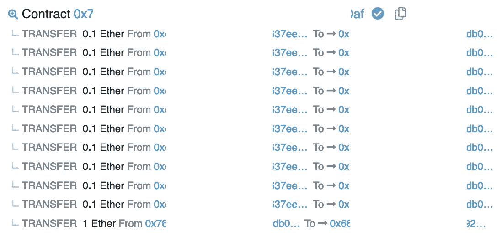

# 信托基金

> 原文：<https://medium.com/coinmonks/trust-fund-2b2f6620bfb8?source=collection_archive---------32----------------------->

## 安全创新区块链 CTF 报道(英文版)

大家好！这篇文章也有泰文版，供那些喜欢的人阅读；[请点击这里](/@teerasak.r/trust-fund-cb1f9739603e)。

สวัสดีครับบทความนี้มีเวอร์ชันภาษาไทยเหมือนกันนะสำหรับคนที่ต้องแบบภาษาไทยสามารถ[คลิกที่นี่](/@teerasak.r/trust-fund-cb1f9739603e)

# 合同代码

# 解决办法

首先，我建议尝试学习合同的目的、工作流程和功能。这可以提供契约的概要，并提示您应该检查哪个功能。

这个挑战的目标是从合同中抽干所有的 ETH。由于只有一个与传输 ETH 相关的功能，很容易注意到，`withdraw()`。

因此，您可以直接使用`withdraw()`函数，并考虑如何在不恢复的情况下调用它。它有两个`require()`语句，你必须让它在调用时产生`true`，但是怎么做呢？

我想缩小一点，解释一下这个挑战是关于什么的。它旨在锁定已部署的 ETH，并允许您每年仅撤回 1/10(`allowancePerYear = msg.value.div(10);`)，因此，**您将需要 10 年时间来解决这一挑战！**等一下…，如果这么直，这就不是挑战了，不是吗？所以，我们来深入探讨一下怎么破吧！

第一个是`allowancePerYear > 0`，完全不用担心，它将始终大于零，因为它将被设置为 ETH 部署量除以 10，该值始终大于零。

第二个，`withdrewThisYear`，打电话时必须是`false`，表示你今年一定没有提款。在调用`withdraw()`之后，它将被设置为真，如果你已经调用了它，你可以通过调用`returnFund()`将它设置回假，其金额与你提取的金额相同。

而且……破绽就在这里！如果您仔细查看第 34–36 行，您会注意到在`withdrewThisYear`被设置为`true`之前，资金被发送给调用者(`msg.sender.call.value(allowancePerYear)()`)，这种模式引入了可重入攻击。我不打算解释这种攻击是什么，但是如果您以前没有听说过它或者对它不熟悉，请使用下面的来源作为起点来了解它的更多信息:

*   [https://swcregistry.io/docs/SWC-107](https://swcregistry.io/docs/SWC-107)
*   [https://hackernoon.com/hack-solidity-reentrancy-attack](https://hackernoon.com/hack-solidity-reentrancy-attack)

契约在设置值之前进行外部调用，在处理第 35 行之前，它将控制权交给被调用者。所以，你可以在`withdrawThisYear`仍然是`false`的时候再次调用`withdraw()`。要在一个事务中执行多个调用，智能合约是不可避免的；没有智能合同就无法做到这一点。智能合约逻辑可以如下所示:

1.  调用`withdraw()`函数。
2.  实现`fallback()/receiver()`函数来递归调用`withdraw()`函数。该功能将由每次呼叫的第 34 行触发。而且，您必须包括剩余余额检查，以在所有资金耗尽后停止递归。
3.  将你的智能合约中所有耗尽的 ETH 转移回给你(如果你愿意，你可以留下它)。

下面是我根据上述逻辑实现的智能契约。

您可以用您喜欢的任何方法来编译、部署和运行它。您只需在部署时输入挑战地址(TrustFund.sol)即可设定目标。

如果你在 [SecurityInnovation](https://blockchain-ctf.securityinnovation.com/#/) 网站上玩，别忘了挑战是继承自`CtfFramework.sol`的。您必须通过调用`ctf_challenge_add_authorized_sender()`将您部署的智能合约地址作为允许的调用方。

一切就绪后，只需调用`pwn()`即可完成😎。

# 吸取的教训

这个挑战显然是有重入攻击漏洞的，因此，[这里可以找到很好的缓解方法](https://swcregistry.io/docs/SWC-107)。我将总结如下:

*   最好不要在更改内部状态之前进行外部调用，但如果需要，请确保外部被调用方是可信的。
*   Openzeppelin 的 [ReentrancyGuard](https://docs.openzeppelin.com/contracts/4.x/api/security#ReentrancyGuard) 非常有帮助，是为此而生的。然而，只对需要不可重入的函数使用它，而不是对所有的函数，因为这包括更多的检查，所以，花费更多的汽油。
*   你也可以考虑使用 [Rari-Capital solmate 的 ReentrancyGuard](https://github.com/Rari-Capital/solmate/blob/main/src/utils/ReentrancyGuard.sol) 来获得比 Openzeppelin 更多的气体优化，如果你打算使用的话。

> *加入 Coinmonks* [*电报频道*](https://t.me/coincodecap) *和* [*Youtube 频道*](https://www.youtube.com/c/coinmonks/videos) *了解加密交易和投资*

# 另外，阅读

*   [3 商业评论](/coinmonks/3commas-review-an-excellent-crypto-trading-bot-2020-1313a58bec92) | [Pionex 评论](https://coincodecap.com/pionex-review-exchange-with-crypto-trading-bot) | [Coinrule 评论](/coinmonks/coinrule-review-2021-a-beginner-friendly-crypto-trading-bot-daf0504848ba)
*   [莱杰 vs n 格拉夫](/coinmonks/ledger-vs-ngrave-zero-7e40f0c1d694) | [莱杰纳诺 s vs x](/coinmonks/ledger-nano-s-vs-x-battery-hardware-price-storage-59a6663fe3b0) | [币安评论](/coinmonks/binance-review-ee10d3bf3b6e)
*   [加密交易机器人](/coinmonks/crypto-trading-bot-c2ffce8acb2a) | [Bingbon 评论](https://coincodecap.com/bingbon-review)
*   [Bybit Exchange 审查](/coinmonks/bybit-exchange-review-dbd570019b71) | [Bityard 审查](https://coincodecap.com/bityard-reivew) | [Jet-Bot 审查](https://coincodecap.com/jet-bot-review)
*   [3 commas vs crypto hopper](/coinmonks/3commas-vs-pionex-vs-cryptohopper-best-crypto-bot-6a98d2baa203)|[赚取加密利息](/coinmonks/earn-crypto-interest-b10b810fdda3)
*   最好的比特币[硬件钱包](/coinmonks/hardware-wallets-dfa1211730c6) | [BitBox02 回顾](/coinmonks/bitbox02-review-your-swiss-bitcoin-hardware-wallet-c36c88fff29)