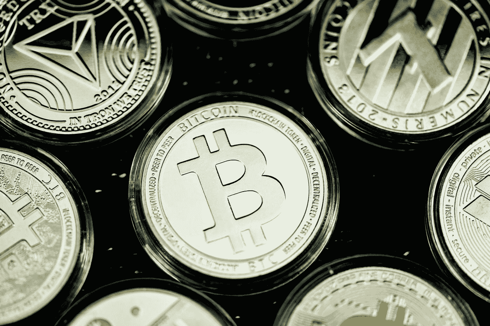

# Trust Machines 希望将 DeFi、NFTs 和 DAOs 引入比特币的区块链

> 原文：<https://medium.com/coinmonks/trust-machines-wants-to-bring-defi-nfts-and-daos-to-bitcoins-blockchain-a798b275d67c?source=collection_archive---------22----------------------->

Photo by [Quantitatives.io](https://unsplash.com/@quantitatives?utm_source=medium&utm_medium=referral) on [Unsplash](https://unsplash.com?utm_source=medium&utm_medium=referral)

比特币仍然主要被视为一种纯粹的投机性投资。对于现场的某些人来说，这是一个赌注，BTC 将越来越多地被接受为国家一级的法定货币。但是，尽管萨尔瓦多已经朝着这个方向迈出了大胆的第一步，但并不是每个人都信服。