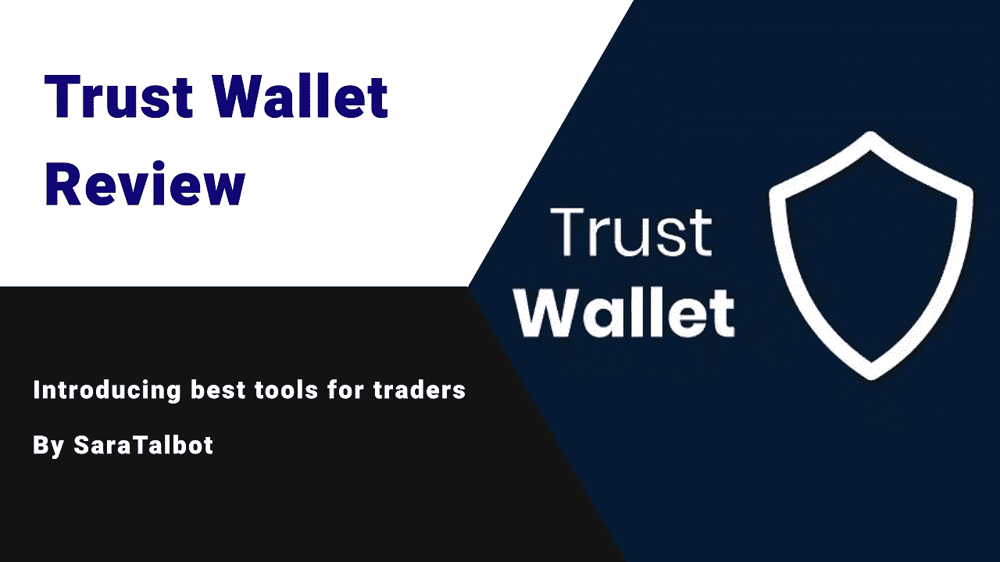

# 信任钱包评论

> 原文：<https://medium.com/coinmonks/trust-wallet-review-653985dfac67?source=collection_archive---------58----------------------->

信任钱包简介

TrustWallet 软件是最好的移动加密货币钱包软件之一，专注于简单易用，允许您管理、存储和兑换各种加密货币，具有高安全性和安全性。该程序通过提供安全的访问密钥和对私钥的完全控制来保护您的资产免受未经授权的访问。Trust wallet 可以在 IOS 和 Android 操作系统的手机上安装和使用。在本文中，我们将教您如何下载、创建帐户以及如何使用信任钱包，但在此之前，我们将介绍该钱包的功能和工作原理。

信任钱包如何工作

信托钱包于 2018 年被币安交易所收购，现在被称为币安官方钱包。另一个特点是它的去中心化和缺乏对用户私钥的控制。像一座桥，这个钱包通过节点连接两个独特的折叠块。

信任钱包功能

除了发送、接收和存储各种加密货币和上述物品之外，它还有许多其他功能，包括:

1-购买货币

这款钱包拥有 Wyre、MoonPay、Simplex 和 Mercuryo 等多个支付网络。这些支付网络通过将其服务与 Trust Walt 软件整合，使得购买加密货币成为可能；因此用户可以使用信用卡购买比特币、以太坊和许多其他货币。

2-即时查看价格

除了之前的功能，它还允许用户即时查看比特币、以太坊、Altcoins 和 ERC 20 代币。也可以通过这个软件钱包查看市值、价格表、交易量。

3-交换和交换

TrustWallet 具有交换、转换或兑换加密货币的能力。通过交换功能，用户可以从不同的网络交换不同的令牌。用户可以随时轻松地更改他们的货币密码，而无需完成任何表格和客户身份验证。

4-通过购买加密货币赚取利润

这款钱包的独特之处在于不同于其他多币种钱包。相反，购买一个货币代码并保存在这个钱包里有利于用户。这个功能的工作原理几乎就像一个银行账户。目前，塞隆、特佐斯、维查因、卡利斯托、卡瓦、托莫查因、卢特克斯、阿尔格兰德的钱包等信任货币只对用户有利。

DApps 浏览器

相信沃尔特的软件钱包有一个有用的浏览器。该浏览器可帮助您找到接受加密货币来销售其产品和服务的企业和供应商。

6-安全访问

通过提供私钥，它向用户保证只有他们才能访问他们的金融资产。

信任钱包的优势

-不到 5 分钟就能买到比特币

-私钥的控制是用户的责任。

-从钱包本身的货币代码中获利的能力

-查看收藏品、NFT 代币等。在一个地方

-无需退出程序的加密转换和交换

-货币的安全存储和防止黑客攻击

-币安交易所专用钱包

信托钱包的缺点

-不支持双因素身份验证

-没有 Windows 和桌面版本

-不如硬件钱包安全

信任钱包中支持的货币:

信任钱包支持所有 ERC20、ERC223 和 BEP20 令牌。因此，有了 TrustWallet，你可以保存多种货币。考虑到 ERC20 和 BEP20 令牌的多样性，以及 Trust Wallet 对几十种不同中国区块的支持，开发商声称 Trust Wallet 支持的加密货币数量超过 100 万种。作为最重要的情况，我们应该提到下列货币:

-比特币(BTC)

以太坊

-币安硬币(BNB)

莱特币

-瑞波(XRP)

-波尔卡多(点)

-恒星(XLM)

- Dogecoin (DOGE)

-兹卡什(ZEC)

-破折号

创(TRX)

-泰佐斯(XTZ)

-宇宙(原子)

-比特币现金(BCH)

-以太坊经典(等)

-纳米(纳米)

- VeChain(兽医)

咖啡(卡瓦)

永恒之塔(Aion)

-θ(西塔)

-本体论(ONT)

- Qtum (QTUM)

- IoTeX (IOTX)

-齐利卡(ZIL)

-阿尔格兰德(ALGO)

-近(近)

-数码字节(DGB)

-和谐(一)

您可以访问 trustwallet.com/assets，查看信托钱包中支持的所有硬币和代币。

检查信任钱包的安全性

与其他类似钱包(软件和热门)相比，Trust Wallet 的安全级别最高，不会被自己黑客攻击，除非用户未能遵循一系列安全提示。在进一步考察 Trust Volt 钱包的安全级别之前，最好先关注一下它的两个非常重要的安全特性。

匿名使用(无需认证):

从下载阶段到创建新钱包，然后接收和发送货币密码，您不需要提供任何信息。你甚至不需要用电子邮件或手机号码登录。信任钱包的使用是完全匿名的，您的身份不会被泄露。这会减轻你对隐私的顾虑。为了保险起见，Trust wallet 的开发者承诺绝不在后台(用户看不到的地方)收集用户信息。

非监禁:

Trust Wallet 属于非保管货币钱包的类别，这意味着它不会在在线服务器上存储您的私钥(表明您对钱包内货币的所有权的密码)，这些密钥总是存储在手机内存中。相比之下，保管钱包，如集中交易所，持有私钥，而不是信任钱包。一个非保管钱包给你 12，18 或 24 个字，包含所有的私钥，所以你可以随时用它来找回你的资产。