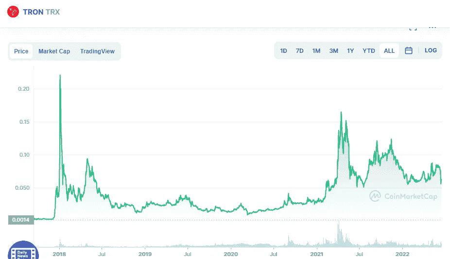

# TRX:从长期来看，创是个好买卖吗？

> 原文：<https://medium.com/coinmonks/trx-is-tron-a-good-buy-for-long-term-ed2867588cc0?source=collection_archive---------42----------------------->

Source photo [TRON price today, TRX to USD live, marketcap and chart | CoinMarketCap](https://coinmarketcap.com/currencies/tron/)

去中心化是 Tron(TRX)使命的核心，这也是为什么加密货币在 2018 年首次出现在市场上。点对点网络被认为是媒体行业的一场革命，它消除了中间商，使艺术家和内容提供商能够直接向消费者销售他们的产品。

这个操作系统正在挑战亚马逊、网飞、脸书和 YouTube 等公司