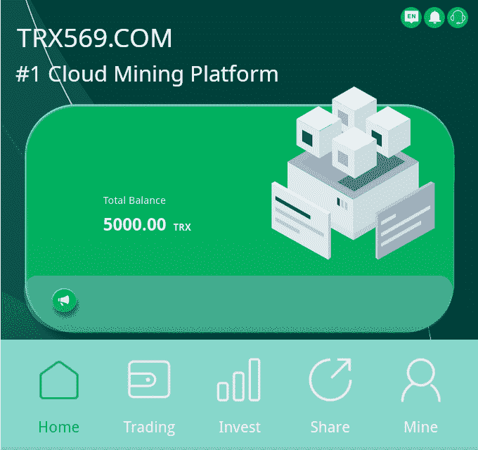
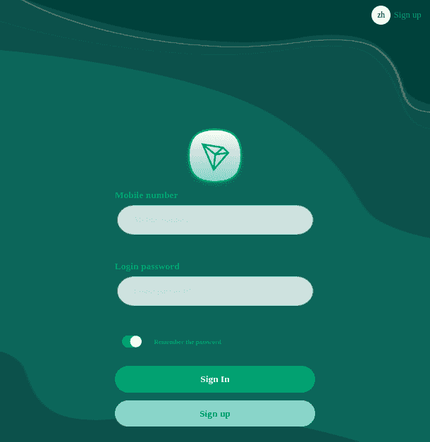
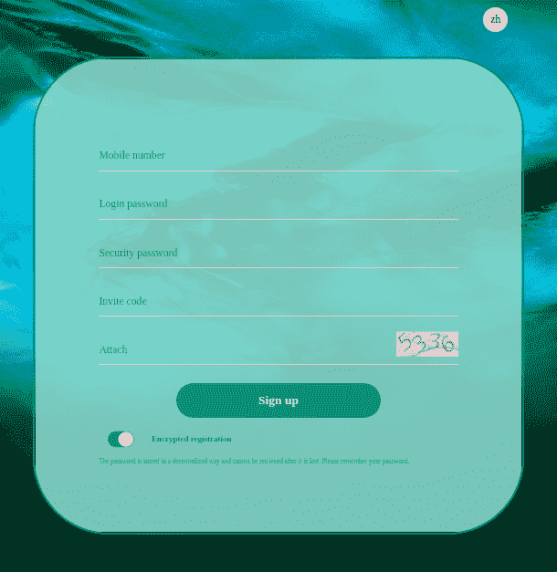
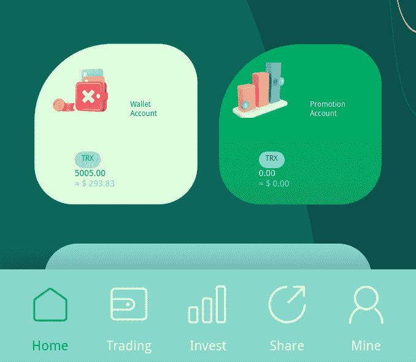

# TRX569.COM |新的高回报云采矿平台！

> 原文：<https://medium.com/coinmonks/trx569-com-new-cloud-mining-platform-with-high-rewards-7c1b030e6383?source=collection_archive---------21----------------------->

2022 年 3 月 10 日

# 什么是云挖掘？

云挖掘是一种机制，使用租用的[云计算](https://www.investopedia.com/terms/c/cloud-computing.asp)电源，无需安装和直接运行硬件和相关软件，即可挖掘出[加密货币](https://www.investopedia.com/terms/c/cryptocurrency.asp)，如[比特币](https://www.investopedia.com/terms/b/bitcoin.asp)。云采矿公司允许人们以基本的费用开立账户并远程参与加密货币采矿过程，使采矿可以为世界各地更多的人所用。由于这种形式的开采是通过云完成的，因此减少了设备维护或直接能源成本等问题。

云矿工成为矿池的参与者，用户购买一定数量的“哈希能力”。每个参与者根据租用的哈希函数的数量按比例获得利润。

# 云挖掘模型

托管挖掘是最流行的云挖掘形式。在这种模式中，客户购买或租赁位于矿工设施中的采矿硬件。矿工负责维护设备并确保其功能正常。通过这种模式，客户可以直接控制他们的加密货币。采矿场的规模经济确保了与采矿相关的昂贵成本(如电力和存储)变得可控。但是这种类型的采矿需要相当大的前期成本。

# 云挖掘的优势

*   没有冷却塔和冷却风扇，这个家变成了平静和安宁的天堂。像矿工一样，在使用**算法**哈希时，CPU 往往会持续使用，主板变热，为了防止任何**硬件**熔化，它需要在寒冷的环境中运行。
*   为了防止冷却设备的持续运行，电力成本很有可能会增加。几乎没有用户能够承担高昂的费用，因此参与加密挖掘的组织开始发挥作用。
*   一旦矿商发现云采矿是一个有利可图的项目，那么处理任何硬件几乎是不可能的。
*   由于参与云开采的公司能够负担得起购买冷却塔和设备，与通风有关的问题就被排除了。

# 云挖掘的缺点

1.  当矿工或用户也分享关于他们的钥匙和数字钱包的信息时，一些云挖掘功能倾向于**实施欺诈**。
2.  在云采矿中，矿工的操作变得脆弱和透明。
3.  没有**云采**的控制和柔顺。
4.  云矿主要是服务提供商。如果他们在开采**区块链**，他们会收取一些费用作为回报，这意味着对采矿者或使用者来说利润会更少。

理想情况下，云采矿是为那些没有时间、不懂技术、也没有任何**加密货币相关设备**的人准备的。另外，假设你在一个电费很高的国家。在这种情况下，明智的做法是将采矿作业分包给位于成本相对较低的国家的组织。

# TRX569。COM 云挖掘解决方案

TRX569.COM Sign In Screen

推荐代码:30424015

现在，我们将了解一家提供云挖掘服务的公司，以及与他们的模式相关的好处和利润。[TRX569.COM](https://trx569.com)目前在全球拥有 50 多个自建矿山和合作矿山。全球领先的一站式区块链计算能力生态系统 TRX569 与 America Mining 合作，集成了全球 36 个其他国家和地区，拥有超过 1530 万台矿用机器。2021 年 12 月，矿商赚了近 850 亿美元，增强了投资者的信心。 [TRX569](https://trx569.com) 以专业的矿业诚信公司自居。

TRX569.COM Sign Up Screen

在官网注册成功后，你会有两个钱包，一个是基础钱包，一个是促销钱包。

规则:

*   基本钱包必须成功投入 5 TRX 才能激活钱包，之后每天都可以提取 TRX。
*   推广钱包用来和朋友分享投资获得的树级返利。
*   取款没有限制。
*   您可以随时全额提取现金。
*   每天必须选择一个钱包取现一次。

# 成功完成注册后

以下是完成注册后需要注意的事项:

1.  基本钱包将获得 5000 TRX 作为矿池助推器。当你的采矿池达到一定的峰值时，这个数量可以解锁。您可以推荐任何有兴趣加入 TRX569 TRON 云矿服务的朋友，您将获得 30 TRX、20 TRX 和 10 TRX 的三级矿池助推器。三级佣金分别为 13%、5%和 2%。

例如朋友 A 投资 1000 TRX，你会收到 130 TRX | A 推荐 B 投资 1000 TRX，你会收到 50 TRX | B 推荐 C 投资 1000 TRX，你会收到 20 TRX。

2.以下是基本的钱包投资提款比率:

*   存款 5–30001 TRX，每天提取 5%
*   存款 30001–100000 TRX，每日提取 5.5%
*   存款 100，001–200，000 元人民币，每天提取 6%
*   存款 200，001–500，000 元人民币，每日提取 6.5%
*   存款 500，001–1，000，000 TRX，每日提取 7%
*   存款 1，000，001–10，000，000 TRX，每日提取 7.5%

TRON-LINK 将通过 TRX 为每位客户提供安全、高效、稳定的长期采矿收入。你的收入取决于你什么时候加入，你投资了多少。

# 常见问题解答

## 什么是加密货币？

加密货币是一种数字或**虚拟货币**，由加密技术保护，这使得伪造或重复消费几乎不可能。许多加密货币是基于  **区块链**技术的分散式网络——一种由不同的计算机网络执行的  **分布式账本**。加密货币的一个定义特征是，它们通常不是由任何中央机构发行的，这使得它们在理论上不受政府干预或操纵。

## 什么是采矿？

挖掘是比特币和其他几种加密货币用来生成新硬币和验证新交易的过程。它涉及到遍布世界各地的庞大、分散的计算机网络，用于验证和保护区块链——记录加密货币交易的虚拟账簿。

## 创是什么？

TRON 是一个基于区块链的分散、开源操作系统，具有**智能合约**功能、**利益证明**原则作为其共识算法，以及一种系统原生的加密货币，称为 **Tronix** 。

推荐代码:30424015

作者:TreyTrillionaire

**NB * TRX569.com 的付费推广**