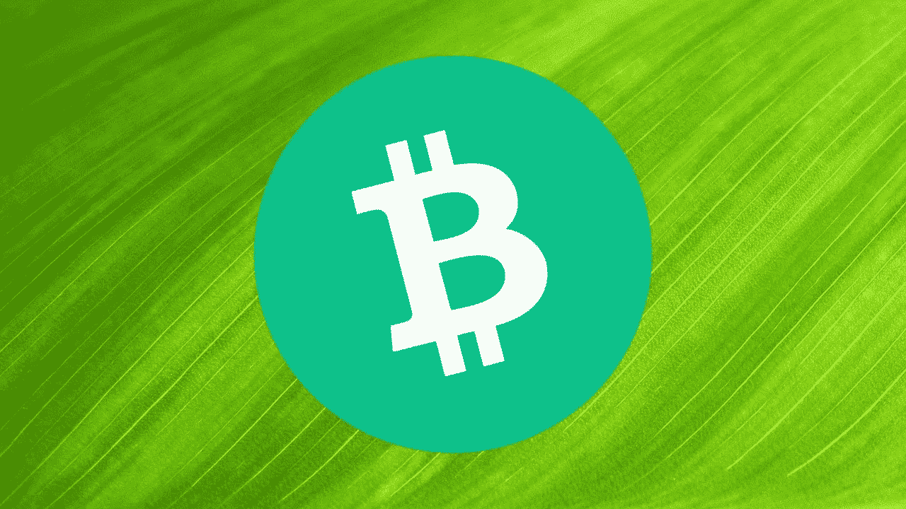

# 让比特币现金情绪变得积极

> 原文：<https://medium.com/coinmonks/turning-the-bitcoin-cash-sentiment-positive-1e6be6457269?source=collection_archive---------26----------------------->

***Photo: by “*** [***llmicro***](https://pixabay.com/users/llmicro-50538/)***” on*** [***Pixabay***](https://pixabay.com/photos/leaf-texture-green-leaf-veins-176722/)

大约一年前，牛市周期结束了。这可能是加密技术最短的牛市，所以比特币(BTC)必须恢复并实现新的 ATH，因为鲸鱼还没有兴趣出售。

因此，BTC 在 5 月 18 日到 7 月 20 日之间有一个三重底，这导致了需求的上升，交易者将 BTC 带入了 69000 美元的新 ATH。