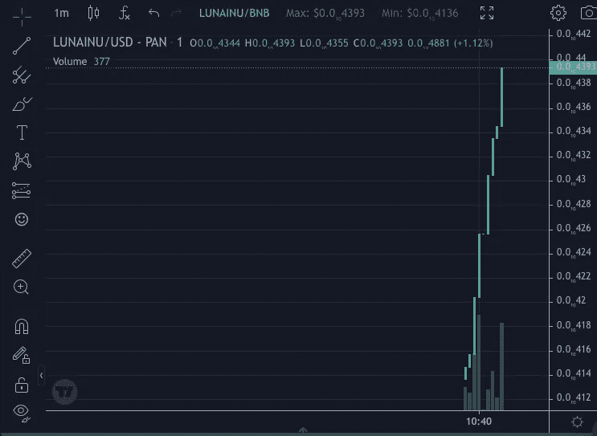
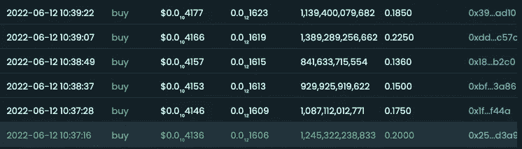
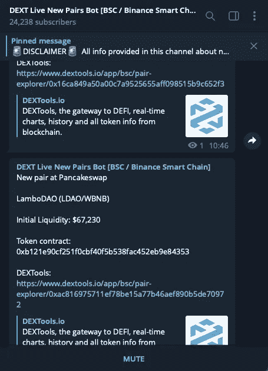
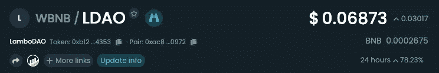
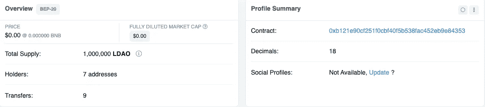
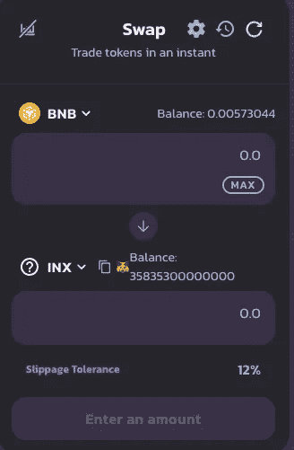
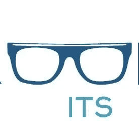
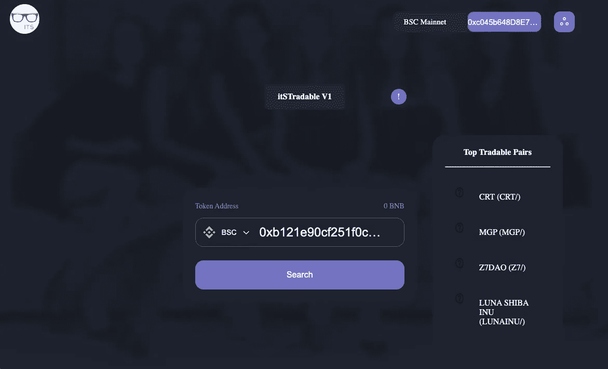
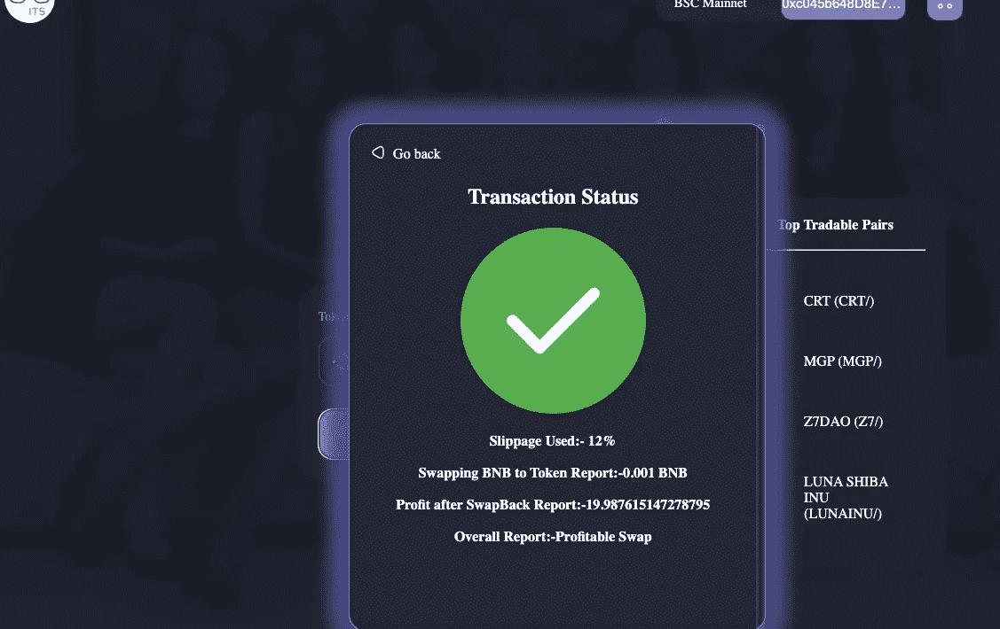
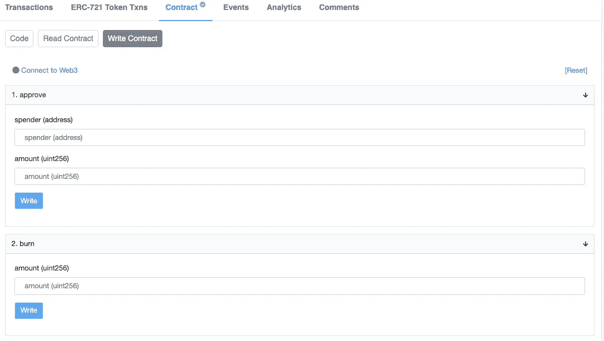

# 将您的 10 美元变成 1000 美元——这是 100 倍的黄金机会

> 原文：<https://medium.com/coinmonks/turning-your-10-into-1000-that-golden-100x-opportunity-a508d54ca97?source=collection_archive---------15----------------------->

***免责声明:被动赚钱还是一个风险很大的领域。只交易你能承受的损失。***

我们都希望有机会赚大钱，有机会一夜暴富，买下那辆兰博，环游世界。事实是，这是 DeFi 使之成为可能的事情之一。一天之内，大概有 500 到 800 个新代币在 pancakeswap DEX 平台上市。

让我们假设我们生活在一个理想的世界中，所有列出的令牌有 90%的机会使我们的投资翻倍，有 80%的机会在一天内达到 100 倍。这意味着在这个理想的世界里，最适者(在这里是最快的)，交易者可以在一个月内成为百万富翁。美丽的场景，但我们不是生活在一个理想的世界，而且，这并不意味着这些机会在现实世界中不存在。

我将通过各种方法来识别这 100 倍的贸易机会，传统的和现代的方法，我发现非常有用。

**找到宝石令牌**

在上述理想情况下，最小化风险的方法是成为现货交易新代币的第一批交易者。同样的场景也是我应用到现实世界中的场景。

我的策略很简单:成为最先交易代币的六个交易者之一，确保没有鲸鱼在我之前交易。这其实是最简单的部分

**守旧派狩猎**

这包括手动检查令牌是否存在任何问题。在 bsc 网络上扫描令牌所遵循的步骤；

*   首先你需要一个电报应用程序，然后通过链接[https://t.me/DEXTNewPairsBotBSC](https://t.me/DEXTNewPairsBotBSC)将这个 dextool 真人配对机器人添加到你的电报中。这实际上提供了新列出的令牌的实时更新，并减轻了您使用节点扫描新列表的压力

dextool pair bot channel telegram

*   监控很难，所以为电报应用程序使用专用的通知声音可能会有所帮助。在新列表中，打开列出的令牌并从 dextool 导航到 bsc 网络。

click on the bsc network logo

*   扫描令牌时要考虑的事项有:确保持有者少于 10 个，(在我的下一篇文章中，我将列出所有可能的恶意令牌合同。保持关注)，合同被验证，(我们可以不通过合同代码，因为快速购买是我们的主要目标)。

*   扫描成功后，导航到 pancakeswap，(现在应该已经打开了)，将合同地址粘贴到 swap 令牌中，并交易最小 0.0001 bnb 来测试它是否可交换。如果是可交换的，就换利润。如果不是忽略。

panckawap

上述方法导致我个人濒临破产。机会是存在的，但是花真金白银在一天内测试超过 200 个代币以及汽油费并不真正有利可图。大多数是诈骗硬币。发现的几个 100 倍的机会，我最多持有 30%,然后抛出以避免拉地毯。

**解决方案**

这就是解决方案:【https://itstradable.info/.】T2 这是一个免费的平台，可以帮助你进行上述代币测试，不需要任何成本就可以知道它是否可以交易，或者只是另一个购买陷阱代币。我更新了我的交易流程；

itsTradable

*   我没有使用真正的 bnb 进行测试，而是将令牌地址放入它的 Trable 中，它对令牌进行扫描，并输出它认为令牌如何的结果。在实际做了一些现场测试后，我相信了输出结果。**同样值得注意的是，你只能扫描 WBNB 对。**

itsTradable Dashboard

*   扫描之后，我检查了合同是否也经过了验证，还检查了令牌的合同代码页上的 write 选项卡，以确保没有只有所有者有权访问的可疑公共函数。

successful scan

verified token write tab

*   然后我交易。

到目前为止，结果是有希望的，因为我只交易了 10 个代币，每个有 30%的回报。此外，检查流动性是否锁定为长期持有和 100 倍回报。

平台[可交易](https://itstradable.info/)，

在 Twitter 上关注 its trable:@ I _ traded

电报泵通道:[https://t.me/itsTradable](https://t.me/itsTradable)。

如果需要，我会分享我如何使用 nodejs 自动化整个过程。将您的速度提高 8 倍，成为交易代币的前两名交易者。

快乐的交易朋友。

> 加入 Coinmonks [电报频道](https://t.me/coincodecap)和 [Youtube 频道](https://www.youtube.com/c/coinmonks/videos)了解加密交易和投资

# 另外，阅读

*   [Coldcard 评论](https://coincodecap.com/coldcard-review) | [BOXtradEX 评论](https://coincodecap.com/boxtradex-review)|[uni swap 指南](https://coincodecap.com/uniswap)
*   [比特币基地评论](/coinmonks/coinbase-review-6ef4e0f56064) | [德里比特评论](/coinmonks/deribit-review-options-fees-apis-and-testnet-2ca16c4bbdb2) | [FTX 评论](/coinmonks/ftx-crypto-exchange-review-53664ac1198f)
*   [Coinmetro 评论](https://coincodecap.com/coinmetro-review) | [VirgoCX 评论](https://coincodecap.com/virgocx-review)
*   [法国 4 大最佳密码交易平台](https://coincodecap.com/copy-trading-platforms-france)
*   [从 WazirX 切换到 CoinDCX 的 5 个理由](https://coincodecap.com/reasons-to-switch-from-wazirx-to-coindcx)
*   [Unocoin 评论](https://coincodecap.com/unocoin-review) | [最佳加密赌注硬币](https://coincodecap.com/best-crypto-staking-coins)
*   [如何使用 MetaMask Wallet 获得 KCC 地址？](https://coincodecap.com/kcc-address-metamask)