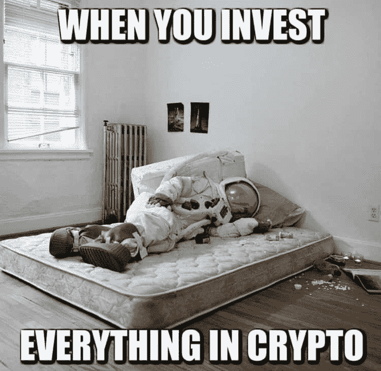

# “原来贪婪是万恶之源”

> 原文：<https://medium.com/coinmonks/turns-out-greed-is-the-root-of-all-evil-968048ec8d46?source=collection_archive---------65----------------------->

“原来贪婪是万恶之源”

加密史上最糟糕的日子:
mt . Gox 黑客窃取了 74 万 BTC(不是美元，实际是 BTC)。
以太坊上导致臭名昭著的叉子的刀黑客。
现在，导致 2022 年神秘事件的地球/月球碰撞。

这使得时间/仙境惨败，虫洞和豆茎黑客似乎微不足道。

许多人受到了这次事故的影响，每个人都被这个疯狂的干草制造者抓住了。
我的博客上充斥着关于人们如何在 Luna 失去全部身家的可怕故事。
一生的积蓄被投入到 Anchor 协议中，却眼睁睁地看着它被剥夺，价值荡然无存。自杀热线和咨询电话在论坛和社交媒体上随处可见。Cryptogeddon 的影响正痛苦地渗入现实世界。像 BTC 和瑞士联邦理工学院这样的蓝筹加密公司正在全力以赴，像黑洞一样摧毁一切。就连蓝筹股 NFT 也未能幸免，因为 BAYC、MAYC 和 Moonbirds 都被裁掉了。更不用说震惊 NFT 世界的志那都红豆闹剧了。
实际上，志那都红豆的一些联合创始人承认他们之前的项目有些拖沓，并向观众吹嘘。如果这是真的，这是卑鄙的，也是令人心碎的。自然，志那都红豆的地板价格自 ATH 以来几乎减半。

但那是以后的事了。

我们能预见到这一切吗？墙上写有标志吗？一些批评家早在其他人之前就发表了意见。
他们说锚定协议的令牌组学是不可持续和不合理的。
谁在乎？
Terra 得到了一些业内重量级公司的支持，如三箭资本和 Jump Capital。每个人都认为确实有太大而不能倒的公司。作为一个社区，我们是否能够客观地审视 Terra / Luna，并避开它？可能，但不太可能。人终究是人，我们在某种程度上都是贪婪和盲目的。
巅峰的时候，大家都在先令锚，20%的利率是多么壮丽。
Web3 和 DeFi 初创公司不知从哪里冒出来，利用 Anchor 荒谬的利率赚钱。几乎每天都会有一个新的协议建立在 Terra/Luna/Anchor 之上，继续将人们吸引到生态系统中。加密社区将 Terra / Luna 的创始人 Do Kwon 誉为专家。个人崇拜是真实的。这些领导者通过魅力、力量和对迷因的掌握而变得受欢迎他们似乎根本不接受公平的批评，用简短的推文公开嘲笑和贬低批评者。我不得不承认，其中一些真的很机智，让我几次把饮料吐出来。但是所有这些似乎只是一个出了差错的非常大的密码实验。风投、投资者、零售市场和投机者都知道风险，但还是选择了跳水。

-

所有加密崩溃和黑客攻击的根源是什么？

-

# startups # business # startupx # dokwon # luna # terra # terraformlabs # stable coin # luna crash # cryptoland # ust # cryptogeddon #比特币#死亡螺旋#bankrun

> 加入 Coinmonks [电报频道](https://t.me/coincodecap)和 [Youtube 频道](https://www.youtube.com/c/coinmonks/videos)了解加密交易和投资

# 另外，阅读

*   [加密货币储蓄账户](/coinmonks/cryptocurrency-savings-accounts-be3bc0feffbf) | [YoBit 评论](/coinmonks/yobit-review-175464162c62)
*   [Botsfolio vs nap bots vs Mudrex](/coinmonks/botsfolio-vs-napbots-vs-mudrex-c81344970c02)|[gate . io 交流回顾](/coinmonks/gate-io-exchange-review-61bf87b7078f)
*   [CoinFLEX 评论](https://coincodecap.com/coinflex-review) | [AEX 交易所评论](https://coincodecap.com/aex-exchange-review) | [UPbit 评论](https://coincodecap.com/upbit-review)
*   [AscendEx 保证金交易](https://coincodecap.com/ascendex-margin-trading) | [Bitfinex 赌注](https://coincodecap.com/bitfinex-staking) | [bitFlyer 点评](https://coincodecap.com/bitflyer-review)
*   [Bitget 回顾](https://coincodecap.com/bitget-review)|[Gemini vs block fi](https://coincodecap.com/gemini-vs-blockfi)cmd |[OKEx 期货交易](https://coincodecap.com/okex-futures-trading)