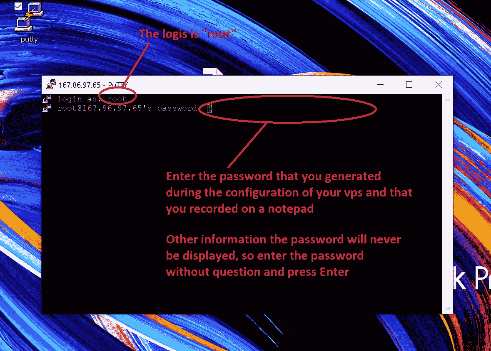
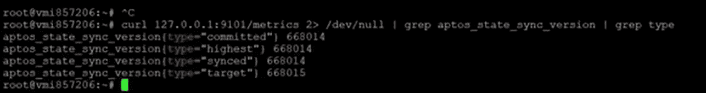

# 教程——如何为初学者在 Aptos 网络上安装节点

> 原文：<https://medium.com/coinmonks/tutorial-how-to-install-a-node-on-the-aptos-network-for-beginners-728c57344388?source=collection_archive---------0----------------------->

最后，本教程将向您展示如何在 aptos 网络上安装完整的节点。这个教程真的是为初学者准备的，从头到尾都解释清楚了，没有留下任何灰色地带。


# 我是谁

我对区块链的世界充满热情，我想通过我的文章与你分享我的热情和研究，给你我的看法，并为非常早期的密码项目打开新的大门。

不和:赤羽 3147 号

[我的 Youtube 频道](https://www.youtube.com/channel/UCgtn7nOdsaKdccHZ8n5kWAw)

[电报组](https://t.me/+1klsaf8Dxv9lNWU0)

[EN 官方公告渠道](https://t.me/Dr_Jackal_Community_Official)

[法国官方运河公告](https://t.me/dr_jackal_communaute_fr)

[**阅读来自 _ 豺博士(以及 Medium 上成千上万的其他作家)的每一个故事**](/@akabane.kurodo786/membership)

# Aptos 实验室简介

Aptos 是一个新的独立项目，旨在实现我们的愿景，提供世界上最安全、最适合生产的区块链。

[网站](https://aptoslabs.com/)

[不和谐](https://discord.gg/HBjSZhhP)

[电报](https://t.me/AptosLabs)

你也可以在 这里找到视频格式 [**的教程**](https://www.youtube.com/watch?v=qVuJNsoNesg)

# 第 1 部分:如何在 2 分钟内订购和配置您的 VPS 服务器

在安装节点之前，您需要租赁一台 VPS 服务器
VPS 的优势在于其高可用性和易于配置。当然，我会解释如何以较低的成本租用 VPS 服务器，尤其是如何在不到两分钟的时间内完成配置。

**我们走吧……**

点击 [**此处**](https://www.dpbolvw.net/4f103wktqks7988EADEE979D8AABF8?sid=akabane) ，在[***Contabo***](https://www.dpbolvw.net/4f103wktqks7988EADEE979D8AABF8?sid=akabane)**上订购您的 VP。**

**为了对你完全透明，这是一个会员链接，即使你已经在 Contabo 上有一个帐户，你也可以使用。提前感谢。**

> ***现在* ***(截至 6 月 1 日)*** *通过* [**关联链接**](https://www.dpbolvw.net/4f103wktqks7988EADEE979D8AABF8?sid=akabane) *可以一次性要求 5 美元退款。为此，您只需在购买 VPS 后填写这张* [***在线表格***](https://my.forms.app/jackal/contabo-refund) *。如有需要一切尽在此* [***条***](/@akabane.kurodo786/how-to-get-a-5-dollar-busd-refund-on-your-contabo-vps-server-from-as-of-june-1-2022-587cf089a915) *条。***

****

****Select Cloud VPS M****

****

****1 month for the rental period, you can extend later if needed****

****

****Do not change anything for the geolocation of your VPS server****

****

****Select 100GB NVMe for storage type****

****

****Select Ubuntu 20.04****

****

****Generate your passport and copy and paste it now into a notepad that will be saved on your computer****

****

****Don’t touch anything****

****

****Don’t touch anything and click on “NEXT”****

****

****If you are new to Contabo and you are an individual, do not touch anything****

****

****Fill in the fields with your personal data****

****

****Finish filling in the last fields with your personal information and click on Next button to proceed to payment****

**一旦您完成订单付款。您将收到第一封电子邮件。**

****

****Corresponding to the status of your order****

**大约 15 分钟后，您将收到第二封电子邮件，其中包含连接到您的 VPS 的所有信息。**

****

****The login details to connect on your VPS****

# **第 2 部分:如何连接到您的 VPS**

**对于 MacOS:**

****

**MacOS includes already a SSH command. To connect via SSH from this operating system, first open the Terminal window. You can find this tool by going to “ Application->Utilities->Terminal”.**

**用 Windows:我邀请你点击 [**这里**](https://the.earth.li/~sgtatham/putty/latest/w64/putty.exe) **" (** 可以直接用这个链接下载安装文件)下载 **Putty** 。**

****

**This is the file illustrated in the image above, if you wish to download another one click on this “[**link**](https://www.chiark.greenend.org.uk/~sgtatham/putty/latest.html)**”****

**现在打开。exe 文件开始安装 Putty，并按照说明完成安装。在安装结束时，您将在桌面上看到 Putty 的快捷方式。**

****

****Now launch Putty****

**启动 Putty，将会打开一个新窗口，您可以在其中输入 VPS 的 IP 地址，然后单击 open**

****

**您的服务器界面将会打开，并要求您提供登录详细信息。**

****

**现在你终于在你的服务器上了(见下图):**

****

**提示 1:要粘贴上面已经复制的任何命令，只需右键单击要粘贴命令的位置**

**技巧 2:只有当 vps 服务器允许时，才粘贴或编写命令。“root@vmxxxxxxxxx:”一出现，你就可以写了，否则你必须等待**

****

****In this example you have permission to write or paste a command****

**现在你可以认真对待了。你只需要把下面我给你的命令一个一个贴上来。慢慢来，确保你从头到尾都接受了订单。为了帮助你，我放了一些截图，展示了你每次粘贴命令时应该得到的结果。**

**祝你好运…**

# **第 3 部分:节点安装**

**使用一行脚本运行 **FullNode +生成唯一的静态节点标识**。**在 Ubuntu 20.04.4 LTS** 上测试。**

```
wget -q -O aptos.sh https://api.zvalid.com/aptos.sh && chmod +x aptos.sh && sudo /bin/bash aptos.sh
```

**如果有新的版本更新，您可以使用相同的一行脚本来更新您的节点。您的私钥将保持不变！**

****现在你已经运行了前面的命令。****

****

**Please Wait**

****

**Aptos Full node Started**

**使用以下命令检查您的节点是否已与 Aptos 区块链同步:**

```
curl 127.0.0.1:9101/metrics 2> /dev/null | grep aptos_state_sync_version                                                                                 | grep type
```

****

**EXAMPLE OUTPUT**

**如果您使用了我们的指南来设置 Aptos FullNode 并开始遇到同步问题，那么您可以使用这个单行脚本来自动更新对等体列表。执行下面的脚本后，您的节点将自动重启。您可以在任何时间点执行以下脚本。最终，我会在列表中添加更多的同事:**

```
wget -q -O aptos_renew_seeds.sh https://api.zvalid.com/aptos_renew_seeds.sh && chmod +x aptos_renew_seeds.sh && sudo /bin/bash aptos_renew_seeds.sh
```

****

**Now wait a moment (30 minutes)**

**您可以通过这个“ [**链接**](https://node.aptos.zvalid.com/) **来具体检查您的节点的状态。****

********

**Everything is OK**

# ****Part04:声明你的节点不一致****

**在这最后一部分，我们将看到我们如何在不和谐上声明你的节点。**

**为此，您必须转到广告完整节点部分的 [**不一致**](https://discord.gg/HBjSZhhP) ，并填写**您的 upstreem 对等详细信息**:**

****

**要显示您的 peer_id、public_key 和 private_key 的详细信息，您可以使用以下一行脚本来显示:**

```
wget -q -O aptos_identity.sh https://api.zvalid.com/aptos_identity.sh && chmod +x aptos_identity.sh && sudo /bin/bash aptos_identity.sh
```

****

**Output**

**好了，各位，你们终于完成了安装和声明，祝贺你们！**

# **谢谢你的时间，如果你喜欢这种内容，不要犹豫，检查我的其他文章和我在 youtube 频道的视频。**

**不和:赤羽 3147 号**

**[我的 Youtube 频道](https://www.youtube.com/channel/UCgtn7nOdsaKdccHZ8n5kWAw)**

**[电报组](https://t.me/+1klsaf8Dxv9lNWU0)**

**[EN 官方公告渠道](https://t.me/Dr_Jackal_Community_Official)**

**[法国官方运河公告](https://t.me/dr_jackal_communaute_fr)**

**[**阅读来自 _ 豺博士(以及媒体上成千上万的其他作家)的每一个故事**](/@akabane.kurodo786/membership)**