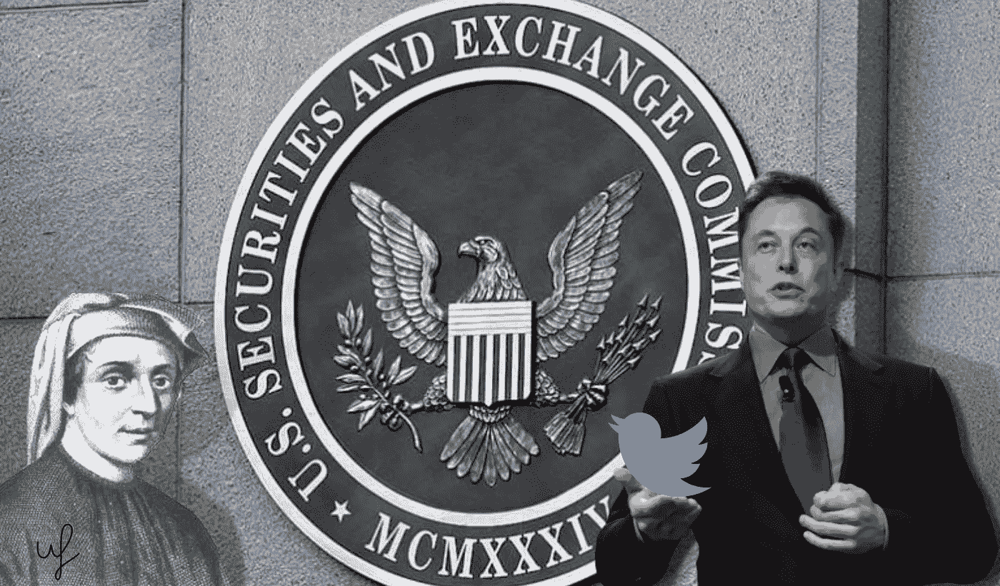
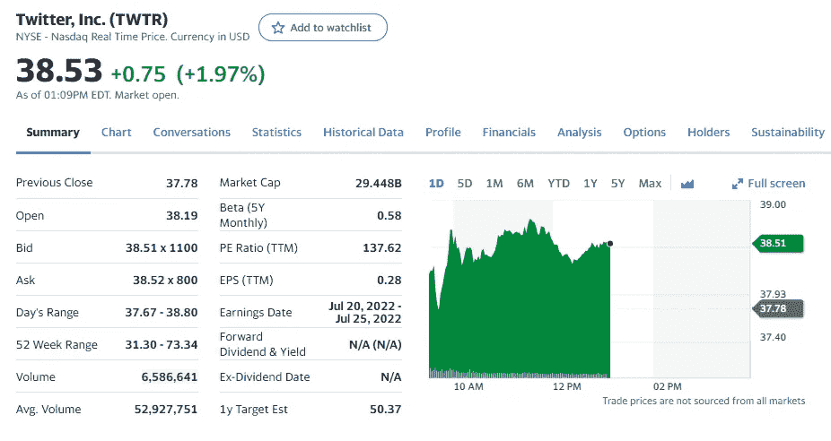
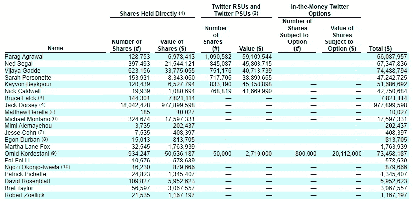

# Twitter 董事会建议批准将该社交网络出售给埃隆·马斯克

> 原文：<https://medium.com/coinmonks/twitter-board-of-directors-recommended-to-approve-the-sale-of-the-social-network-to-elon-musk-1ee7baf4a2c1?source=collection_archive---------29----------------------->

## Twitter 董事会一致建议股东批准埃隆马斯克(Elon Musk)以 440 亿美元收购这家社交网络。提交给美国证券交易委员会的文件证明了这一点。

This preview will be included in the NFT collection called “[Uncle Fibonacci News](https://opensea.io/collection/uncle-fibonacci-news)”

> “Twitter 董事会在考虑了所附中期声明中更详细描述的因素后，一致认为收购协议是适当的[……]，符合公司及其股东的最佳利益，”该文件写道。

TWTR 的股票在开盘后上涨了近 2%。该公司目前的市值为 294.4 亿美元。

以下是 Twitter 的最大股东名单:

如果这笔交易现在完成，他们每个人的每股收益将超过 15 美元。前 Twitter 首席执行官杰克·多西将会赚到近 9.78 亿美元。

回想一下，4 月底，埃隆马斯克(Elon Musk)同意收购 Twitter。这位亿万富翁在本月中旬向公司管理层提出了收购要约。

这位企业家解释说，他的意图是希望创造一个“包容性的言论自由舞台”，而不是为了赚钱。

最初，Twitter 董事会对马斯克的提议持负面看法，但后来修改了立场。

今年 5 月，由于有报道称社交媒体观众人数膨胀，这位亿万富翁暂停了购买过程。在演讲中，他表示推特的日活跃用户数应该达到每天 100 万。在第一季度，他们的人数是 2.29 亿。

📰 ***订阅*** [***斐波那契***](/@unclefibonacci) ***我来保持最新***

☕️eth:0x40a 8443813 e 8 fa 4a 9 f 88 f 18 b 77442 aa 4ed 91 fd4c

☕️BTC:1kkekcmdrghajztfxjoq 5 otg bv 1 mgucwdj

> 加入 Coinmonks [电报频道](https://t.me/coincodecap)和 [Youtube 频道](https://www.youtube.com/c/coinmonks/videos)了解加密交易和投资

# 另外，阅读

*   [用信用卡购买密码的 10 个最佳地点](https://coincodecap.com/buy-crypto-with-credit-card)
*   [加拿大最佳加密交易机器人](https://coincodecap.com/5-best-crypto-trading-bots-in-canada) | [Bybit vs 币安](https://coincodecap.com/bybit-binance-moonxbt)
*   [阿联酋 5 大最佳加密交易所](https://coincodecap.com/best-crypto-exchanges-in-uae) | [SimpleSwap 评论](https://coincodecap.com/simpleswap-review)
*   [购买 Dogecoin 的 7 种最佳方式](https://coincodecap.com/ways-to-buy-dogecoin) | [ZebPay 评论](https://coincodecap.com/zebpay-review)
*   [最佳期货交易信号](https://coincodecap.com/futures-trading-signals) | [流动性交易所评论](https://coincodecap.com/liquid-exchange-review)
*   [火币加密交易信号](https://coincodecap.com/huobi-crypto-trading-signals) | [Swapzone 审查](/coinmonks/swapzone-review-crypto-exchange-data-aggregator-e0ad78e55ed7)