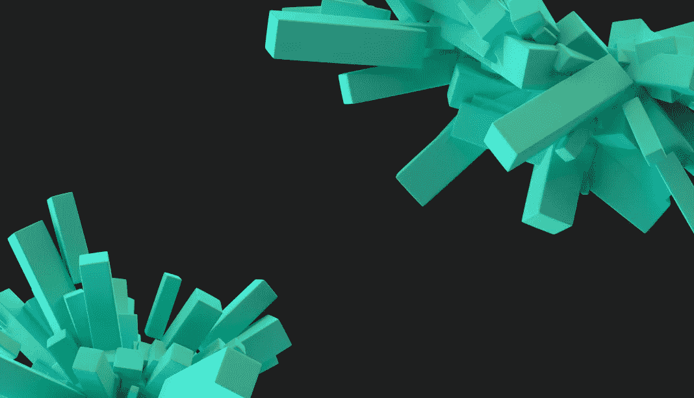

# 与软件开发人员互动的两个选项

> 原文：<https://medium.com/coinmonks/two-options-for-interacting-with-software-developers-e6e93fc53b45?source=collection_archive---------46----------------------->

一旦客户有了项目的想法，他面临的主要问题是:*去哪里找开发人员*？

有两种选择:外包和外包。

根据我们的经验，我们在本文中更详细地描述了这两种方法:

*   什么是外包，什么是突出？
*   他们的区别是什么？
*   各有什么好处？

# 外包

外包时，一家公司与另一家公司签订合同，从 A 到 z 执行一个项目。

外包的好处是客户不需要招聘、行政、培训或其他人力资源活动的管理工作。

我们负责创建项目的整个过程:从开发的业务分析到必要文档的设计和签署。在我们的团队中，有 150 多名员工，其中 66%是开发人员，20%是经理、设计师和质量工程师，14%是管理人员。

保证在区块链开发过程中使用最新的技术。

如果你想和整个 [Crypton Studio](https://crypton.studio) 团队一起实施你的项目，那么外包就适合你 [https://crypton.studio](https://crypton.studio/)

外包的缺点是，与外包相比，客户的外包成本更高。

# 杰出的

通过 outstaffing，一家公司扩展了其内部开发团队，以包括开发 outstaffing 服务。并且因此，杰出的服务提供商接管人力资源管理。

在 [Crypton Studio](https://crypton.studio) 中的突出表现是一种合作形式，在你的项目期间，我们分享我们最好的人员。这是快速组建一个最好的开发人员团队的最可靠的方法。

使用 [Crypton 比](https://outstaff.crypton.studio)出色的优势:

*   你可以接触到专业的 Solidity 和 Rust 开发人员。此外，我们还帮助优化公司的财务活动:
*   我们为员工缴纳税款和社会款项；
*   您降低了维护办公室、设备和软件的成本；
*   我们出色的服务比其他欧洲国家更有利可图；
*   每个开发人员和团队都有我们这边的技术领导和导师。他们对所选择的技术提出建议，并为开发人员提供支持；
*   我们始终对新技术持开放态度，我们的员工也在不断发展，我们有机会为特定的堆栈对他们进行再培训。

我们与区块链的创业公司和开发工作室合作。如果您需要迅速扩大您的员工队伍，并通过优质开发人员加强您的员工队伍，那么我们随时为您服务！[https://out staff . crypton . studio](https://outstaff.crypton.studio/)

[https://crypton . studio/blog/026 e845a-7 ebb-4b 39-8f 06-b083b 388828 a](https://crypton.studio/blog/026e845a-7ebb-4b39-8f06-b083b388828a)

> 加入 Coinmonks [电报频道](https://t.me/coincodecap)和 [Youtube 频道](https://www.youtube.com/c/coinmonks/videos)了解加密交易和投资

# 另外，阅读

*   [3 商业评论](/coinmonks/3commas-review-an-excellent-crypto-trading-bot-2020-1313a58bec92) | [Pionex 评论](https://coincodecap.com/pionex-review-exchange-with-crypto-trading-bot) | [Coinrule 评论](/coinmonks/coinrule-review-2021-a-beginner-friendly-crypto-trading-bot-daf0504848ba)
*   [莱杰 vs n rave](/coinmonks/ledger-vs-ngrave-zero-7e40f0c1d694)|[莱杰 nano s vs x](/coinmonks/ledger-nano-s-vs-x-battery-hardware-price-storage-59a6663fe3b0) | [币安评论](/coinmonks/binance-review-ee10d3bf3b6e)
*   [Bybit Exchange 评论](/coinmonks/bybit-exchange-review-dbd570019b71) | [Bityard 评论](https://coincodecap.com/bityard-reivew) | [Jet-Bot 评论](https://coincodecap.com/jet-bot-review)
*   [3 commas vs crypto hopper](/coinmonks/3commas-vs-pionex-vs-cryptohopper-best-crypto-bot-6a98d2baa203)|[赚取秘密利息](/coinmonks/earn-crypto-interest-b10b810fdda3)
*   最好的比特币[硬件钱包](/coinmonks/hardware-wallets-dfa1211730c6) | [BitBox02 回顾](/coinmonks/bitbox02-review-your-swiss-bitcoin-hardware-wallet-c36c88fff29)