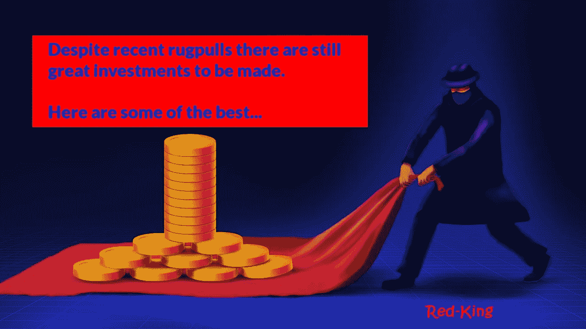

# 最近的两个 Defi Rugpulls 和你可以投资的地方

> 原文：<https://medium.com/coinmonks/two-recent-defi-rugpulls-and-where-you-could-invest-instead-9328d34ecb98?source=collection_archive---------6----------------------->

两个最近的 Defi Rugpulls 和他们的更好的替代品(加上一个奖金)。

太空投资是一个有风险的领域，但伴随着这些风险，也能带来丰厚的回报。自从涉足 Crypto 以来，我个人已经成为一些骗局和欺诈的受害者，但我从这些经历中学到了很多，现在更加谨慎地对待。对我来说，这些风险仍然是值得的，因为我仍然**在加密方面获得了比我失去的**多得多的东西，尤其是在 defi 领域。

像许多其他投资者一样，我喜欢参与加密矿工，但我不会投资所有的公司，我会仔细选择我的资金投向。什么都不能保证，但回报可能非常丰厚。

# 最近的摩擦

# RUGPULL #1(在 Matic 链条上)

最近，一个奇怪的拉拽是在 Matic 链上的*紫水晶矿工*。我很早就连接到了这个网站，并在网站上观看了它推出前几天的倒计时。

我也在发布日加入了他们的电报组。我没有在产品发布时立即投资，因为正如我在之前的文章中提到的[，我不喜欢在产品发布的前几个小时投资，我会采取稍微谨慎的方法，看看事情会如何发展。](/@Red-King/my-best-passive-income-crypto-investments-earning-up-to-8-daily-83d09d72854)

白痴紫水晶开发商，然后 rugpulled 该项目仅半小时后，它推出了这是完全令人震惊的。他们总共偷走了 9622 Matic(价值约 12，600 美元),并禁用了一个电报组的聊天功能。混蛋。

# 替代方案

如果你在 Matic chain 上寻找一名优秀的矿工，我肯定会建议你加入 [***【农场***](https://redkingadventures.com/farmhouse) 。你[可以在这里加入](https://redkingadventures.com/farmhouse)或者你[可以在这里阅读我关于它的整篇文章](/@Red-King/how-i-easily-mine-matic-in-my-browser-passive-crypto-income-a606b056b179)。

我真的很喜欢这个农舍，他们有一个很棒的社区，他们正在努力建造一些坚固的东西。他们对未来也有很大的计划，有很好的合作，一款 NFT 游戏正在开发中。

# RUGPULL #2(在币安链条上)

接下来我要提到的 rugpull 是*圣鸡*；这是币安智能链上的一个 BUSD 矿工。这个看起来不错，我确实投资了，幸运的是只是很小的一笔。

我又一次在它启动后等了几天，它不是一个非常受欢迎的项目，只设法让大约 51 个投资者进入这个项目。大约 9 或 10 天后，他们开始拉；关闭了整个网站，删除了他们所有的社交媒体渠道，然后消失了。混蛋。

# 备选方案

#1 如果你正在寻找智能链上更好的选择，我会全心全意地推荐*。我知道很多很多人已经投资了这个。滴滴是我在加密领域最赚钱的投资，这是在没有其他人加入我的团队的情况下进行的。*

*它已经持续了一年多，并证明了它的可持续性。他们还会有更多的计划，而且会越来越强。如果你还没有加入滴滴，并且你想加入，[你可以点击这里](http://drip.community/faucet?buddy=0xDfFFD20aD90C08a5e636fB5b8ea0110240ca97d9) *使用我的好友代码(或者直接手动输入我的好友代码:0x dfffd 20 ad 90 c 08 a 5 e 636 FB 5b 8 ea 0110240 ca 97d 9)*。滴滴每天给你持续 1%的 ROI，被归类为**低风险高收益**。这是我最信任的人。*

*#2 智能链上另一个好矿工是 [***烤豆***](https://redkingadventures.com/bakedbeans) 。烤豆也被认为是这些矿工的祖父之一，因为它已经持续了 7 个多月，现在已经有了很多很多的投资者。合同里有超过 31000 BNB。 ***更新*** *:这方面的合约已经开始慢慢减少，这意味着大多数人已经开始取出他们的利润…我建议试试下面的作物农民。**

*#3 另一个我认为有潜力的 BNB 矿工是 [***庄稼农民***](https://redkingadventures.com/crops) 。它仍然很新，所以有点冒险，但开发者似乎有一个很好的计划，合同正在稳步增长，它将有机会获得最大的收益。它也有稳定的收入(BUSD ),所以你不必担心兑现奖励时的市场波动。如果你想看看，去 https://redkingadventures.com/crops*

*我推荐的所有项目都是我个人投资的项目。*

# *额外的机会*

*然后我对另一个矿工的额外建议是 Cronos 链，这仍然是一个非常新的未充分利用的链。我加入了 [***鳄鱼窝***](https://redkingadventures.com/crocnest) 观察哪个农场的$CRO 代币是 crypto.com 的官方硬币。*

**

*正如我之前提到的，在之前的文章中，我看好 CRO 代币，并希望尽可能多地积累它。如果你也想种植令牌[你可以加入这里](https://redkingadventures.com/crocnest)。*

# *AVAX 网络上的农民呢？*

*在雪崩网络上阅读我最好的[农民。](/@Red-King/the-two-avax-miners-i-am-most-excited-about-earn-8-cypto-passive-income-daily-7ad19c099191)*

# *觉得这有帮助吗？*

*我希望这篇文章对你有所帮助。如果你喜欢这个故事，请给它竖起大拇指，并在下面留下评论！*

*如果您想了解更多关于**加密货币、被动收入、玩赚取游戏和产量农业的信息，请关注我的 **Medium** 。***

*你觉得这篇文章有趣吗？
请给它一些掌声(最多 50 次！)👏。这有助于文章被其他读者找到，也让我知道你喜欢这篇文章！:-)*

*所以让我们看看有多少掌声！👏*

# *最后要注意的是:*

*我不是财务顾问。这不是一个财务建议，无论你在我的文章中读到什么，都完全是出于教育目的。*

*这些是锁定的智能合约。*

*这篇文章包含附属链接。*

*我只认可我个人投资的项目。*

***免责声明:** *本人并非本文提及的任何项目/公司的赞助人。这不是财务建议，本文中的信息仅用于教育目的。永远不要投资你输不起的东西。我否认任何根据我文章中讨论的信息、想法或策略行事的人所承担的任何责任或损失。自己做研究。**

> *加入 Coinmonks [电报频道](https://t.me/coincodecap)和 [Youtube 频道](https://www.youtube.com/c/coinmonks/videos)了解加密交易和投资*

# *另外，阅读*

*   *[最佳比特币保证金交易](/coinmonks/bitcoin-margin-trading-exchange-bcbfcbf7b8e3) | [萝莉点评](/coinmonks/lolli-review-e6ddc7895ad8) | [比特币保证金交易](https://coincodecap.com/bityard-margin-trading)*
*   *创造并出售你的第一个 NFT | [密码交易机器人](https://coincodecap.com/best-crypto-trading-bots)*
*   *[如何在 CoinDCX 上购买柴犬(SHIB)币？](https://coincodecap.com/buy-shiba-coindcx)*
*   *[CBET 评论](https://coincodecap.com/cbet-casino-review) | [库科恩 vs 比特币基地](https://coincodecap.com/kucoin-vs-coinbase) | [拜比特 vs 比特币基地](https://coincodecap.com/bybit-vs-coinbase)*
*   *[折叠 App 回顾](https://coincodecap.com/fold-app-review) | [LocalBitcoins 回顾](/coinmonks/localbitcoins-review-6cc001c6ed56) | [Bybit vs 币安](https://coincodecap.com/bybit-binance-moonxbt)*
*   *[加密保证金交易交易所](/coinmonks/crypto-margin-trading-exchanges-428b1f7ad108) | [赚取比特币](/coinmonks/earn-bitcoin-6e8bd3c592d9) | [Mudrex 投资](https://coincodecap.com/mudrex-invest-review-the-best-way-to-invest-in-crypto)*