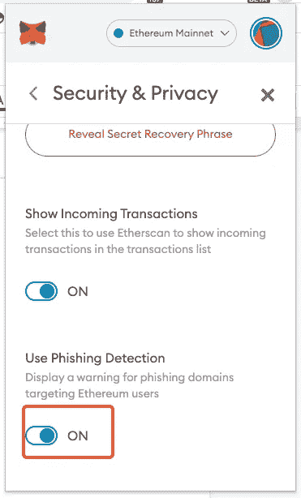

# 避免因成为 DeFi 网络钓鱼目标而损失 100 亿美元的两个简单技巧，以及另外两个原则

> 原文：<https://medium.com/coinmonks/two-simple-tricks-to-avoid-losing-10-billion-for-being-defi-phishing-target-and-two-more-f575560ba1f9?source=collection_archive---------15----------------------->

> 2021 年，截至 11 月 19 日，105 亿美元的损失来自盗窃、欺诈和诈骗。
> 
> *—美国消费者新闻与商业频道*

Photo by [Clint Patterson](https://unsplash.com/@cbpsc1?utm_source=unsplash&utm_medium=referral&utm_content=creditCopyText) on [Unsplash](https://unsplash.com/s/photos/internet-security?utm_source=unsplash&utm_medium=referral&utm_content=creditCopyText)

几天前，有人联系了 EigenPhi，请求我们帮助收集有关他的欺诈案件的信息。为了描述清楚，我们就叫他约翰吧。

约翰访问了这个网站: [**www.ammuni.io**](http://www.ammuni.io/) ，这似乎是一个合法的 DeFi 项目。后来，负责这个项目的人哄骗他授权他们可以通过网站无限制地访问 John 的 MetaMask 钱包:

***【预警:不要，重复，不要把你的钱包连到这个网站】***

https://ammuni.shop/#/.然后他们要求约翰以赌博的名义投入一大笔钱。接下来的几天，代币不见了。

在研究了这个场景之后，虽然我们为约翰感到难过，但我们承认我们无能为力。本质上，这种情况需要执法部门的介入。

然而，我们仍然认为两个简单的技巧可以降低被诈骗团伙盯上的风险。

**招数一:打开 MetaMask 的钓鱼检测设置。**

下面是详细步骤。

第一步:打开你的元蒙版浏览器插件，点击你的账户头像。

第二步:在打开的窗口中点击设置。

第三步:在设置菜单中点击“安全与隐私”。

步骤 4:打开“使用网络钓鱼检测”

就是这样。现在，当您访问一个您不知道的钓鱼网站时，就像上面提到的那样，您会看到这样的消息:

**招数 2:使用反向图片搜索验证项目背后的团队。**

打开 [www.ammuni.io](http://www.ammuni.io/) ，看起来一切都在。当然，对于一个普通的#德根来说，很难花时间去阅读他们的白皮书和金融术语。但是他们把球队的信息放在网页上，你可以用你的浏览器来验证。其他浏览器也有类似的功能、插件或扩展。

步骤 1:滚动到页面的“我们的团队”部分。

第二步:右键点击团队成员的图片，选择“用谷歌镜头搜索图片”

步骤 3:查看我们从新选项卡中获得了什么:

很明显，这家伙的图片来自某股票图片网站，这足以举起一面红旗:你遇到过哪个数据科学家想把自己的肖像当股票照片卖吗？

第四步:让我们检查另一个。右键单击首席执行官的照片并查看结果。

又是免费照片。

好吧，忘掉这个，继续下一个项目。

总之，在目前的发展下，DeFi 就是大家应该知道的黑暗森林。像本文中的一些简单的技巧很容易用来减轻诈骗和欺诈的风险。

即使你不使用这些技巧，在进行任何交易之前，也要记住两个原则:

1.  发送前仔细检查交易。
2.  **设定智能合同支出限额。**

请随时留下您对 DeFi 无风险活动有帮助的意见和建议。

附注:如果您想了解更多有关令牌批准的信息，这对您的资产安全至关重要，请阅读以下两个链接:

1.  [https://medium . com/ethex-market/ERC 20-approve-allow-explained-88d 6 de 921 ce 9](/ethex-market/erc20-approve-allow-explained-88d6de921ce9)
2.  [https://learn . zapper . fi/articles/breaking-down-the-steps-of-token-approval](https://learn.zapper.fi/articles/breaking-down-the-steps-of-token-approval)

[以太坊令牌批准工具](https://info.etherscan.com/tokenapprovals/)也是审查和撤销任何 dApp 令牌批准的优秀工具。

跟随我们通过这些来挖掘更多隐藏的 DeFi 的智慧:

*   [EigenPhi 的推特](https://twitter.com/eigenphi)
*   [EigenPhi 的微博提醒](https://twitter.com/eigenphi_alert)
*   [子堆栈](https://eigenphi.substack.com/)
*   [中等](/@eigenphi)
*   [Mirror.xyz](https://mirror.xyz/0xc19565163aFdEe3783FC970E4Bd0275B11848d34)
*   [电报](https://t.me/WisdomOfDeFi)
*   [不和](https://discord.com/invite/JXD8cyzR2a)
*   [时事杂志](https://www.getrevue.co/profile/EigenPhi)

> *加入 Coinmonks* [*电报频道*](https://t.me/coincodecap) *和* [*Youtube 频道*](https://www.youtube.com/c/coinmonks/videos) *了解加密交易和投资*

# 另外，阅读

*   [3 商业评论](/coinmonks/3commas-review-an-excellent-crypto-trading-bot-2020-1313a58bec92) | [Pionex 评论](https://coincodecap.com/pionex-review-exchange-with-crypto-trading-bot) | [Coinrule 评论](/coinmonks/coinrule-review-2021-a-beginner-friendly-crypto-trading-bot-daf0504848ba)
*   [莱杰 vs n rave](/coinmonks/ledger-vs-ngrave-zero-7e40f0c1d694)|[莱杰 nano s vs x](/coinmonks/ledger-nano-s-vs-x-battery-hardware-price-storage-59a6663fe3b0) | [币安评论](/coinmonks/binance-review-ee10d3bf3b6e)
*   [Bybit Exchange 审查](/coinmonks/bybit-exchange-review-dbd570019b71) | [Bityard 审查](https://coincodecap.com/bityard-reivew) | [Jet-Bot 审查](https://coincodecap.com/jet-bot-review)
*   [3 commas vs crypto hopper](/coinmonks/3commas-vs-pionex-vs-cryptohopper-best-crypto-bot-6a98d2baa203)|[赚取加密利息](/coinmonks/earn-crypto-interest-b10b810fdda3)
*   最好的比特币[硬件钱包](/coinmonks/hardware-wallets-dfa1211730c6) | [BitBox02 回顾](/coinmonks/bitbox02-review-your-swiss-bitcoin-hardware-wallet-c36c88fff29)