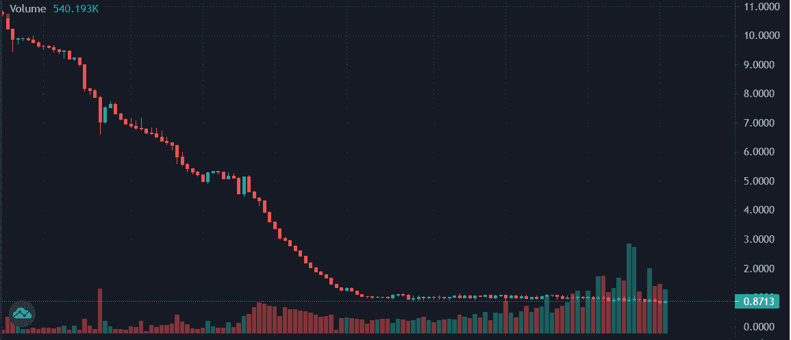
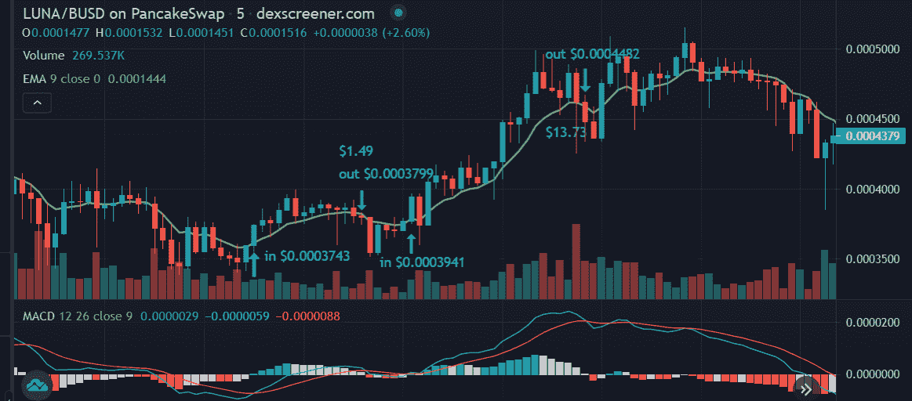
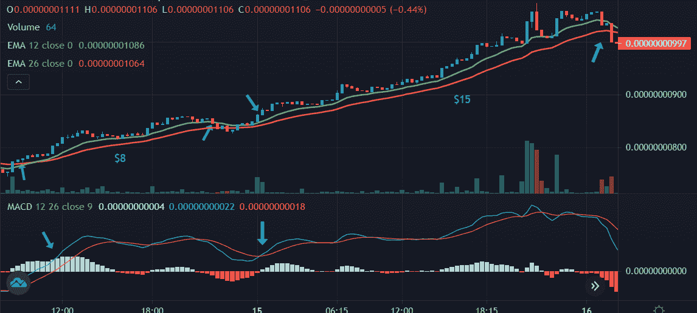
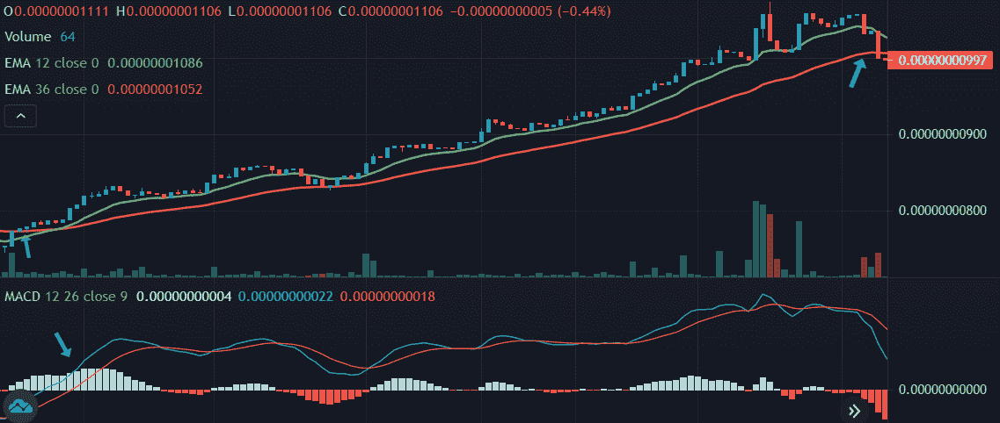

# 刷单的两种技术分析策略

> 原文：<https://medium.com/coinmonks/two-technical-analysis-strategies-for-scalping-8836d16dd162?source=collection_archive---------22----------------------->

首先，我想讨论一下我的几条基本原则:

1.我不做杠杆(目前)。

2.我不做空(目前)。这意味着我只是在寻找上涨的动力，所以我可以买。

因此，我首先说，在熊市中，这可能更具挑战性。

所以第一步，我在看日线图来确定整体趋势。我真的想要一个明显的上升轨迹，但从低迷中稳健反弹也是可行的。这意味着，没有像这样的交易图！⬇️

现在，虽然我建议只交易明显的上涨趋势，但也有可能在横盘中获利。这完全取决于策略。对于这个例子，我选择了 [$LUNA](https://twitter.com/search?q=%24LUNA) (因为这是最近的热门话题)。

这是一天中的一个片段。UST 时间上午 9 点到下午 5 点之间的 5 分钟图表。我列出了 4 个交易(2 个交易“往返”)，接下来我会讨论策略…

首先，我使用了 9 周期 EMA(指数移动平均线)指标。这基本上是过去 9 个时期收盘价的平滑平均值。这部分策略很简单:等待绿色蜡烛线收在均线上方。这是买入信号。

然后，当一根蜡烛收在均线以下时，这是卖出的信号(最好是盈利)。这在明显的上升趋势中非常有效。但在今天这样一个横盘的日子里，进行所有这些交易很可能以无利可图告终。所以我们需要添加一些“合流”

为此，我们将使用 MACD(移动平均收敛发散)。这是最底部的线条。基本上，这是一个围绕“零线”上下跳动的动量指标这里，我们不想在均线信号上交易，除非…

仅在以下情况下购买…

1.  MACD 线在零线以下或非常接近零线，看起来会上涨。
2.  速度较快的 MACD 线(蓝线)与速度较慢的 MACD 线(橙线)交叉或接近交叉。

仅在以下情况下出售…

1.MACD 线再次会聚或交叉。

所以，购买条件是:

—5 分钟蜡烛线收于 EMA9 上方。

—快速 MACD 在零线或零线以下收敛或穿过慢速 MACD 线。

出售条件是:

—5 分钟蜡烛线收于 EMA9 下方。

— MACD 线再次会聚或交叉。

在我们的 [$LUNA](https://twitter.com/search?q=%24LUNA) 例子中，这一天只发生了两次。然而，这两次都是盈利的。如果用 100 美元进入这些头寸，遵循这些规则可以获得大约 15 美元的利润。

这相当于单一资产单日收益 15%。然而，许多人可能会指出，在一个明显的上升趋势中买入一个代币并持有它会带来更高的利润。这可能是真的，但有两件重要的事情要记住:

没有指标，你不知道趋势会持续多久。所以你不知道什么时候卖。你不会知道当天的顶部或底部在哪里。在不知道甚至没有任何线索的情况下，你在盲目交易。

现在让我们回顾一下我最喜欢的当前策略。不过，这个策略更像是一个摇摆交易策略(意味着它跨越了更长的时间)。在这个例子中，我们将使用两条均线和 15 分钟图上的 MACD。

下面是我们设置的指标:12 周期均线，26 周期均线，MACD，默认设置。

当 EMA12 在 EMA26 上方交叉，或者 15 分钟蜡烛线在两者上方收盘，MACD 线在零线下方或接近零线时，我们开始交易。

当 EMA12 在 EMA26 下方交叉或者 15 分钟蜡烛线在 EMA26 下方收盘时，我们想退出交易。在退出交易时，不要使用 MACD 作为汇合点。

在这个例子中，在一天半的时间里有两次往返交易。如果每笔交易的价格是 100 美元，第一笔交易会产生大约 8 美元的利润，第二笔交易会产生大约 15 美元的利润。这意味着在一天半的时间里上涨了 23%。

这很不错，但我们可以做得更好。如果在我们进入交易后，我们决定将 EMA26 扩展到 EMA36 呢？看看会发生什么。

现在这两个交易合并成了一个，因为蜡烛线不再收在均线底部，触发了卖出。这是如何影响利润的呢？

这将产生不到 29 美元的利润。绝对是个进步。然而，关于这个策略有一些重要的事情需要注意。首先，为了确保你能盈利，重要的是只在明显的上升趋势上交易。

此外，因为波动可能持续几个小时或几天，你必须设置价格警报或找到自动交易的方法(我个人仍在努力优化这一点)。

好，上一次，让我们回顾一下挥杆策略:

1.  设置两个 EMA，一个 12 期，一个 26 期。
2.  建立 MACD。
3.  当 EMA12 穿过 EMA26 或 15 分钟蜡烛线在两者上方收盘时进场交易。
4.  寻找 MACD 的汇合点，汇合线在零度线附近或以下。

5.进入交易后，将 EMA26 改为 EMA36。

6.当 EMA12 低于 EMA36 或 15 分钟蜡烛线低于 EMA36 时退出交易。

7.在交易时，在睡觉前设置一个电报价格警报，并打开通知铃。

另一个免责声明这些策略对于发现可能的波动非常有效，但并不总是准确的。事实上，回顾我过去的 34 笔交易，只有 40%是正确的(即盈利)。然而…

平均损失在 5 美元左右，而平均收益超过 11 美元。这种差异使得即使精确度较低也能盈利。另外很重要的一点是，你要灵活的止盈。

在 34 笔交易中，有两笔我提前结束了。你一定要严格遵守你的规则…然而，在这两个例子中，音量消失了几个小时。这就是为什么这是值得关注的。

交易者不交易的时间越长，你过去的指标就越不准确。因此，如果成交量枯竭了一段时间，那么当它再次启动时，它可能会向任何方向发展，而没有太多迹象表明是哪个方向。所以在我看来，更好的办法是获利了结。

好的，这是我最近使用的两个策略。我更喜欢 5 分钟 EMA9 策略，因为它更简单(对我来说指标越少越好)。但是，它不会产生很高的利润。😞

如果你决定尝试这些( [#NFA](https://twitter.com/search?q=%23NFA) [#DYOR](https://twitter.com/search?q=%23DYOR) )，我建议进行回溯测试和纸上交易，看看它们是否适用于你想交易的资产。我希望这能对你有所帮助和启发。干杯！

> *加入 Coinmonks* [*电报频道*](https://t.me/coincodecap) *和* [*Youtube 频道*](https://www.youtube.com/c/coinmonks/videos) *了解加密交易和投资*

# 另外，阅读

*   [Bookmap 评论](https://coincodecap.com/bookmap-review-2021-best-trading-software) | [美国 5 大最佳加密交易所](https://coincodecap.com/crypto-exchange-usa)
*   最佳加密[硬件钱包](/coinmonks/hardware-wallets-dfa1211730c6) | [Bitbns 评论](/coinmonks/bitbns-review-38256a07e161)
*   [新加坡十大最佳加密交易所](https://coincodecap.com/crypto-exchange-in-singapore) | [购买 AXS](https://coincodecap.com/buy-axs-token)
*   [红狗赌场评论](https://coincodecap.com/red-dog-casino-review) | [Swyftx 评论](https://coincodecap.com/swyftx-review) | [CoinGate 评论](https://coincodecap.com/coingate-review)
*   [投资印度的最佳密码](https://coincodecap.com/best-crypto-to-invest-in-india-in-2021)|[WazirX P2P](https://coincodecap.com/wazirx-p2p)|[Hi Dollar Review](https://coincodecap.com/hi-dollar-review)
*   [加拿大最佳加密交易机器人](https://coincodecap.com/5-best-crypto-trading-bots-in-canada) | [KuCoin 评论](https://coincodecap.com/kucoin-review)