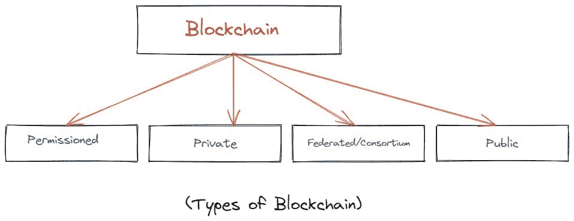

# 区块链的类型

> 原文：<https://medium.com/coinmonks/types-of-blockchain-a546e6213a5b?source=collection_archive---------38----------------------->

**大家好，**

我只知道大家都在做好事，太好了！

今天我写了一篇关于区块链**类型的新文章。**

在此之前，我假设你对*区块链*技术有所了解。如果没有请阅读我之前关于 [*这篇*](/coinmonks/so-whats-the-blockchain-actually-is-254bd0f6e19) 的文章。

**牛逼！**

那还等什么？开始吧:)

如您所知，区块链是存储在分布于广阔地理区域的成百上千台计算机或服务器中的一系列数据块。它是一个完整的分类帐，维护数字资产的所有贷项/借项(并非在所有情况下)交易的副本。而且，区块链是基于分散技术的。

有什么想法吗？

**超赞！**

现在，让我们看看有多少种区块链可供选择。

正如你在上面的图片中看到的，有 4 种类型的区块链可供选择。

他们是

1.  **许可的区块链**
2.  **私有区块链**
3.  **联盟/财团区块链**
4.  **公有区块链**

让我们一个一个来看。

**1。私有区块链**

一个*列兵区块链*也被称为*特许区块链*。在这种类型中，只有参与合同的个人才能获得合同的信息，而其他人则不能访问它。这也是一个更快和更具成本效益的系统。只有经过授权的节点才能将交易数据读写到该区块链中。但是，与公共区块链相比，私人区块链不太安全。

例如:- Linux 基金会的 Hperledger Fabric。

**2。公共区块链**

一个*公共区块链*是一个没有权限的区块链。任何人都可以在没有明确授权和许可的情况下访问网络并对参与者进行读写。

例子:-比特币、莱特币、以太坊等。

**3。联盟/财团区块链**

一个财团或联合区块链是一个私人的、被许可的区块链。它与公共区块链相反，在公共中，实体只能通过事先批准或投票才能成为网络成员。在这种类型的区块链中，许可权被授予一组公司和个人。此外，只有联盟成员可以进行、验证和更新交易。

例如:- R3 Corda 区块链

**一个*被许可的区块链*和一个*私人区块链*是一样的。**

我现在 100%确定，你对区块链的类型有所了解。

**太好了！**

这就是今天的全部内容，稍后会有新的有趣文章。我希望你喜欢这次阅读。

**干杯！**

> *加入 Coinmonks* [*电报频道*](https://t.me/coincodecap) *和* [*Youtube 频道*](https://www.youtube.com/c/coinmonks/videos) *了解加密交易和投资*

# 另外，阅读

*   [Bookmap 评论](https://coincodecap.com/bookmap-review-2021-best-trading-software) | [美国 5 大最佳加密交易所](https://coincodecap.com/crypto-exchange-usa)
*   最佳加密[硬件钱包](/coinmonks/hardware-wallets-dfa1211730c6) | [Bitbns 评论](/coinmonks/bitbns-review-38256a07e161)
*   [新加坡十大最佳加密交易所](https://coincodecap.com/crypto-exchange-in-singapore) | [购买 AXS](https://coincodecap.com/buy-axs-token)
*   [红狗赌场评论](https://coincodecap.com/red-dog-casino-review) | [Swyftx 评论](https://coincodecap.com/swyftx-review) | [CoinGate 评论](https://coincodecap.com/coingate-review)
*   [投资印度的最佳密码](https://coincodecap.com/best-crypto-to-invest-in-india-in-2021)|[WazirX P2P](https://coincodecap.com/wazirx-p2p)|[Hi Dollar Review](https://coincodecap.com/hi-dollar-review)