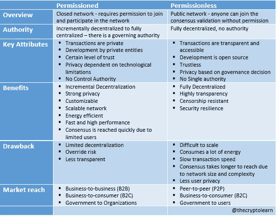
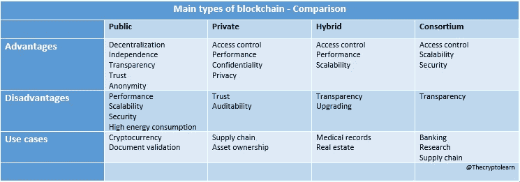

# 区块链的类型—清晰的分类

> 原文：<https://medium.com/coinmonks/types-of-blockchain-clear-classification-79c6bce26f00?source=collection_archive---------8----------------------->

每个区块链都由一组运行在对等(P2P)网络系统上的节点组成。网络中的每个节点都有一个共享分类帐的副本，该副本定期更新，并且具有验证交易、发起或接收交易以及创建块的能力。

区块链网络分为两种根本不同的区块链模型，有许可和无许可的区块链。

每种设计对于底层区块链的安全性、可访问性和可持续性都有不同的含义，并且它们在事务和新块提交到其节点的方式上也有所不同。

这些平台各有优缺点和使用案例，如下表所示。提供进一步的分析。

Difference between Permissionless and Permissioned blockchains

# 未经许可的区块链

无许可区块链是一种区块链网络，它允许任何人参与并为网络的运行做出贡献。

无许可的方法没有限制，通常被称为公共区块链，参与不受管理员的监管。任何人都可以参与共识和数据验证。没有管理员允许用户参与，也没有管理员授权用户进行修改。这是一个去中心化的区块链平台，连接着不相关的各方。

**特点**:

*   **分权**:大部分未经许可的区块链都是分权的。因此，单个实体无法自行更改分类帐、关闭网络或更改其协议。这是基于协商一致的程序，依赖于多数人的公平感。为了达成共识，必须有超过一半的用户同意。
*   **透明**:在无权限网络中的用户可以不受限制地访问所有形式的数据(除了私钥)。在无许可网络中交易的透明性是有价值的，因为分散网络的目的是避免中央权威实体。
*   匿名:在无权限的区块链上创建地址时，用户不会被询问他们的身份或个人信息。
*   **令牌**:令牌或数字资产可以在无许可区块链上使用。这些经常被用来激励人们加入网络。根据市场的不同，代币和资产可能会随着时间的推移而升值或贬值。

**好处:**

*   高度透明
*   分散化:公共记录是安全的、可信的，并且对所有人都是可见的，因为它不是在单一的中央存储库中维护的。
*   安全和抵制审查:它很容易被世界各地的用户使用。因此，攻击者将很难闯入网络。

**缺点:**

*   性能:要达成共识，需要大量的精力和计算机能力。
*   速度:通常更慢，更难扩展。由于其规模和验证交易所需的处理能力，无许可区块链需要大量的能量和计算能力。
*   隐私:由于交易数据的公开性质，隐私较少

# 许可区块链的类型:

## 公共区块链:

公共区块链是一种无许可、非限制性的分布式账本技术。任何有互联网连接的人都可以注册区块链平台，成为授权节点并加入网络。公共区块链节点或用户有权访问当前和历史记录、验证交易或对传入数据块执行工作证明，以及挖掘。公共区块链最基本的用途是用于加密货币的开采和交换。

区块链的例子:

*   比特币区块链
*   莱特币区块链

# 被许可的区块链

许可区块链是封闭的网络，其中在给定的区块链网络中，只有有限数量的组被允许验证交易或数据。它有一个管理结构，不同的成员有不同的角色和权力，管理人员定期监管和展望区块链平台。这些应用于隐私和安全至关重要的网络中。

## 特点:

*   **不基于共识**:许可网络不依赖于共识机制。相反，网络管理员通过一个预定义的中心级别做出决策。
*   **分权问题**:被许可的区块链可以完全或部分集中。成员通常决定网络的分散程度以及共识算法。
*   **透明**:被许可的区块链不需要透明。透明度是可选的，因为出于安全原因，大多数许可的区块链网络被设计成不可见的。透明度级别通常由运行区块链网络的组织的目标决定。

**好处**:

*   **高水平的隐私和安全性**:跟踪变更和授权给高参与度的成员非常容易。除非经过验证或获得许可，否则外部人员无法访问或更改交易信息。
*   **灵活性**:它可以是增量式的，也可以是完全集中式的，允许企业参与其中，而不必担心与高度集中的网络相关的风险。
*   **高度可定制**:可根据组织的需求进行配置和集成。它易于维护，因为管理员可以控制访问平台或特定功能的用户数量，并且他们能够调整用户流量
*   **可扩展和高性能**:管理交易验证所需的节点数量有限，使得网络速度更快，因为只有极少数用户可以访问

**弊端:**

*   **缺乏分散性**:需要权限才能访问
*   **缺乏透明度**:由于仅限于少数人，并由私人集团控制，因此存在合谋和共识凌驾的高风险。因此，网络运营商可以很容易地改变共识规则。此外，所有者或管理员决定共享多少信息。
*   安全问题:获得许可的区块链的安全也依赖于其成员的完整性。拥有网络控制权的个人或团体有能力为自己的利益修改数据。

> 将许可的区块链集中到一些中央机构(无论是政府、公司、贸易团体，还是授予节点许可并创建区块链限制的一些其他实体或团体)使其成为更不安全的系统，更容易受到传统黑客安全缺陷的攻击。因为区块链上的节点越少，坏人就越容易合作，所以私有区块链管理员必须确保添加和验证数据块的节点是高度可信的。

# 许可区块链的类型:

## 私有区块链:

私有区块链是由单个组织控制的有限或许可的区块链。中央管理机构授权选定的成员加入区块链网络，并确定谁可以成为节点。每个节点可以有不同或相同的权限来执行操作。由于公共访问受到限制，并且安全级别、授权、许可和可访问性都在控制组织的手中，所以私有区块链只是部分分散的。一般来说，他们有一个小的限制性网络，他们被部署用于投票、供应链管理、数字身份、资产所有权等等。

私人区块链的例子:

*   [Hyperledger Fabric](https://www.hyperledger.org/) :让任何人都可以开发解决方案或应用程序来插入和使用不同的服务。
*   [Quorum](https://consensys.net/quorum/) :由 JP 摩根创立，是金融行业的企业级区块链
*   [Corda](https://www.corda.net/) :支持在金融服务和其他监管市场中快速构建面向未来的应用。

## 财团区块链:

区块链财团是一个私人区块链，对某个特定群体的访问权限有限。更具体地说，这是一种半分散的类型，即一个区块链网络由一个以上的组织管理。因此，多个组织成员可以充当节点，并在分散的网络上协作，以交换信息或进行挖掘。银行、政府机构和其他组织通常使用区块链。

区块链财团的例子:

*   [货讯通](https://www.cargosmart.com/en-us/):旨在实现航运业的数字化，让海运业运营商更好地合作
*   [能源网络基金会](https://www.energyweb.org/):该组织致力于利用开源、分散的技术为能源网脱碳
*   [R3](https://www.r3.com/) :企业软件公司，为金融服务行业及其他行业提供区块链联盟解决方案

## 混合区块链:

混合区块链是私人和公共区块链的结合。它们由单个实体管理，但受到区块链的一些监督，这是进行某些交易验证所必需的。

它提供了私有和公共区块链的功能，允许基于私有和公共许可的系统。通过这样的混合网络，用户可以管理谁可以访问存储在区块链上的哪些数据。区块链的数据或记录只有一部分可以公开，其余部分在私有网络上保持私有。混合区块链技术适应性强，允许用户将私人区块链与众多公共区块链无缝结合。

混合区块链的示例:

*   [IBM 食品信托](https://www.ibm.com/blockchain/solutions/food-trust):目的是提高整个食品供应链的效率
*   Dragonchain :开源混合区块链平台，用于创建分散式应用程序

> 加入 Coinmonks [电报频道](https://t.me/coincodecap)和 [Youtube 频道](https://www.youtube.com/c/coinmonks/videos)了解加密交易和投资

# 另外，阅读

*   [用信用卡购买密码的 10 个最佳地点](https://coincodecap.com/buy-crypto-with-credit-card)
*   [加拿大最佳加密交易机器人](https://coincodecap.com/5-best-crypto-trading-bots-in-canada) | [Bybit vs 币安](https://coincodecap.com/bybit-binance-moonxbt)
*   [阿联酋 5 大最佳加密交易所](https://coincodecap.com/best-crypto-exchanges-in-uae) | [SimpleSwap 点评](https://coincodecap.com/simpleswap-review)
*   购买 Dogecoin 的 7 种最佳方式
*   [最佳期货交易信号](https://coincodecap.com/futures-trading-signals) | [流动性交易所评论](https://coincodecap.com/liquid-exchange-review)
*   [火币加密交易信号](https://coincodecap.com/huobi-crypto-trading-signals) | [Swapzone 审查](/coinmonks/swapzone-review-crypto-exchange-data-aggregator-e0ad78e55ed7)