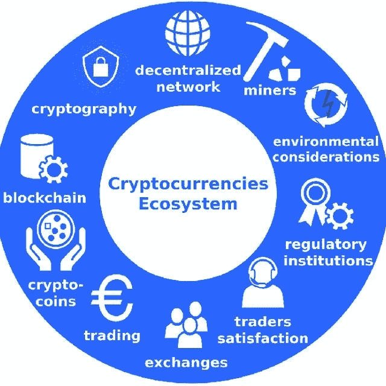
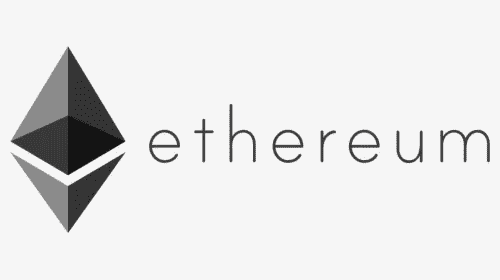
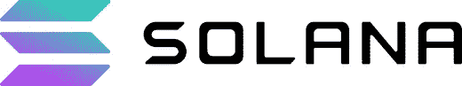
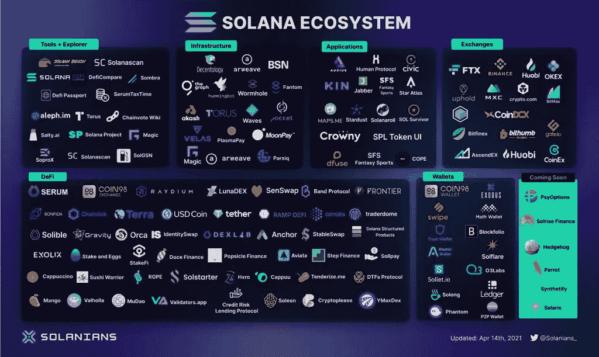
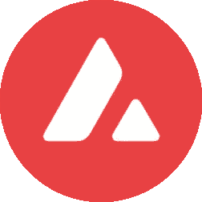
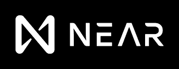
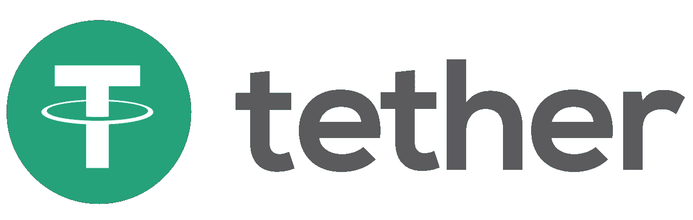
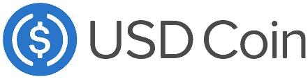
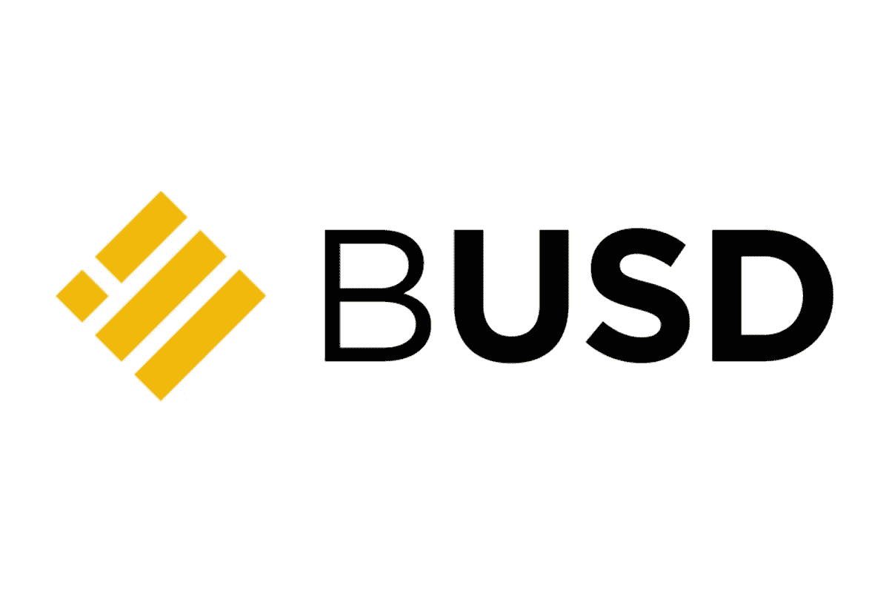

# 加密货币的类型

> 原文：<https://medium.com/coinmonks/types-of-cryptocurrencies-ae5c522e43b8?source=collection_archive---------68----------------------->

在我们的上一篇文章中，我们已经介绍了作为用例的加密技术及其最初的存在。但是加密货币并没有随着比特币而停止。在去中心化的世界里，它已经蔓延到许多其他不同用途的硬币。在本文中，我们将涵盖大多数其他著名的加密货币，他们的目的和其他类别。

# 生态系统加密货币:

# 以太坊

以太坊是仅次于比特币的全球第二大加密货币。于 2015 年 7 月 30 日发布，起拍价为【0.308 美元/ETH。

以太坊(ETH)是第一个加密货币生态系统，它提供了一系列更新的用例。Eth 的概念是创建一个平台来创建应用程序，该平台使用去中心化的概念，并使用以太坊作为基础平台。

以太坊为此创造了他们自己的公共区块链。与此同时，联邦理工学院宣布他们的区块链兼容创建智能合同，这是一个签署协议并将其存储在区块链上的概念。

目前，ETH 在密码市场排名第二，价格为【2,761.73 美元(2022 年 3 月 17 日)。

以太坊是第一个支持 NFT 概念的区块链，而 Opensea 作为一个媒介/市场来买卖这些 NFT

虽然 ETH 是第二大市场领导者，但是 Eth 在交易费用/每秒交易数量方面有一些缺点。由于有这么多的 Eth 竞争对手，ETH 侧链的出现解决了这些问题。目前，ETH 正在开发他们期待已久的 ETH 2.0 项目，该项目将解决所有这些问题，并使 ETH 生态系统更加兼容、高效和快速。

# 索拉纳

索拉纳是一个区块链，在交易速度方面是 ETH 的竞争对手。ETH 执行 16TPS，而 Solana 执行 65000 TPS。Solana 是非常快速、高效和轻量级的区块链，用于在区块链上构建应用程序。

索拉纳已经声名鹊起，价格也提到了 2021 年的新 ATH。许多应用程序建立在 Solana 上，一个新的生态系统建立在 Solana 区块链上，为各个行业提供服务。

# 多边形

多边形(MATIC)被认为是 ETH 的侧链。Polygon 为连接各种基于以太坊的解决方案提供了可伸缩、可持续和可互操作的基础设施。

Polygon 参与政府主导的区块链项目，支持超过 800，000 个独立用户、7600 万笔交易和 400 多个应用，包括 Aave 和 EasyFi。

Polygon 被用作创建去中心化 app、DAO、minting 等应用的平台。它还用于构建轻量级智能契约，即基于 ETH 的应用程序和服务之间的互操作性基础设施。

# 雪崩

Avalanche(AVAX)是另一个区块链，由 AVA 实验室支持，作为一个生态系统，在 AVAX 区块链上创建应用程序。

Avax 是全球加密市场十大区块链之一。它还提供了构建智能合同的能力。

AVAX 还允许用户定制他们的区块链来创建侧链，并根据他们的要求使用区块链。

# 卡尔达诺

Cardano 是一个轻量级区块链，主要用于创建智能合同。从一开始，它就向网络上的验证者提供大约 70%的货币。商业和金融机构可以在区块链创建智能合同。

最近，卡尔达诺还为 NFT 铸币和虚拟世界(如分散土地)创建了一个市场。

# 近的

NEAR 协议，NEAR 是一个分散的应用程序平台，旨在创建有助于未来网络及其经济的应用程序。Near 主要关注那些有助于连接 Web3、去中心化环境(如钱包等)的应用。

在 NEAR 平台上，开发人员可以托管无服务器应用程序和智能合同，轻松访问与开放金融相关的网络

# 稳定的硬币

稳定硬币是由法定货币如美元、欧元支持的硬币类型，用于购买/出售其他加密货币。

# 极限

系绳是第一个稳定的硬币，最近获得了很大的人气。系绳由美元的价值支持，被认为是最常用的稳定硬币

加密货币通常以其极端波动的行为而闻名，这种行为会给投资者带来巨额利润或损失。这就导致了恐慌性买卖。

Tether 将自己描述为“一个区块链平台，旨在以数字方式促进法定货币的使用。”

# USDC

USDC 是一种完全抵押的美元稳定硬币。USDC 是美元和加密货币交易所交易之间的桥梁。CENTRE 背后的技术使得人们、企业和金融机构之间的价值交换成为可能，就像邮件服务之间的电子邮件和短信服务提供商之间的短信一样。我们相信，通过消除人为的经济边界，我们可以创造一个更具包容性的全球经济。

来源:CoinGecko

# BUSD

币安美元(BUSD)是由币安(与 Paxos 合作)发行的 1:1 美元支持的稳定硬币，由纽约州金融服务局(NYDFS)批准和监管，BUSD 月度审计报告可从官方网站查看。

本文到此为止。我们将在下一部分介绍更多的类别。

感谢你阅读这篇文章😊

> 加入 Coinmonks [电报频道](https://t.me/coincodecap)和 [Youtube 频道](https://www.youtube.com/c/coinmonks/videos)了解加密交易和投资

# 另外，阅读

*   [Bookmap 点评](https://coincodecap.com/bookmap-review-2021-best-trading-software) | [美国 5 大最佳加密交易所](https://coincodecap.com/crypto-exchange-usa)
*   最佳加密[硬件钱包](/coinmonks/hardware-wallets-dfa1211730c6) | [Bitbns 评论](/coinmonks/bitbns-review-38256a07e161)
*   [新加坡十大最佳加密交易所](https://coincodecap.com/crypto-exchange-in-singapore) | [购买 AXS](https://coincodecap.com/buy-axs-token)
*   [红狗赌场评论](https://coincodecap.com/red-dog-casino-review) | [Swyftx 评论](https://coincodecap.com/swyftx-review) | [CoinGate 评论](https://coincodecap.com/coingate-review)
*   [投资印度的最佳密码](https://coincodecap.com/best-crypto-to-invest-in-india-in-2021)|[WazirX P2P](https://coincodecap.com/wazirx-p2p)|[Hi Dollar Review](https://coincodecap.com/hi-dollar-review)