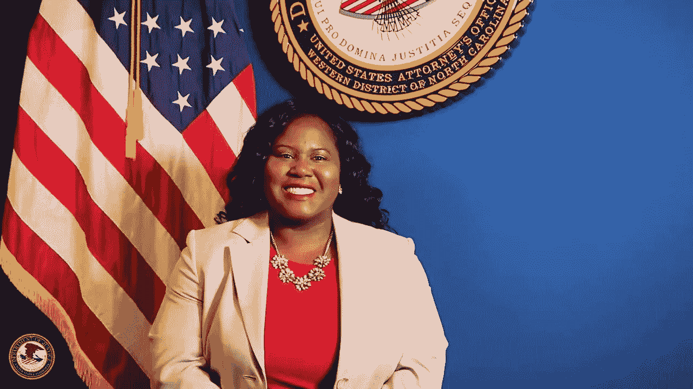

# 美国检察官 Dena J. King 宣布将 12.1 被盗的 BTC 归还给一名老年受害者——Derev 博客

> 原文：<https://medium.com/coinmonks/u-s-attorney-dena-j-king-announces-return-of-12-1-stolen-btc-to-an-elderly-victim-derev-blog-b49a7ae05ead?source=collection_archive---------67----------------------->

**美国检察官宣布没收并归还 12.1 BTC。**

**受害者是阿什维尔的一名老年居民，他的毕生积蓄和退休基金被洗劫一空。**

# 快速拍摄:

*   诈骗犯欺骗受害者，冒充某人从…