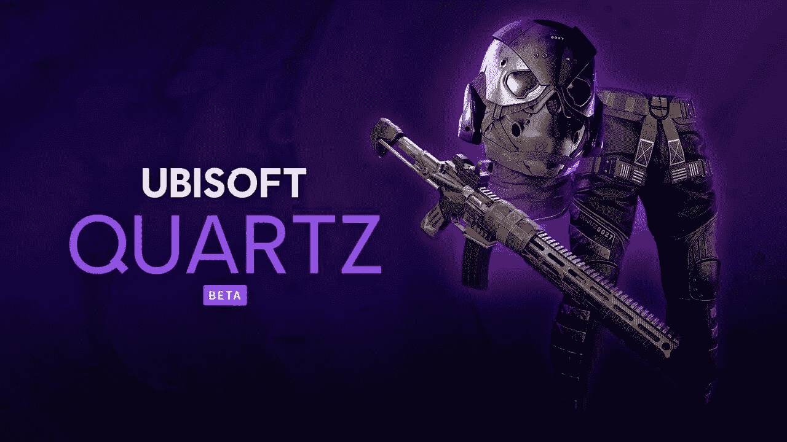

# 育碧是第一家将 NFTs 引入游戏的大型游戏公司

> 原文：<https://medium.com/coinmonks/ubisoft-is-the-first-major-gaming-company-to-introduce-nfts-to-gaming-cef9c87140d8?source=collection_archive---------56----------------------->

## 育碧是第一家对区块链技术感兴趣的大型视频游戏发行商，近年来一直在尝试加密游戏原型并资助初创公司。

育碧是第一家对区块链技术感兴趣的大型视频游戏发行商，近年来一直在尝试加密游戏原型并资助初创公司。然而，在 Tezos 支持的新业务中，这个游戏巨头将真正在其最大的特许经营之一中部署 NFTs。《刺客信条》和《Just Dance》的出版商今天宣布了育碧石英(Ubisoft Quartz)平台，该平台允许玩家在 Tezos 区块链上赢得和购买 NFT 令牌化的游戏内产品。石英最初将在 PC 上的汤姆克兰西的幽灵侦察断点，远程战术射击系列的最新在线游戏。

在尽可能多的大陆扩张
12 月 9 日，Quartz 将在美国、加拿大、法国、德国、西班牙、意大利、比利时、巴西和澳大利亚进入测试阶段。游戏中达到 5 级经验值的幽灵侦察断点玩家可以使用 NFT 掉落。根据育碧的新闻稿，玩家必须年满 18 岁才能创建一个 Tezos 钱包来配合游戏使用。

育碧将其 NFT 版本称为“数字”，并计划在 12 月 9 日、12 日和 15 日向早期用户提供免费的 NFTs，并计划在 2022 年进行几次投放。一张信息图描述了枪皮和其他处于危险中的优质元素，以及一份调侃未来倡议的声明:“这只是开始”。

NFT 实际上充当了一种可能被证明罕见的数字商品的收据，尽管数字艺术品和个人资料图片已经流行，但它们也可以是视频游戏资产。根据 CryptoSlam 的数据，以太坊驱动的怪物战斗游戏 Axie Infinity 现在是业内最大的玩家，迄今为止的交易额超过 36 亿美元。

育碧战略创新实验室副总裁 Nicolas Pouard 在一份声明中表示:“育碧石英是我们创造一个真正的元宇宙这一宏伟目标的第一个基石。”。“除非从一开始就克服了区块链限制，如可扩展性和功耗，否则它无法实现。”

出于生态原因选择 Tezos 平台
育碧今天的声明主要关注 Tezos 区块链和耗能的比特币区块链在环境影响上的差异。

Tezos 表示，其网络中的单笔交易比主要加密货币比特币消耗的能量“少 200 多万倍”。这也意味着，单个 Tezos 交易消耗的能量大约相当于 30 秒的流媒体电影，但据估计，一个比特币交易将对一整年的流媒体视频环境产生影响。

区块链技术的潜在环境影响已经在传统视频游戏中引发了愤怒，特别是当恐怖游戏《白日之下的死亡》透露出打算以 NFT 的形式加入一个新角色时。

育碧在区块链世界的历史
育碧几年前就开始探索加密和 NFT 空间，开发了一款类似《我的世界》的游戏原型，名为 HashCraft。从那时起，育碧通过其企业家实验室加速计划与众多加密初创公司合作，并支持 Axie Infinity、Nine Chronicles 和 NBA Top Shot 等项目。今年 4 月，他还成为了 Tezos 网络中的企业验证员。

虽然 HashCraft 从未发布，但育碧已经启动了许多小型太空实验:以慈善为重点的 NFT 兔子令牌项目，以及今年的一次性联盟，这是广受欢迎的 NFT 梦幻足球游戏《如此罕见》的衍生游戏。10 月，育碧对一家加密初创公司进行了第一次真正的投资，参与了 Animoca Brands 的 6500 万美元融资，并表示计划与这家总部位于 NFT 的游戏公司合作。

其他主要游戏发行商也在关注这个领域:Square Enix 在 11 月宣布了开发 NFT 游戏的计划，而电子艺界的首席执行官安德鲁·威尔逊最近将 NFTs 描述为“重要的一部分”我们行业的未来。"

**署名金牌密码**

> 加入 Coinmonks [电报频道](https://t.me/coincodecap)和 [Youtube 频道](https://www.youtube.com/c/coinmonks/videos)了解加密交易和投资

# 另外，阅读

*   [如何购买 Monero](https://coincodecap.com/buy-monero) | [IDEX 评论](https://coincodecap.com/idex-review) | [BitKan 交易机器人](https://coincodecap.com/bitkan-trading-bot)
*   [CoinDCX 评论](/coinmonks/coindcx-review-8444db3621a2) | [加密保证金交易交易所](https://coincodecap.com/crypto-margin-trading-exchanges)
*   [红狗赌场评论](https://coincodecap.com/red-dog-casino-review) | [Swyftx 评论](https://coincodecap.com/swyftx-review) | [CoinGate 评论](https://coincodecap.com/coingate-review)
*   [Bookmap 点评](https://coincodecap.com/bookmap-review-2021-best-trading-software) | [美国 5 大最佳加密交易所](https://coincodecap.com/crypto-exchange-usa)
*   [如何在 FTX 交易所交易期货](https://coincodecap.com/ftx-futures-trading) | [OKEx vs 币安](https://coincodecap.com/okex-vs-binance)
*   [CoinLoan 评论](https://coincodecap.com/coinloan-review) | [YouHodler 评论](/coinmonks/youhodler-4-easy-ways-to-make-money-98969b9689f2) | [BlockFi 评论](https://coincodecap.com/blockfi-review)