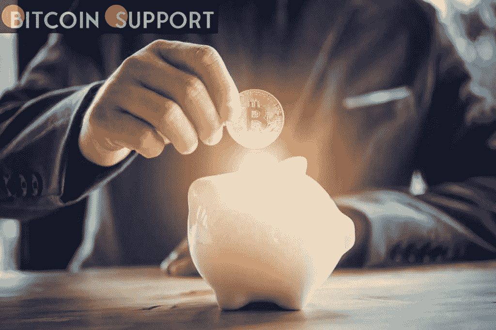

# 乌克兰接受 70 多项加密资产捐赠

> 原文：<https://medium.com/coinmonks/ukraine-accepts-over-70-crypto-assets-as-donations-f4720f3a8e19?source=collection_archive---------61----------------------->

**Visit our website:-** [**https://bitcoinsupports.com/**](https://bitcoinsupports.com/)

Coingate 和国际商业结算(IBS)已经开始与乌克兰国家银行(NBU)合作，使好心人能够使用 70 多种不同的加密资产向乌克兰捐款。

**呼吁扩大接受的加密货币捐赠**

总部位于立陶宛的加密货币支付处理器 Coingate 最近宣布，它已经开始与乌克兰中央银行合作，将好心人可以捐赠给该国武装部队的加密资产数量从 4 个增加到 70 多个。就在几天前，乌克兰政府批准了 Polkadot 开发商 Gavin Wood 的请求，将 dot 列入了接受捐赠的加密资产名单。据 Bitcoin.com 新闻报道，在乌克兰政府表示将接受波尔卡多特捐款后不久，伍德很快兑现了他的誓言，捐赠了总额超过 500 万美元的点币。

由于乌克兰政府决定接受 DOT 和其他三种加密货币，加密货币领域的更多参与者，包括 Tron 创始人 Justin Sun，都向乌克兰政府提出了类似的呼吁。

**加密货币实时转换为法定货币**

Coingate 联合创始人 Dmitrijus Borisenka 在新闻发布后的言论中谴责了这场骚乱，称其“损害了乌克兰及其人民的独立。”加密货币支付处理器的产品负责人 Sarunas Matulevicius 表示:

**“我们擅长我们所做的事情。我们有一项技术，能够处理 70 多种不同的密码，并实时将其转换为任何其他密码或货币。”另一位 Coingate 首席执行官 Matas Kibildis 在一篇描述加密货币如何确立其重要性的文章中被引用。正如他所言:

个人或私人组织能够如此容易地向经历危机的国家进行跨境分散系统捐赠，这绝对是令人瞩目的，也是欧洲共同体积极援助乌克兰的主要原因之一。与此同时，一份来自比特币新闻平台的报告显示，这笔交易包括国际支付公司国际商业结算(IBS)。根据该报告，所有加密货币捐赠都将被转换为欧元，IBS 将负责批准并将资金转移到央行的特别捐赠账户。

**访问我们的网站:-**[**https://bitcoinsupports.com/**](https://bitcoinsupports.com/)

**免责声明:以上为作者观点，不应视为投资建议。读者应该自己做研究。****