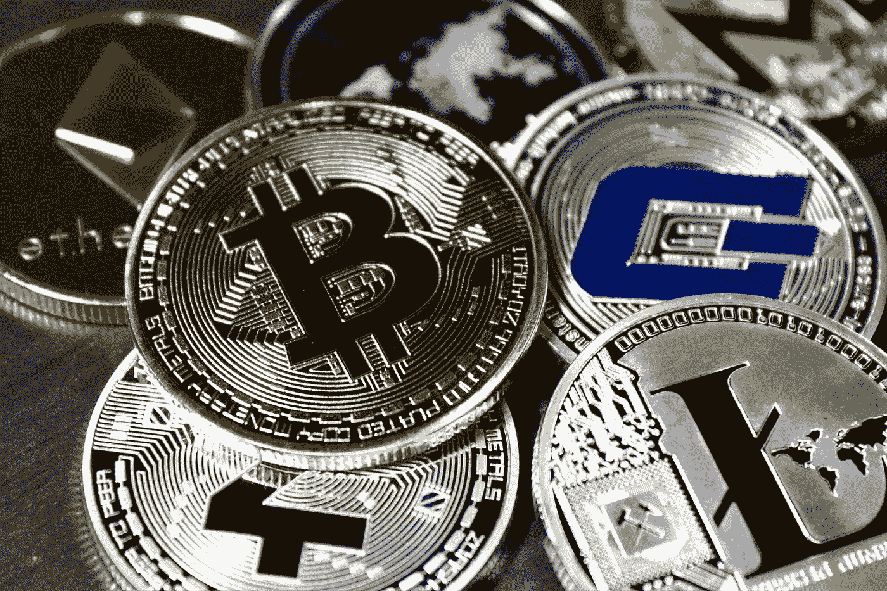

# 乌克兰在加密领域有所动作。乌克兰的秘密捐赠计划超过 3000 万美元。

> 原文：<https://medium.com/coinmonks/ukraine-has-made-moves-in-the-crypto-world-b52c17d4c2b6?source=collection_archive---------76----------------------->

CRRYPTO

在一系列支持和俄罗斯入侵[后迫在眉睫的人道主义危机中，乌克兰](https://yazing.com/deals/coinsmart/EthanRobertsDaily)正在扩大其[加密货币](https://yazing.com/deals/crypto/EthanRobertsDaily)的名单，以接受捐赠。

根据区块链分析公司 Elliptic 的数据，到目前为止，乌克兰和支持军方的非政府组织已经筹集了大约 3170 万美元到 26000 美元的加密货币捐款。

根据周二政府推特账户[的一份声明，除了](https://yazing.com/deals/coinsmart/EthanRobertsDaily)[比特币](https://yazing.com/deals/coinsmart/EthanRobertsDaily)、[以太坊](https://yazing.com/deals/coinsmart/EthanRobertsDaily)和[系绳](https://yazing.com/deals/coinsmart/EthanRobertsDaily)之外，该国还将接受波尔卡圆点，这是市值第 11 大的加密货币。据帖子称，更多的代币将很快被接受。

据 Blockchain.com 消息，自从乌克兰几天前发布了一个请求资金的钱包以来，乌克兰已经收到了大约 820 万美元的比特币钱包和 710 万美元的以太钱包。

[乌克兰](https://yazing.com/deals/coinbase/EthanRobertsDaily)在推特上谈论了[加密货币](https://yazing.com/deals/crypto/EthanRobertsDaily)空投的可能性，或者通常涉及赠送免费硬币的促销活动，声明“空投尚未得到证实”我没有立即知道我的帐户所指的空投类型的细节，它会影响什么，以及它会影响谁。

CRYPTO

周二，比特币上涨 4.7%，至 43600 美元，有猜测称，在制裁[俄国](https://yazing.com/deals/coinsmart/EthanRobertsDaily)后，[加密货币](https://yazing.com/deals/crypto/EthanRobertsDaily)将受到青睐。截至 13:25，最近 24 小时乙醚上涨 3.8%，DOT 上涨 5.8%，SOL 上涨 1.4%。按照纽约 [CoinGecko、](https://yazing.com/deals/coinsmart/EthanRobertsDaily)的价格。

> *加入 Coinmonks* [*电报频道*](https://t.me/coincodecap) *和* [*Youtube 频道*](https://www.youtube.com/c/coinmonks/videos) *了解加密交易和投资*

# 另外，阅读

*   [有哪些交易信号？](https://coincodecap.com/trading-signal) | [Bitstamp vs 比特币基地](https://coincodecap.com/bitstamp-coinbase) | [买索拉纳](https://coincodecap.com/buy-solana)
*   [ProfitFarmers 回顾](https://coincodecap.com/profitfarmers-review) | [如何使用 Cornix Trading Bot](https://coincodecap.com/cornix-trading-bot)
*   [十大最佳加密货币博客](https://coincodecap.com/best-cryptocurrency-blogs) | [YouHodler 评论](https://coincodecap.com/youhodler-review)
*   [my constant Review](https://coincodecap.com/myconstant-review)|[8 款最佳摇摆交易机器人](https://coincodecap.com/best-swing-trading-bots)
*   [MXC 交易所评论](/coinmonks/mxc-exchange-review-3af0ec1cba8c) | [Pionex vs 币安](https://coincodecap.com/pionex-vs-binance) | [Pionex 套利机器人](https://coincodecap.com/pionex-arbitrage-bot)
*   [我的加密副本交易经历](/coinmonks/my-experience-with-crypto-copy-trading-d6feb2ce3ac5) | [比特币基地评论](/coinmonks/coinbase-review-6ef4e0f56064)
*   [CoinFLEX 评论](https://coincodecap.com/coinflex-review) | [AEX 交易所评论](https://coincodecap.com/aex-exchange-review) | [UPbit 评论](https://coincodecap.com/upbit-review)
*   [AscendEx 保证金交易](https://coincodecap.com/ascendex-margin-trading) | [Bitfinex 赌注](https://coincodecap.com/bitfinex-staking) | [bitFlyer 审核](https://coincodecap.com/bitflyer-review)