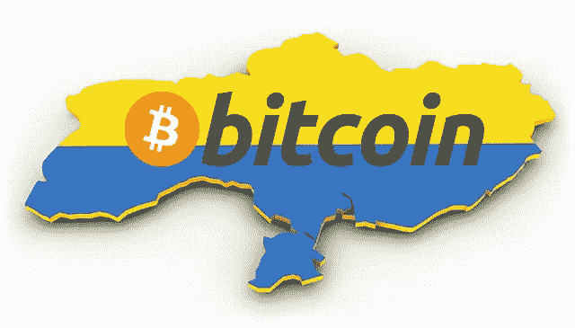
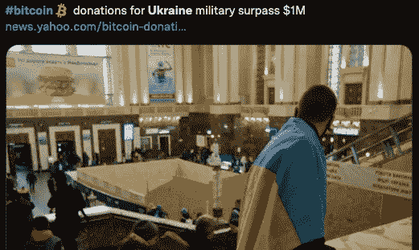

# 乌克兰、俄罗斯和全球金融秩序。

> 原文：<https://medium.com/coinmonks/ukraine-russia-and-the-global-financial-order-2df005461f74?source=collection_archive---------19----------------------->

Image credit: [https://kryptomoney.com/ukraine-compnesate-citizen-one-bitcoin/](https://kryptomoney.com/ukraine-compnesate-citizen-one-bitcoin/)

作为一名中东的国际教师，最令人满意的一点是课堂上观点的多样性。每天，来自大约 25 个不同国家的学生坐在我的教室里。

昨天的课无疑让我们很多人质疑自己的观点。

我们在课程的第一部分讨论了范式转换事件。我解释了情景记忆的概念，并与他们分享了我的第一次情景记忆，那是在 2001 年 9 月 11 日。对于许多正在阅读这篇文章的人来说，你的情景记忆会回溯得更远一些。它们可能包括柏林墙的倒塌，JFK 的遇刺，很可能还包括广岛和长崎的轰炸。

入侵乌克兰感觉像是一个改变范式的事件。这一天将会被我们许多人铭记一生。很可能是未来的前奏。

在 45 分钟内，我们讨论了许多主题。我们讨论了当前的世界秩序，讨论了“美国治下的和平”、全球化、冷战、石油美元和全球金融秩序。

我们争论“力量投射”在什么情况下是正当的？并评估了各国投射力量的多种方式。

最后，我们详细讨论了责任。保护乌克兰是谁的责任？美国还应该有维持世界治安的责任吗？还是其他国家应该开始为自己的安全承担更大的责任？

我们研究了战争的财政影响。我们一致认为战争是昂贵的，我们考虑谁有责任为战争提供资金。政府会用税收来支付吗？还是通过货币贬值？

许多学生声称，西方大国在乌克兰的直接军事介入是不明智的，因为相互确保毁灭的可能性增加了。因此，有理由认为，针对俄罗斯投射力量的最合理/有效的方式是实施更严厉的金融制裁。

在研究了俄罗斯的出口和 GDP 数据后，学生们意识到将俄罗斯从全球金融体系中分离出来将会导致许多负面的外部性。

首先，欧洲仍然严重依赖俄罗斯的能源。其次，迫使俄罗斯用美元以外的货币为石油定价可能会破坏全球金融市场的稳定，并从本质上终结石油美元体系。最后，严厉的经济制裁极有可能引发第二次冷战……俄罗斯别无选择，只能向东看。莫斯科/北京对西方列强。

我解释说，俄罗斯在过去 8 年里一直在为后石油美元时代做准备。他们已经远离美国国债，增加了黄金储备，并在过去几周内将比特币网络合法化/监管，作为替代支付轨道，以逃避西方的制裁。(照目前的情况来看，俄罗斯可能会在未来几天被从 SWIFT 系统中移除。)

许多专家认为，俄罗斯开始用黄金或比特币等硬资产为其石油和天然气定价只是时间问题。

俄罗斯将比特币作为篡夺石油美元霸权的一种方式，这无疑会让许多人下意识地将比特币贴上不好的标签。然而，这个标签是错误的。

我们不会因为美元被用于洗钱、贩毒或恐怖融资而将其妖魔化，对吗？

当比特币被用作我们不认可的行为和行动的支付手段时，我们也不应该妖魔化它。

因为比特币是去中心化的，所以朋友和敌人都可以使用。我们有责任将比特币作为一种有益的工具。更重要的是，在过去的几天里，比特币实际上已经成为许多乌克兰人的生命线！

Yahoo News Story

正是因为它对社会的积极外部性，美国许多州正计划在未来几个月内承认比特币为法定货币。

德克萨斯州现在拥有全球约 20%的比特币矿商。这些矿工保护了电网，提供了许多高薪工作，并大幅减少了排放到大气中的天然气量。

除了经济和环境利益，国防部门的许多人认为比特币的采用具有巨大的地缘政治战略重要性。美国国防研究员[杰森](https://twitter.com/JasonPLowery)劳里认为，比特币是一种战争[威慑](https://www.trustnodes.com/2021/08/14/bitcoin-is-a-war-deterrent-and-in-the-interest-of-us-national-security-says-space-force-engineer)，很快将成为美国国家安全的重要组成部分。

对我来说，“比特币竞赛”感觉像是太空竞赛的又一次迭代。是的，俄罗斯是第一个把卫星送入太空的国家……但最终是美国把人送上了月球。是的，俄罗斯可能是第一个用比特币出售石油的国家，也是第一个通过比特币友好立法的 G7 国家。然而，说到底，我相信美国将是向比特币标准过渡的领导者和最大受益者。

这一信念建立在我们宪法的分权治理体系(联邦、州、地方)、对法治的尊重以及对财产权的保护之上。

我最真诚的希望是我的学生带着更多的问题而不是答案离开昨天的课堂。他们被激励去问困难的问题和调查他们周围的世界。看着他们提出有逻辑和证据支持的观点，我很开心。看他们用他们的世界历史知识来解释/理解我们的现在和预测我们的未来是很有趣的。

直到下一次，一个合适的报价。

“有几十年什么也没发生；还有几周是几十年发生的时间”——弗拉基米尔·列宁。

> 加入 Coinmonks [电报频道](https://t.me/coincodecap)和 [Youtube 频道](https://www.youtube.com/c/coinmonks/videos)了解加密交易和投资

# 另外，阅读

*   [如何购买 Monero](https://coincodecap.com/buy-monero) | [IDEX 评论](https://coincodecap.com/idex-review) | [BitKan 交易机器人](https://coincodecap.com/bitkan-trading-bot)
*   [CoinDCX 评论](/coinmonks/coindcx-review-8444db3621a2) | [加密保证金交易交易所](https://coincodecap.com/crypto-margin-trading-exchanges)
*   [红狗赌场评论](https://coincodecap.com/red-dog-casino-review) | [Swyftx 评论](https://coincodecap.com/swyftx-review) | [CoinGate 评论](https://coincodecap.com/coingate-review)
*   [Bookmap 评论](https://coincodecap.com/bookmap-review-2021-best-trading-software) | [美国 5 大最佳加密交易所](https://coincodecap.com/crypto-exchange-usa)
*   [如何在 FTX 交易所交易期货](https://coincodecap.com/ftx-futures-trading) | [OKEx vs 币安](https://coincodecap.com/okex-vs-binance)
*   [CoinLoan 审核](https://coincodecap.com/coinloan-review) | [YouHodler 审核](/coinmonks/youhodler-4-easy-ways-to-make-money-98969b9689f2) | [BlockFi 审核](https://coincodecap.com/blockfi-review)
*   XT.COM 评论 | [币安评论](https://coincodecap.com/xt-com-review)
*   [SmithBot 评论](https://coincodecap.com/smithbot-review) | [4 款最佳免费开源交易机器人](https://coincodecap.com/free-open-source-trading-bots)
*   [比特币基地僵尸程序](/coinmonks/coinbase-bots-ac6359e897f3) | [AscendEX 审查](/coinmonks/ascendex-review-53e829cf75fa) | [OKEx 交易僵尸程序](/coinmonks/okex-trading-bots-234920f61e60)